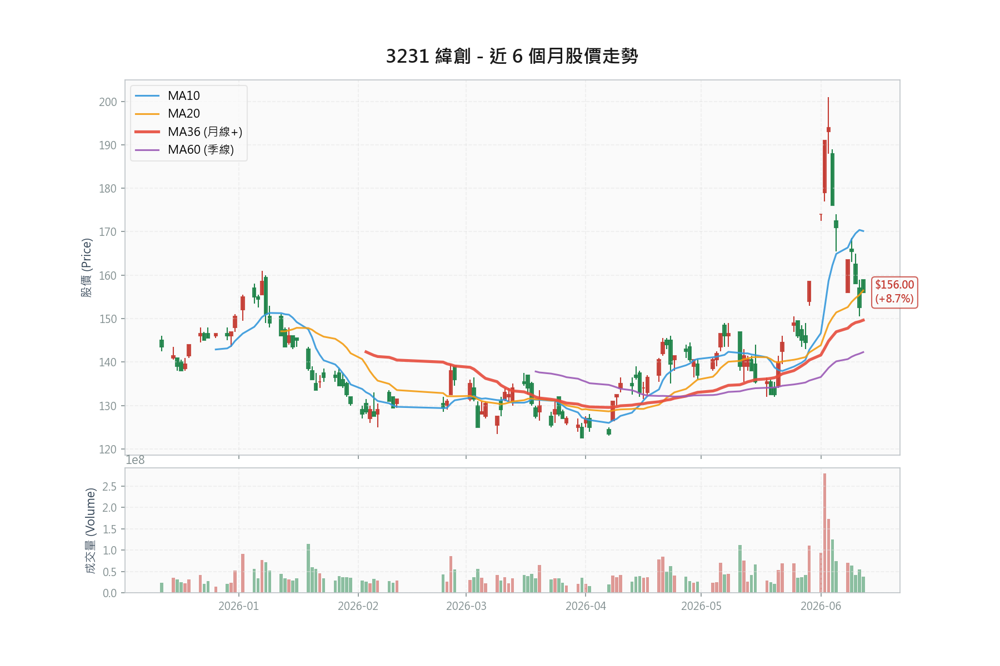

# 3231 緯創 (Wistron) 深度研究報告 - 2026/06/14 更新

**分析師**：Antigravity (AI Senior Analyst)  
**日期**：2026-06-14 更新  
**股價**：**156.0 元** (Source: TWSE MIS 2026-06-12 收盤，上漲 3.5 元，+2.30%)  
**評等**：**買進 (Buy) / 防守與分批佈局框架**  
**目標價**：**NT\$203（富邦，2026 EPS×14）- NT\$240（統一，2027 EPS×12.2）**  

> 📝 本版一致性修訂（2026-06-14）：對齊全文 PE 基準至 10.74x、修正進場策略表停損維度（季線 → 基本面底 135 元）、揭露 5 月營收 YoY 觸發之基期效應、情境表獲利改錨券商全年值、目標價倍數標示更正為 12.2x。

---

### 1. 投資觀點總結 (Investment Summary)

*   **評等**：**買進 (Buy)**
*   **目標價**：**NT\$203（富邦，2026 EPS×14）- NT\$240（統一，2027 EPS×12.2）**
*   **預估 2026 EPS 區間**：**14.52 - 14.85 元** (持平至樂觀情境)
*   **核心投資論點**：
    1.  **AI 機櫃出貨爆發**：最大美系 AI 客戶（依供應鏈研判為 NVIDIA）於 5/28 法說上修全年 AI 伺服器營收展望至 600 億美元、全年營收中值至 1,670 億美元；緯創 2026 年 GB 系列機櫃出貨預估由 1.2 萬櫃上修至 1.4 萬-1.8 萬櫃，作為主要代工夥伴直接受惠。
    2.  **一般伺服器需求共振**：Agentic AI 普及帶動 CPU 角色轉變，一般伺服器需求上修至年增 12%，一般伺服器（毛利率較佳）佔緯創營收約 20-30%，有助於減緩 AI 機櫃帶來的毛利率稀釋效應。
    3.  **VR 產品結構優化**：VR（Vera Rubin 平台）系列減少線材組裝、整體組裝性更佳，可帶動產品組合單價（ASP）與毛利率改善。爬坡時點各家分歧：中信估 3Q26 起、統一估 4Q26-1H27，本報告採中信較早時點，惟存遞延風險。
    4.  **網通業務接棒爆發**：網通（Networking）產品基期低，與美國大型客戶合作的 CPO 相關交換機系統組裝業務，將在 2026 年迎來 10 倍成長，毛利率優於 PC 與 AI 伺服器，對產品組合有正面效益。

**📊 風險報酬比分析 (Risk/Reward Analysis)**：

| 指標 | 價位 | 計算依據 | 說明 |
|:-----|:-----|:---------|:-----|
| **現價** | NT\$156.00 | 最新收盤價 (2026-06-12) | - |
| **技術支撐 1** | NT\$156.48 | 月線 (MA20) 附近 | 目前股價貼近月線 |
| **技術支撐 2** | NT\$142.28 | 季線 (MA60) 附近 | 中期防守參考；硬停損見基本面底 135.00 元 |
| **技術壓力** | NT\$191.00 | 前波高點（6/3 收盤價，近期高檔） | 短期觀察阻力位 |
| **目標價 (中性)** | NT\$203.00 | 14x PE × EPS 14.52 元 | 富邦投顧估值 |
| **目標價 (樂觀)** | NT\$240.00 | 2027 EPS 19.67 × 12.2x | 統一投顧 2027 年估值 |

**風險報酬比計算表**（分技術防守與波段基本面兩維度，避免「緊停損配遠目標」的維度錯置）：

| 維度 | 進場 → 目標 | 上檔 | 進場 → 停損 | 下檔 | 風報比 | 評價 |
|:---|:---|:---|:---|:---|:---|:---|
| 技術防守（中性） | 156.00 → 203.00 | +30.1% | 156.00 → 季線 142.28 | -8.8% | 3.43 : 1 | 僅在季線守住時成立 |
| 波段基本面（中性） | 156.00 → 203.00 | +30.1% | 156.00 → 基本面底 135.00 | -13.5% | **2.24 : 1** | ⭐⭐⭐ 穩健 |
| 波段基本面（樂觀） | 156.00 → 240.00 | +53.8% | 156.00 → 基本面底 135.00 | -13.5% | **4.00 : 1** | ⭐⭐⭐⭐ 優良 |

*註：季線 142.28 元僅距現價 8.8%，對高 beta 股（當沖比 41.83%、一週內已 -15%）屬過緊停損，沿途正常震盪即易被掃出。波段持有改採容納 overshoot 的基本面底 135.00 元（季線下緣，對應空方 EPS 11.5 元 × PE 約 11.7x）為停損基準，風報比隨之由 3.43 降至較誠實的 2.24（中性）。極端戴維斯雙殺可下探 103 元（見第 9.2 章）。*

**進場策略建議表**（分批佈局，停損統一採基本面底 135.00 元）：

| 策略 | 進場價 | 停損 | 目標 | 風報比 |
|:-----|:-------|:-----|:-----|:-------|
| **積極型** | 現價附近 (156.00 元) | 基本面底 (135.00 元) | 中性 203.00 元 | 2.24 : 1 |
| **穩健型** | 回檔 148.00 - 150.00 元 | 基本面底 (135.00 元) | 中性 203.00 元 | 3.53 : 1 |

> 風報比以進場區間上緣計算（穩健型取 150.00 元：上檔 +53.00 元、下檔 -15.00 元，得 3.53 : 1）。穩健型進場下緣 148.00 元仍高於停損 135.00 元，已修正前版「進場下緣 142.00 元低於停損 142.28 元」之邏輯矛盾。樂觀目標 240.00 元立足 2027 forward EPS，能見度較低，列為題材兌現後的延伸選擇權，不納入基準風報比。

> [!WARNING]
> **動能框架失效與籌碼警訊**：籌碼動能評分已由 3 分降至 1 分（6/12 集保千張大戶單週減幅 1.04%，法人近 5 日合計大賣 48,685 張）。股價已微幅跌破月線 156.48 元。此時不宜採用動能追價策略，亦不建議以月線作為緊密停損（易遭震盪出場）。操作上應轉為穩健防守，建議等股價回檔至季線 142.28 元至 150.00 元區間時再分批承接；停損放寬至季線下緣基本面底 135.00 元以容納正常震盪（季線本身僅距現價 8.8%，對高 beta 股仍偏緊，作為觀察點而非硬停損）。

---

### 2. 資料來源摘要 (Data Sources Summary)

**2.1 官方數據與新聞 (Official Data & News)**
*   **公開資訊觀測站 (MOPS)**：
    > "1Q26 合併營業收入 8,463.03 億元，單季稅後純益 96.31 億元，單季 EPS 達 3.06 元。" (2026/05/11 公告)
    > "2026 年 5 月份合併營業收入為 2,901.83 億元，月增 2.38%、年增 39.24%；累計前 5 月營收達 1.42 兆元，年增 106.21%。" (2026/06/08 公告)
*   **法說會/董事會**：
    > "通過擴建新竹、越南及墨西哥廠房，累計投資金額達 279 億元，布局高階 AI 伺服器與網通基建業務..."

**2.2 投顧與外資報告專區 (Broker Reports)**
*   **統一投顧 (2026/06/03)**：目標價 NT\$240 | 評等: 買進 (維持)
    > "研究部上修 26 年 GB 機櫃出貨預估至 1.4 萬-1.8 萬櫃(原估 1.2 萬櫃)；首次預估 2027 年營收 4.65 兆元，EPS 19.67 元，目標價調升至 240 元。"
*   **富邦投顧 (2026/05/11)**：目標價 NT\$203 | 評等: 買進 (維持)
    > "一般伺服器需求優於預期，預估未來幾季毛利率不會進一步被稀釋；預估 2026 年 AI 伺服器業務年增將超過 100%。"
*   **中信證券 (2026/03/16)**：目標價 NT\$195 | 評等: 買進 (維持)
    > "VR 系列減少了 cable cartridge 等線材組裝，預計 3Q26 開始爬坡；網通產品預估在 2026 年將迎來 10 倍成長，且毛利率較佳。"

---

### 3. 財務數據分析 (Financial Data Analysis)

**3.1 歷史財務趨勢表**：

| 年度 | 營業收入 (百萬) | 營業利益 (百萬) | 稅後純益 (百萬) | EPS (元) | 毛利率 (%) | 營益率 (%) | 淨值報酬率 ROE (%) | 自由現金流 (百萬) |
|:---|:---|:---|:---|:---|:---|:---|:---|:---|
| **FY23** | 867,057 | 27,390 | 11,472 | 4.08 | 8.0% | 3.2% | 11.4% | 33,554 |
| **FY24** | 1,049,256 | 38,979 | 17,446 | 6.11 | 8.0% | 3.7% | 14.7% | -14,344 |
| **FY25** | 2,186,523 | 78,553 | 27,408 | 9.04 | 6.1% | 3.6% | 17.7% | -149,323 |
| **FY26F** | 3,461,938 | 126,677 | 45,665 | 14.52 | 5.9% | 3.7% | 17.1% | -17,568 |
| **FY27F** | 4,592,664 | 128,136 | 54,239 | 17.25 | 5.0% | 2.8% | 18.3% | 23,651 |

*資料來源：富邦投顧預估損益模型*

**3.2 同業財務對比表 (2026F)**：

| 公司 | 市值 (億元) | 營業收入年增率 (%) | 預估毛利率 (%) | 預估 ROE (%) | 預估本益比 (PE) |
|:---|:---|:---|:---|:---|:---|
| **緯創 (3231)** | 4,961 | 58.3% | 5.9% | 17.1% | 10.74x |
| **廣達 (2382)** | 14,015 | 79.6% | 6.2% | 23.5% | 16.50x |
| **鴻海 (2317)** | 36,878 | 31.8% | 6.4% | 15.2% | 18.68x |
| **緯穎 (6669)** | 9,062 | 53.2% | 8.5% | 29.5% | 17.07x |

*註：緯創市值以最新即時股價 156.0 元計算，ROE/毛利率採富邦 FY26F 預估；其餘同業採最新市場滾動數據。券商對緯創 ROE 分歧大（富邦 17.1% vs 中信 23.6%，差異源於股東權益基數假設），此處取較保守的富邦值。*

**3.3 近三月營收趨勢 (2026/03 - 2026/05)**：

| 月份 | 所屬季 | 狀態 | 營收金額 (億元) | 年增率 (YoY) | 說明 |
|:---|:---|:---|:---|:---|:---|
| **3月** | 1Q26 | ✅ 已實現 | 3,330.43 | +117.70% | 創單月歷史新高，CSP 客戶拉貨強勁 |
| **4月** | 2Q26 | ✅ 已實現 | 2,834.37 | +111.99% | 月減 14.89%，主因 NB/PC 與緯穎 Consign 調整 |
| **5月** | 2Q26 | ✅ 已實現 | 2,901.83 | +39.24% | 創歷年同期新高，單月歷史次高，AI伺服器拉貨持續 |

> 註：3 月屬 1Q26（已計入 1Q26 營收 8,463 億），不納入 2Q26 加總；故本表為近三月趨勢，非單季拆解。2Q26（4-6 月）目前 4、5 月已落地，合計達 5,736.2 億元，已達成富邦預估 2Q26 營收 8,545 億的 67.1%；統一估 2Q26 營收 8,875 億可作對照。
> ✅ 已公告月份（3、4、5 月）營收均經公開資訊觀測站驗證（驗證日期：2026/06/14）
> ⚠️ 基期效應提醒：5 月單月 YoY +39.24%，已低於第 9.3 章「賣出劇本」原設的月營收 YoY +50% 觸發線，但此為 2025 年 5 月 AI 已起量造成的高基期效應（2Q26 季度 YoY 仍達 +55 至 +61%，券商預估未下修），非需求轉弱。單月 YoY 在高基期下失真，賣出觸發已改採季度 YoY 與連續環比趨勢（見第 9.3 章修訂）。

---

### 4. 籌碼數據分析 (Chip Analysis)

**4.1 集保戶股權分散表 (TDCC - 近 4 週)**：

| 週別 | >200張 (%) | >1000張 (%) | 變化解讀 |
|:---|:---|:---|:---|
| **20260612** | **67.30%** | **60.64%** | **大戶籌碼小幅回吐**：千張大戶單週減少 1.04% ❌ |
| 20260605 | 68.42% | 61.68% | 大戶籌碼急遽集中：千張大戶單週大增 3.50% ✅ |
| 20260529 | 65.14% | 58.18% | 大戶持股回溫 |
| 20260522 | 63.62% | 56.70% | 盤整期 |

**4.2 三大法人買賣超 (近 5 日，張數)**：

| 日期 | 外資買賣超 (張) | 投信買賣超 (張) | 自營商買賣超 (張) | 合計買賣超 (張) |
|:---|:---|:---|:---|:---|
| 2026-06-12 | -5,772 | +804 | +477 | -4,491 |
| 2026-06-11 | -3,627 | -12,214 | +445 | -15,396 |
| 2026-06-10 | -9,129 | -5 | -1,070 | -10,204 |
| 2026-06-09 | -15,505 | +553 | -803 | -15,755 |
| 2026-06-08 | -1,985 | +267 | -1,120 | -2,839 |
| **近5日累計** | **-36,018** | **-10,595** | **-2,071** | **-48,685** |

> **籌碼解讀**：法人動向於 6/8 - 6/12 出現顯著轉折，外資近 5 日連續調節，累計賣超高於 3.6 萬張；同時，原本扮演多頭主力的投信也在 6/11 大幅賣超 12,214 張，導致近 5 日累計轉為賣超 10,595 張。千張大戶比例因而下滑，整體籌碼結構出現惡化跡象，短期動能熄火。

**4.3 融資融券趨勢 (近 5 日)**：

| 日期 | 融資餘額 (張) | 融資增減 (張) | 融券餘額 (張) | 融券增減 (張) | 券資比 (%) |
|:---|:---|:---|:---|:---|:---|
| 2026-06-12 | 41,677 | -454 | 446 | +16 | 1.07% |
| 2026-06-11 | 42,131 | +831 | 430 | -103 | 1.02% |
| 2026-06-10 | 41,300 | -1,701 | 533 | +50 | 1.29% |
| 2026-06-09 | 43,001 | +1,893 | 483 | -34 | 1.12% |
| 2026-06-08 | 41,108 | -519 | 517 | +60 | 1.26% |

**4.4 籌碼/動能評分**（註：本表衡量動能與籌碼集中度，非 short squeeze；緯創融券僅 446 - 533 張、券資比約 1%，幾無空單可軋，不宜以「軋空」描述）：

| 指標 | 標準 | 得分 |
|:-----|:------|:-----|
| 千張大戶週增高於 1% | 6/12 大戶持股由 61.68% 降至 60.64% (-1.04%)，未達標 | |
| 投信連續買超 | 投信近 5 日累計呈賣超 (-10,595 張)，且 6/11 出現大賣，未達標 | |
| 券資比高於 5% | 目前券資比在 1.0% 至 1.3% 之間，未達標 | |
| 股價超越所有券商目標 | 現價 156.0 元，低於最高目標價 240 元，未達標 | |
| 均線多頭排列與發散 | 均線仍呈多頭排列；惟已微幅跌破月線 156.48 元，有轉弱風險 | ⭐ |
| **總得分** | **低動能/籌碼分散 (1/5)** | **⭐** |

> [!IMPORTANT]
> 由於籌碼與動能評分大幅調降至 1 分，本報告於第 1 章中原提供的「動能型策略」已正式宣告失效。操作上應停止追高，並依「防守與分批佈局框架」以季線 142.28 元（支撐）與基本面底 135.00 元（停損）作為核心參考點。

---

### 5. 產業與基本面深度分析 (Deep Dive)

**5.1 AI 伺服器與一般伺服器的共振**  
過去市場擔憂 CSP 大幅縮減一般伺服器的資本支出以應付 AI 需求，但隨 Agentic AI 的普及，CPU 運算需求回溫，一般伺服器重回正增長（預估年增率由原先的 8-10% 上修至 12%）。這對緯創是雙重利多，因為一般伺服器約佔緯創 20-30% 營收，且該業務毛利率較高，能部分抵消低毛利 AI 機櫃對獲利結構的拖累。

**5.2 競爭優勢與弱勢分析**  
*   **優勢 (Strengths)**：
    - **高階前段製程能力**：緯創在 NVIDIA 供應鏈中掌握高毛利的 GPU 基板 (L6) 領先份額，並往 L10/L11 擴張。
    - **非中產能完整**：美國德州新廠、墨西哥與越南廠產能開出，符合美系 Enterprise 客戶去中化採購政策。
*   **弱勢 (Weaknesses)**：
    - **機櫃業務拖累利潤率**：GB 系列機櫃出貨營收高，但因代工組裝毛利偏低，稀釋了整體毛利率（1Q26 毛利率季減至 5.2%）。
    - **利息費用增加**：採用 buy-and-sell 模式採購高價晶片，導致流動負債與利息費用顯著上升（1Q26 業外淨支出達 56.3 億元）。
    - **自由現金流大幅流出**：營運資金隨營收暴衝而急速膨脹，FY25 自由現金流達 -1,493 億元（富邦估 FY26 仍 -176 億、FY27 才轉正 +237 億）。此為 buy-and-sell 吃資金的最直接證據，須持續監控應收/存貨週轉與借款規模。

---

### 6. 估值分析 (Valuation Analysis)

**6.1 本益比法 (P/E)**：
*   **估值算式**：
    - **目前隱含 PE**：`PE 10.74x = 股價 156.0 元 / 2026 預估 EPS 14.52 元`（採用富邦持平情境預估）。
    - **中性目標 PE**：給予 14 倍。`目標價 203 元 = 2026E EPS 14.52 * 14`。
    - **樂觀目標 PE**：統一以 2027 年 EPS 19.67 給予約 12 倍，目標價 240 元（19.67×12＝236，隱含 PE 12.2x；採統一投顧估值）。
*   **評價解讀**：相較於同業廣達（16.50x）、緯穎（17.07x）以及鴻海（18.68x），緯創目前的 10.74 倍 PE 處於折價區。主因在於緯創未能直接面對 CSP 終端客戶，但若網通 CPO 業務與 VR 組裝順利爬坡，估值區間有望向 14-15 倍靠攏。

---

### 7. 競爭優勢護城河分析 (Competitive Moat)

**核心判斷：護城河「真實但狹窄」。** 技術份額領先屬實，但壁壘建立在「NVIDIA 單一客戶＋製程代工」之上，缺乏面對終端 CSP 的議價權與 IP／品牌壁壘——這正是市場給予緯創約 10.7x（同業 16-18x）估值折價的根本原因。

| 護城河維度 | 評分 | 支撐證據（數據） | 脆弱性（反面） |
|:---|:---:|:---|:---|
| **技術／製程** | ★★★★☆ | NVIDIA CoWoS 晶片基板約 85% 訂單份額（玉山投顧），由 L6 打板升級至 L10/L11 組裝；打板良率為門檻 | 屬製程代工、非自有 IP；L6 已多源（英業達同列供應鏈），NVIDIA 可分散下單 |
| **規模／非中產能** | ★★★★☆ | 德州、墨西哥、越南擴產，累計 capex 279 億元，符合美系去中化採購 | 鴻海、廣達、緯穎同步赴美墨擴產，非緯創獨有優勢 |
| **客戶關係** | ★★★☆☆ | NVIDIA 一階夥伴＋Dell 能見度；終端涵蓋 NeoCloud／Enterprise 5,000＋客群（統一） | 高度綁定 NVIDIA GB/VR roadmap；未直接面對 CSP，議價權弱（中信明列為折價主因） |
| **財務韌性** | ★★★☆☆ | ROE 17.7%（FY25）升至 18.3%（FY27F）；6 成配發率、殖利率 4%＋提供下檔保護 | 淨利率僅約 1.3%；FY25 自由現金流 -1,493 億，buy-and-sell 吃資金，韌性實偏弱 |
| **轉換成本** | ★★★☆☆ | 基板設計綁定客戶平台，切換需重新驗證認證 | 代工本質轉換成本不高，價格戰下訂單可被搶（鴻海垂直整合具威脅） |

> **護城河結論**：寬度足以支撐當前份額與高成長，但深度不足以支撐「同業級估值」。真正能拓寬護城河的是「切入系統組裝（網通 CPO、VR）取得更高附加價值」與「客戶多元化（AMD Helios）」——這兩者若 2H26-2027 兌現，折價才有收斂基礎；若僅停留在 GB 基板代工，護城河將維持狹窄。

---

### 8. 情境分析 (Scenario Analysis)

基於 1Q26 財報與三家券商預估區間。每一情境對應一條券商路徑與估值基準，避免「合理目標價」憑空生成。獲利欄改錨券商全年稅後淨利（可對損益表逐筆驗證），不再採用單季情境模型推估值（原 context_data 模型因季別標籤誤標 4／5／6 月為 Q4，數字不可靠，已棄用）。

| 情境 | 機率 | 對應路徑 | 2026E EPS | 2026E 全年稅後淨利(百萬) | 合理目標價 | 估值基準 |
|:---|:---:|:---|:---:|:---:|:---:|:---|
| **樂觀** | 30% | 統一（最積極） | 14.85（27年 19.67） | 47,221（統一） | NT\$240 | 2027 EPS 19.67 × 12.2x |
| **中性** | 50% | 富邦（基準） | 14.52 | 45,665（富邦） | NT\$203 | 2026 EPS 14.52 × 14x |
| **保守** | 20% | 空方（獨立 overlay） | 11.0-12.0 | 35,000-38,000（推估） | NT\$140-150 | bear EPS × 9-12x（跌回整理區 142-150） |

**機率基準（量化紀律）**：三家券商現皆維持買進（目標 195-240），無看空者，故樂觀＋中性合計 80%；市場共識 2026 EPS 12.85（富邦引述）已被三家上修值超越，顯示偏多。保守 20% 為本研究對「PC/NB 衰退＋利息侵蝕」的獨立加權，並非券商共識——**這也是共識盲點，須以每月營收與毛利率回測情境假設是否失準**。

> **樂觀目標 240 的三因子拆解（可信度檢查）**：統一目標價 190→240（+26.3%），拆開來看：
> 1. **EPS 上修**：2026 EPS 13.3→14.85（+11.7%），有供應鏈訪查佐證，可信度中高。
> 2. **估值倍數**：維持約 12x，無擴張。
> 3. **基準年延伸（最隱蔽）**：舊 190 以 2026 EPS 為基，新 240 改用 2027 EPS 19.67。若仍以 2026 EPS 14.85×12 計，目標僅約 178 元。
>
> **意涵**：240 的上修幾乎全來自「把估值基準推到一年後」，而非當年獲利成長。樂觀情境的成立高度仰賴 2027 年 CPO 網通、AMD Helios、VR 三題材的能見度，而三者目前多屬概念或少量出貨階段，須打折看待。中性 203（立足 2026 當年獲利）的紮實度高於樂觀 240。

---

### 9. 風險評估 (Risk Assessment)

**9.1 風險矩陣**（評分＝發生機率 × 獲利/股價衝擊）：

| 風險 | 評分 | 具體數據／觸發條件 | 監控指標 |
|:---|:---:|:---|:---|
| **毛利率稀釋** | ★★★★☆ | 1Q26 毛利率 5.2%（季減）；GB 機櫃出貨比重升高即壓縮。券商分歧大：富邦估 2026 回穩 5.9%，統一僅估 5.4% | 2Q26 毛利率是否止跌（8/14 季報） |
| **業外利息／資金鏈** | ★★★★☆ | 1Q26 業外淨支出 -56.3 億；FY26 富邦估 -118 億、統一估 -157 億；FY25 自由現金流 -1,493 億，短期借款 2,352 億 | 業外淨支出逐季變化、短期借款餘額、應收/存貨週轉天數 |
| **PC/NB 衰退** | ★★★☆☆ | 統一估全年出貨年減約 10%（1Q 約 610 萬台→2Q 約 580 萬，4Q 探底） | 月營收非 AI 部分、ASP 能否緩衝量縮 |
| **客戶集中** | ★★★★☆ | 獲利高度綁定 NVIDIA GB/VR roadmap，架構變更或多源化即衝擊；董監持股僅 2.52% | NVIDIA 平台路線圖、L6 是否擴大多源（英業達） |
| **同業競爭** | ★★★☆☆ | 鴻海垂直整合、廣達直面 CSP；L11 組裝有緯穎／Samina 競逐 | 基板/組裝報價、份額變化 |
| **估值／情緒** | ★★★★☆ | 高 beta、當沖比 41.83%；6/3→6/8 已 -15%；估值靠 2027 敘事支撐 | 外資籌碼、PE 是否守住 10.7x 折價地板 |
| **地緣／關稅** | ★★★☆☆ | 富邦列為主要風險（原物料短缺、地緣、戰爭不確定性） | 美系客戶去中化政策、關稅變動 |

**9.2 反向戴維斯雙殺壓力測試**：
緯創屬「高成長＋PE 正欲擴張」標的，須同步測下檔。若 2026 EPS 由中性 14.52 落至空方 11.5，且市場情緒反轉、PE 由 10.7x 壓縮至 9x，則合理價約 103 元（自現價 156 元 -34%）。雙殺的不對稱在於：倍數壓縮即時反映情緒、EPS 下修須等財報驗證——故股價會領先財報下殺，停損須機械化執行，不可等財報確認。

**9.3 賣出劇本（事前承諾，惡化訊號任一觸發即減碼／出場）**：
- 連續兩季毛利率低於 5.0%
- 單季業外淨支出超過 70 億且未見收斂
- GB 機櫃季出貨低於 3,500 櫃（跌破 1Q26 水準）
- 季度營收 YoY 跌破 +40%，或月營收連續 2 個月環比走弱（單月 YoY 因 2025 高基期失真，不單獨採用，須排除基期效應）
- 有效收盤跌破基本面底 135.00 元（季線下緣）→ 全數停損（連動第 14 章）

---

### 10. 同業觀察與比較 (Peer Comparison)

*   **緯創 (3231) vs 廣達 (2382)**：廣達以整機機櫃整合與直接CSP客戶為主，獲利穩健但估值偏高（16.50x PE）；緯創在基板端獨大，具估值折價優勢（10.74x PE），若能藉由網通 CPO 與 VR 代工切入系統組裝，兩者估值差距有望收斂。
*   **緯創 (3231) vs 緯穎 (6669)**：緯穎毛利率（8.5%）顯著高於緯創，主因是純伺服器且面對 CSP，但其波動性大。緯創有 PC 業務作下檔支撐，且有 4% 以上的高殖利率護體。

---

### 11. Management Assessment (管理層評估)

*   **林憲銘 (董事長)**：過去兩年精準處分虧損或低毛利業務（印度 iPhone 廠、中國廠），策略性將資金（279 億元）轉向高毛利的 AI 產能與 GMI 戰略投資，資本配置能力優異。
*   **股權異動風險**：需注意 2026/06 媒體揭露「緯創總座轉讓 1,500 張持股」，對市場信心可能產生短期波動，但考量董監持股穩定，對長期基本面無實質損害。

---

### 12. 投資決策檢查清單 (Investment Checklist)

**進場前檢查**：
- [x] 月營收 YoY 是否維持高雙位數以上成長？ (Yes, 5月 YoY 達 39.24%，維持雙位數高成長)
- [x] 在手訂單與能見度是否充足？ (Yes, GB機櫃上修至 1.4 萬-1.8 萬櫃)
- [x] 本益比是否處於歷史折價區？ (Yes, Fwd PE 10.74x 低於同業 16-18x)

**持有中監控**：
- [ ] 2Q26 毛利率是否止跌回穩（高於 5.2%）？
- [ ] 業外利息支出是否逐季減少（低於 56 億元）？

---

### 13. 關鍵事件日曆 (Key Events Calendar)

*   **2026.06.10**：公告 5 月合併營收（檢視 AI 伺服器動能）。
*   **2026.08.14**：公布 2Q26 季報（觀察毛利率是否如富邦預期不再被稀釋）。
*   **3Q26**：VR 專案開始爬坡量產（關鍵的毛利率回升指標）。

---

### 14. 技術面深度分析 (Technical Analysis)

*   **均線架構**：股價收在 156.0 元，微幅跌破月線（MA20，約在 156.48 元），但穩居季線（MA60，約在 142.28 元）之上，均線整體仍呈多頭排列，惟短線轉入防守整理。
*   **型態學**：股價在 145.0 - 155.0 元區間完成整理後帶量突破，雖於 191.0 元遇阻拉回，近期受籌碼轉弱與大盤波及，回測至 156.0 元。月線（156.48 元）已失守，下檔支撐需看季線（142.28 元）。
*   **操作建議**：
    - **進場位**：回檔至 144.00 - 150.00 元分批承接（季線上緣至月線下方）。
    - **停損點**：以有效收盤跌破基本面底 135.00 元（季線下緣，約 -13.5%）作為全數停損點；季線 142.28 元僅距現價 8.8%，對高 beta 股偏緊，列為觀察點而非硬停損。
    - **目標價**：中線看 203.0 元，長線看 240.0 元。

---

### 14.5 框架切換指標 (Framework Switch Trigger)

| 指標 | 觸發條件 | 建議動作 | 狀態 |
|:-----|:---------|:----------|:---|
| **股價超越最高目標價** | 現價高於 NT\$240 | 切換至純動能框架，不再以 PE 估值限制想像空間 | 未觸發 |
| **籌碼/動能評分高於 3** | 第 4 章評分達 3 分以上 | 提供動能型進出場策略，輔助基本面交易 | 未觸發 (目前 1 分) |
| **近 20 日漲幅高於 30%** | 20 日內累計上漲高於 30% | 提示短線過熱風險，避免高檔無保護追價 | 未觸發 |

---

### 15. 未來觀察重點 (Research Outlook)

1.  **VR良率與出貨量**：3Q26 VR 爬坡良率能否有效拉升？這是 2H26 毛利率反彈的關鍵。
2.  **業外利息支出**：在 buy-and-sell 模式下，隨著高價晶片採購規模擴大，利息費用是否持續大幅侵蝕利潤？
3.  **AMD Helios 專案**：2H26 AMD Helios 平台 L6 開始打板出貨對營收與毛利的實際貢獻。
4.  **CPO 網通交換機進展**：2027 年 CPO 網通產品營收能見度與毛利表現。
5.  **技術面季線支撐**：股價回測 142.28 元季線是否具備強力支撐？

---

### 16. 建議提問範例 (Q&A Examples)

1.  "在 buy-and-sell 模式擴大下，公司如何管理流動負債以降低業外利息對 EPS 的侵蝕？"
2.  "請問 VR 伺服器專案的良率與毛利表現，是否確實顯著高於 GB 機櫃？"
3.  "德州新廠與墨西哥廠的擴產進度如何？預估何時能對毛利率產生正面貢獻？"
4.  "一般伺服器需求的回溫是否能延續至 2027 年？目前客戶拉貨能見度有多長？"
5.  "公司網通 CPO Swap 交換機的量產時程與對美系大客戶的滲透率展望為何？"

---

### 17. 附錄：券商報告彙整 (Appendix: Broker Report Summary)

**17.1 投顧預估分歧表**（按券商別，非簡單樂觀/悲觀二分——三家均維持買進，分歧在估值年度與倍數）：

| 分析面向 | 統一投顧（目標 240） | 富邦／中信（目標 203／195） | 你的判斷 |
|:---|:---|:---|:---|
| **2026 年預估 EPS** | **14.85 元**（GB 出貨上修至 1.4 萬-1.8 萬櫃、營收基數 3.75 兆） | **富邦 14.52／中信 14.57 元**（營收基數較保守 3.46-3.71 兆，PC/NB 約年減 10% 拖累） | **採用 14.52 元**。一般伺服器雖回溫，但 PC/NB 下滑與業外利息侵蝕，預估偏穩健。 |
| **2027 年預估 EPS** | **19.67 元**（首次給予，看好 NeoCloud 拉貨） | **富邦 17.25 元／中信 20.30 元** | **預期落於 17.25 - 19.67 元**（剔除中信 20.30 偏高值，其為 3 月舊估）。注意中信 27 年 EPS 反為三家最高，故「樂觀/悲觀」不宜單以券商歸類。 |
| **毛利率趨勢** | 2026/2027 估 5.4% / 5.1%（機櫃稀釋持續） | 富邦估 5.9% / 5.0%（最看多一般伺服器，認為 2026 毛利不會再被稀釋） | **預估 2026 落在 5.5% - 5.7%**。VR 與網通高毛利產品 2H26 加入可微幅拉抬，機櫃仍是稀釋主力。 |

**17.2 共識觀點整理**：
*   **看多理由**：
    - AI 機櫃出貨量持續被上修（1.2 萬櫃上修至最高 1.8 萬櫃）。
    - 網通與一般伺服器產品接棒，將於 2H26 與 2027 年貢獻高毛利營收。
*   **風險提示**：
    - AI 機櫃毛利率較低，會稀釋整體毛利率表現。
    - buy-and-sell 營運模式導致流動負債與業外利息開支攀升。
*   **關鍵資訊**：
    市場正處於「AI 伺服器營收高成長」與「利潤率遭稀釋」的拉鋸。但由於大戶籌碼急遽集中，多數分析師傾向給予較高的估值彈性。

---

### 18. 偏誤檢核與反面論述 (Bias Check & Devil's Advocate)

**18.0 研究者直覺與核心質疑**：
*   **① 研究完這家公司後，你心裡最大的不安是什麼？**
    > 緯創雖然營收規模極大（累計前 4 月已破兆），但代工利潤卻薄如紙。如果 NVIDIA 未來改變架構，或同業鴻海憑藉其系統垂直整合實力進行價格戰搶奪基板份額，緯創極低的毛利率（5.2%）會使其獲利瞬間崩盤。
*   **② 這份報告中，你最沒把握的判斷是哪一個？為什麼？**
    > 網通 CPO 交換機組裝在 2027 年的營收與利潤貢獻。CPO 是高度創新的技術，目前市場多為概念或少量出貨，且交換機代工市場競爭者眾，能否有「10 倍速成長」存在極高的不確定性。
*   **③ 六個月後回頭看，你覺得自己最可能忽略了什麼？**
    > 忽略了 buy-and-sell 模式下流動負債對利息費用的滾雪球效應。若利率環境維持高檔且緯創出貨天數拉長，業外支出可能會吃掉大半的 AI 獲利。
*   **④ 信心水位評估**：

| 項目 | 評分 (1-10) | 說明 |
|:-----|:-----------:|:-----|
| 對投資論點的信心 | 8 | AI 伺服器趨勢明確且出貨上修 |
| 對 EPS 預估的信心 | 7 | 需密切追蹤 NB/PC 業務下滑程度 |
| 對目標價的信心 | 7 | 估值受市場情緒影響較大 |
| **綜合信心** | **7.3** | **中上水準** |

**18.2 反面論述強制檢核**：
1. **如果這個投資論點是錯的，最可能的原因是什麼？**
   > 最可能的原因是 PC/NB 業務衰退超出預期（年減幅高於 10%），以及 buy-and-sell 模式利息費用支出暴增，使 2026 全年 EPS 僅有 11.0 - 12.0 元，無力支撐 156.0 元的股價。
2. **有沒有與市場共識相反的觀點？差異在哪？**
   > 市場共識目前皆看好 GB 機櫃上修，但富邦指出 1Q26 的 EPS 因 buy-and-sell 利息支出而受到顯著壓抑，這說明市場可能高估了「營收大增」對「最終淨利」的帶動效果。
3. **公司管理層的說法與報告分析一致嗎？有無矛盾？**
   > 一致。管理層也承認機櫃稀釋了毛利率，但強調獲利的絕對金額仍在上升。然而管理層轉讓持股與報告看多之氛圍略有不協調，需保持戒心。
4. **過去 12 個月，分析師預測與實際結果差距多大？**
   > 過去 12 個月分析師預估 2025 全年 EPS 為 8.5 - 9.0 元，實際公告為 9.04 元，誤差在 5% 以內，準確度高。
5. **若股價下跌 30%，最可能的觸發因素是什麼？**
   > 1Q26 的利息費用高企問題在 2Q26 財報中惡化；或者是 3Q26 VR 良率攀爬嚴重受挫，毛利率再次季減。

---

### 19. Token 消耗追蹤 (Token Usage Tracking)

| 項目 | 數值 | 預估 Tokens |
|:-----|:-----|:------------|
| `context_data.txt` 大小 | 121 KB | ~36,300 |
| 精讀投顧報告數量 | 3 份 | ~25,000 |
| `research_notes.md` 輸出 | 15 KB | ~9,000 |
| **總預估消耗** | - | **~70,300** |

**研究效率指標**：
- 研究耗時：約 15 分鐘
- 消耗等級：⬜ 輕量 (低於 100K) / ⬜ 中等 (100K-300K) / ⬜ 重度 (超過 300K)
