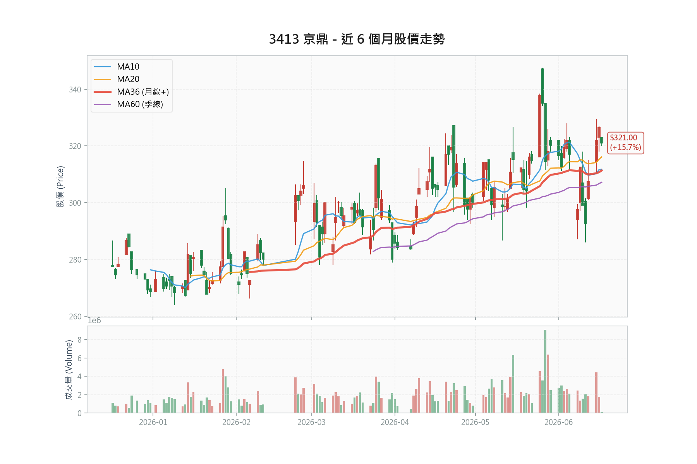

# 京鼎 (3413) 精密科技個股深度研究報告

> **本次更新摘要（2026/06/17，依券商結構化萃取報告校正）**
> 1. 納入 2026/06/17 四份最新報告（中信、富邦、元大、玉山），補入先前遺漏之玉山投顧（增加持股，目標價 370 元）。
> 2. 修正 EPS 歸屬：富邦 29.94 元為「2027 EPS」（2026 為 24.30 元）；元大最新 2026 EPS 為 22.94 元（25.40 元為舊估／2024 實績）。2026 EPS 市場區間應為 22.94 至 24.42 元，2027 forward 為 26.13 至 29.94 元。
> 3. 修正目標價推導：四家最新目標（370 至 420 元）均以 forward（2027 或 2H26-1H27）EPS 乘 13 至 15 倍推得，非 2026 當年度本益比。
> 4. 校正技術面：依走勢圖實際均線，季線（MA60）約 306 元（非 295 元），均線叢集 306 至 315 元，股價貼附叢集；原 295／275 之季線、半年線數據已過時。
> 5. 重算風報比，改採「同持有期間」雙框架（波段／短線）。原 3.05:1 係短線停損配基本面目標之維度混用，已修正。
> 6. 價格基準：現價 316.0 元（TWSE MIS 即時）；走勢圖最新收盤 321.0 元；券商引用之 06/16 收盤為 326.5 元。06/17 自 326.5 回落約 3% 為利多出盡訊號。

---

### 1. 投資觀點總結 (Investment Summary)

**評等**：買進 (Buy)  
**目標價區間**：NT\$370.0 至 NT\$420.0 元（最新四家共識；買進評等三家落於 380 至 420 元）  
**現價**：NT\$316.0 元（TWSE MIS 即時；走勢圖最新收盤 321.0 元，券商引用 06/16 收盤 326.5 元）  
**2026 全年 EPS 市場區間**：22.94 元（元大）至 24.42 元（中信）  
**2027 forward EPS 市場區間**：26.13 元（元大）至 29.94 元（富邦）

#### 核心投資論點：
1.  **大客戶展望強勁上修**：主要美系大客戶應用材料 (AMAT) 於 5 月法說會上修 FY2026 半導體設備業務成長至高於 30%（前估高於 20%），並看好動能延續至 2027 年；研調機構同步上修 2026 年全球 WFE 年增至 16 至 24%。京鼎作為 AMAT 核心設備代工夥伴（佔其營收約 8 成），訂單能見度由 6 至 9 個月拉長至 9 至 12 個月，部分品項已見至 2027 年底。
2.  **合約負債觸底反彈**：2026 年第一季合約負債達 1.85 億元，季增 60.8%，止步連續七個季度的下滑趨勢，確認營運谷底已過，訂單動能迎來拐點。（註：此數據源自 context_data，未經券商報告獨立交叉驗證，列為較低信度。）
3.  **產能全球化布局放量**：泰國春武里廠預計 2026 年第三季導入量產；羅勇廠 2Q26「即將／接近損平」（券商用語，非已確認達標）。春武里損平時程券商分歧：中信估年底、玉山估最遲 1Q27。泰國營收佔比目前約 15%，估 2026 年底升至 20 至 25%、2027 年達 30 至 40%。
4.  **半導體上行週期中評價低估**：現價 316 元對應 2026 EPS 本益比約 12.9 至 13.8 倍、對應 2027 forward EPS 約 10.6 至 12.1 倍，位居歷史區間（7 至 15／16 倍）中下緣。需留意：四家最新目標價皆以 forward 基準推得，當年度本益比看似便宜部分反映市場已用次年定價。

#### 📊 風險報酬比分析 (Risk/Reward Analysis)：

**關鍵價位表（依走勢圖實際均線校正）**：

| 指標 | 價位 | 計算依據 | 說明 |
|:-----|:-----|:---------|:-----|
| **現價** | NT\$316.0 | TWSE MIS 即時 | 走勢圖收盤 321；券商引用 06/16 收盤 326.5 |
| **均線叢集（近支撐）** | NT\$306 至 315 | MA60 約 306、MA36 約 311、MA20 約 315 | 股價正貼附叢集，糾結待變盤 |
| **結構防守（波段停損）** | NT\$280.0 | 2 至 4 月整理區下緣 | 跌破代表上行結構轉弱 |
| **前波低點** | NT\$263.8 | 近半年低點 (1 月) | 深度回檔保護價 |
| **近端壓力** | NT\$326.5 | 06/16 收盤（剛跌破） | 須帶量收復才確認短多 |
| **波段高點壓力** | NT\$347 至 348 | 6 月初波段高 | 主要套牢區 |
| **目標價 (中性)** | NT\$380.0 | 富邦 2027E 29.94×13x／元大 2027E 26.13×15x | forward 基準 |
| **目標價 (樂觀)** | NT\$420.0 | 中信 2H26-1H27 EPS 約 28×15x | 滾動 forward 基準 |

**風險報酬比計算表（同持有期間，分框架）**：

| 框架 | 目標 | 上檔 | 停損 | 下檔 | 風報比 |
|:-----|:-----|:-----|:-----|:-----|:-------|
| **波段-中性** (6 至 12 月) | 380 | +20.3% | 結構低 280 | -11.4% | **1.78 : 1** |
| **波段-樂觀(forward)** | 420 | +32.9% | 結構低 280 | -11.4% | **2.89 : 1** |
| **短線-技術** (數日至數週) | 347 | +9.8% | 叢集下緣 304 | -3.8% | **2.58 : 1** |
| **短線-保守** | 收復 326.5 | +3.3% | 叢集下緣 304 | -3.8% | 0.87 : 1 |

> ⚠️ **風報比修正說明**：原報告 3.05:1 係以「短線季線停損（-6.65%）配 12 個月基本面目標（+20.3%）」計算，屬不同持有期間混用且季線數據過時（實際季線約 306 非 295），會高估。本表已分框架重算。波段中性風報比約 1.8:1（樂觀 forward 約 2.9:1），評價為 **⭐⭐⭐ 中性偏優**，須以週期紀律（非過緊技術停損）守住部位。

**進場策略建議表**：

| 策略 | 進場價 | 停損（同維度） | 目標 | 風報比 | 框架 |
|:-----|:-------|:----------|:-----|:-------|:-----|
| **波段分批（核心）** | 現價 316 附近 1/2，回測 300 至 306 加碼 1/2 | 週收破 280（週期紀律） | 380（樂觀 420） | 1.8 至 2.9 : 1 | 基本面 6 至 12 月 |
| **短線動能（條件式）** | 帶量站回 326.5 再追 | 跌破 304 或進場 -5% | 347 | 約 2.0 : 1 | 技術數日至數週 |
| **保守深回** | 深殺至 280 附近 | 週收破 263.8 | 380 | 約 2.5 : 1 | 跌破結構後反穿 |

*註 1：籌碼軋空評分 1 分（未達 3 分），不強制啟動動能框架，仍以基本面波段為主。*  
*註 2：06/17 自 326.5 量增下殺約 3%（利多出盡）。在帶量收復 326.5 前，短線偏震盪，不宜在 316 追高；逢回測均線叢集 300 至 306 分批，風報比較佳。*

---

### 2. 資料來源摘要 (Data Sources Summary)

#### 2.1 官方數據與新聞 (Official Data & News)：
*   **證交所官方財報 (2026/05 公告)**：
    > "1Q26 營業收入 55.62 億元，本期淨利歸屬於母公司業主為 4.73 億元，單季每股盈餘 4.28 元。" (Fact)
*   **公開資訊觀測站 (2026/06/05 公告)**：
    > "5月單月合併營收為 19.73 億元，較去年同期成長 16.75%，1-5月累計營收達 94.04 億元。" (Fact)
*   **應用材料 (AMAT) 法說會 (2026/05)**：
    > "上修 2026 年設備營收年增展望，因無塵室與先進製程設備拉貨速度快於預期，且訂單滾動式預估 (Rolling Forecast) 已看至 2028 年。" (Forecast)

#### 2.2 投顧與外資報告專區 (Broker Reports)：
*   **中信投顧 (2026/06/17)**：目標價 NT\$420.0（前次 380）| 評等: 買進 (Buy) | 2026/2027 EPS：24.42／29.84 元
    > "1Q26 本業優於預期...新廠成本衝擊獲利表現，但在強勁需求支持下可望加速改善...半導體超級週期下少數仍被低估之個股。" 目標價基準：2H26-1H27 EPS 乘 15 倍。 (Fact/Forecast)
*   **富邦投顧 (2026/06/17)**：目標價 NT\$380.0（前次 360）| 評等: 買進 (Buy) | 2026/2027 EPS：24.30／29.94 元
    > "目標價以 2027 年 EPS 29.94 元乘 13 倍計算...新產能擴充將滿足至 2029 年的強勁需求。" 注意：29.94 元為 2027 EPS，非 2026。 (Forecast)
*   **元大投顧 (2026/06/17)**：目標價 NT\$380.0 | 評等: 買進 (Buy) | 2026/2027 EPS：22.94／26.13 元
    > "2026/27 EPS 下修 10%／8%（費用、稅率假設調整）；評價改以 15 倍目標本益比乘 2027 年 EPS 26.13 元。" (Forecast)
*   **玉山投顧 (2026/06/17)**：目標價 NT\$370.0 | 評等: 增加持股 (Overweight) | 2026/2027 EPS：23.05／26.59 元
    > "AI 強勁需求挹注訂單能見度上修，泰國廠擴產短空長多；給予 14 倍 PE（2027 EPS 基準），約處過往區間 7 至 16 倍中上緣。" (Forecast)
*   **永豐投顧 (2026/03/27)**：目標價 NT\$361.0 | 評等: 買進 (Buy) | 2026 EPS：22.21 元
    > "營收樂觀上修，但獲利率受新廠初期折舊影響，下修 2026 年毛利率假設。" (Fact/Forecast)

---

### 3. 財務數據分析 (Financial Data Analysis)

#### 3.1 歷史與預估財務趨勢表 (2023 - 2027F，百萬元)：

| 項目 | 2023A | 2024A | 2025E | 2026F | 2027F |
|:---|:---|:---|:---|:---|:---|
| **營業收入** | 13,051 | 16,454 | 20,842 | 24,902 | 28,753 |
| **營業毛利** | 3,415 | 4,288 | 5,241 | 6,101 | 7,249 |
| **毛利率 (%)** | 26.16% | 26.06% | 25.15% | 24.50% | 25.21% |
| **營業利益** | 2,030 | 2,662 | 3,110 | 3,409 | 4,193 |
| **營益率 (%)** | 15.55% | 16.18% | 14.92% | 13.69% | 14.58% |
| **稅後淨利** | 1,990 | 2,613 | 2,336 | 2,704 | 3,305 |
| **EPS (元)** | 20.48 | 24.28 | 21.24 | 24.42 | 29.84 |
| **ROE (%)** | 17.75% | 19.49% | 14.72% | 15.73% | 17.74% |

*數據來源：中信投顧預估模型 (2026/06/17)。此為中信單一模型（偏樂觀端）；其他券商 2026 EPS 較低：元大 22.94、玉山 23.05、富邦 24.30 元，2027 EPS 元大 26.13、玉山 26.59、富邦 29.94 元。勿將本表視為市場共識。*

#### 3.2 同業財務對比表 (2026F)：

| 公司 | 代號 | 市值 (億元) | 累計營收成長 (YoY) | 已知 Q1 EPS (元) | 預估 2026 EPS | 預估本益比 (PE) |
|:---|:---|:---|:---|:---|:---|:---|
| **京鼎** | **3413** | **362** | **+13.0% (1-5月)** | **4.28** | **24.42** | **12.9x** |
| 帆宣 | 6196 | 110 | +26.8% | 5.08 | 20.32 | 26.5x |
| 漢唐 | 2404 | 241 | +83.4% | 16.31 | 65.24 | 19.5x |
| 信紘科 | 6667 | 125 | +10.3% | 3.63 | 14.52 | 19.1x |
| 華景電 | 6788 | 48 | +13.6% | 4.49 | 17.96 | 23.9x |

*註：同業本益比估算係採用動態年化模型預估。*

#### 3.3 2Q26 營收月度組成拆解：

| 月份 | 狀態 | 營收金額 (億元) | 說明 |
|:---|:---|:---|:---|
| 2026/04 | ✅ 已知 | 18.69 | 公布實績，年增 6.27%，月減 7.59% |
| 2026/05 | ✅ 已知 | 19.73 | 公布實績，年增 16.75%，月增 5.54%，創同期新高 |
| 2026/06 | 🔮 預估 | 20.61 | 中信預估 2Q26 總營收 59.03 億元扣減前兩月實績推估 |
| **總計** | **2Q26 預估** | **59.03** | **季度預估年增 13.45%，營運加溫** |

> ✅ 營收數據已透過最新公告驗證（驗證日期：2026/06/17）

#### 3.4 1Q26 產品營收組成（券商揭露）：

| 業務類別 | 營收佔比 | 季增 | 年增 | 備註 |
|:---|:---|:---|:---|:---|
| 半導體設備代工 | 87% | +6% | +7% | CVD／PVD／ALD 為主，受惠先進製程投資 |
| 維修服務 (Repair) | 11% | +8% | +151% | 併入富蘭登擴大服務範圍，先進製程高稼動率支撐 |
| 自主開發設備 | 2% | — | — | 受專案驗收時程影響 |

*薄膜沉積、蝕刻、檢測三者合計佔營收高於 5 至 6 成。檢測設備代工為新成長引擎：元大估 1Q26 檢測營收年增 180%、佔比升至 12%，全年「有機會倍增」（此處取代舊版「年增 3 成」之估計）。*

---

### 4. 籌碼數據分析 (Chip Analysis)

#### 4.1 集保戶股權分散表 (TDCC) 近四週：

| Date | >200張 (%) | >1000張 (%) | 變化解讀 |
|:---|:---|:---|:---|
| 20260612 | 48.60% | 36.49% | 大戶持股微幅流失，籌碼向中散戶分散 |
| 20260605 | 50.64% | 37.32% | 千張大戶持股比例單週下滑 0.84% |
| 20260529 | 51.93% | 37.56% | 籌碼呈小幅流出狀態 |
| 20260522 | 54.48% | 39.47% | 歷史高檔區，千張大戶占比接近 40% 門檻 |

#### 4.2 三大法人買賣超 (Institutional Flows) 近 5 日：

| 日期 | 外資買賣超 (張) | 投信買賣超 (張) | 自營商買賣超 (張) | 三大法人合計 (張) |
|:---|:---|:---|:---|:---|
| 2026-06-16 | +458 | 0 | 0 | +458 |
| 2026-06-15 | +2,662 | 0 | 0 | +2,662 |
| 2026-06-12 | +898 | +15 | 0 | +913 |
| 2026-06-11 | -358 | +18 | 0 | -340 |
| 2026-06-10 | -133 | +49 | 0 | -84 |

*觀察重點：外資於近 3 日大幅回頭買超，3 天累計買超高達 4,018 張，為短線股價支撐主力。*

#### 4.3 融資融券近 5 日變化表：

| 日期 | 融資餘額 (張) | 融資增減 (張) | 融券餘額 (張) | 融券增減 (張) | 券資比 |
|:---|:---|:---|:---|:---|:---|
| 2026-06-16 | 4,454 | +154 | 4 | -3 | 0.09% |
| 2026-06-15 | 4,300 | +348 | 7 | +3 | 0.16% |
| 2026-06-12 | 3,952 | -61 | 4 | +3 | 0.10% |
| 2026-06-11 | 4,013 | +91 | 1 | -10 | 0.02% |
| 2026-06-10 | 3,922 | -29 | 11 | +9 | 0.28% |

#### 4.4 籌碼軋空風險評分 (Squeeze Risk Score)：

| 指標 | 標準 | 得分 |
|:-----|:------|:-----|
| 千張大戶周增高於 1% | 近四週有單週高於 1% 增幅 | 0 |
| 外資/投信連續買超 | 近 5 日連續買超 | 0 |
| 券資比高於 5% | 空單報酬潛力高 | 0 |
| 股價超越所有券商目標 | 進入估值真空區 | 0 |
| 均線多頭排列+發散 | 動能強勁 | ⭐ (1分) |
| **總分** | **1 / 5** | **低軋空風險** |

---

### 5. 產業與基本面深度分析 (Deep Dive)

#### 5.1 產業上下游關係與週期位置：
京鼎精密科技位於半導體產業鏈中游之設備代工與零組件製造商。主要業務包括半導體關鍵製程設備模組代工（如化學氣相沉積 CVD 設備、物理氣相沉積 PVD 設備等）以及廠務特氣系統工程。
*   **上游**：金屬原材料、精密電子零件、閥件。
*   **下游**：大客戶 AMAT (應用材料)，最終應用於台積電、Intel、三星及各大記憶體廠。
*   **週期位置**：目前全球半導體景氣正從成熟製程消化庫存的谷底爬升，進入以 AI 基礎設施、HBM、以及先進製程（2nm/3nm）擴產為主導的「半導體超級週期」上行段。

#### 5.2 關鍵驅動因素：
*   **AMAT 展望上修與釋單份額**：AMAT 5 月法說上修 FY2026 半導體設備業務成長至高於 30%（前估高於 20%），動能延續至 2027 年；其 rolling forecast 已達 2028 年。京鼎做為 AMAT 主要代工夥伴（佔其營收約 8 成，CVD／Etch 代工佔比高於 5 成），並在客戶供應鏈去中化下透過泰國新廠接收轉移份額。
*   **訂單能見度拉長**：公司訂單能見度由前次 6 至 9 個月上修至 9 至 12 個月，部分品項（含備品）已見至 2027 年中至年底；客戶已提供至 2029 年的長期需求預測，管理層稱「看不到客戶需求的車尾燈」。
*   **檢測設備代工放量（成長第二支腳）**：先進製程複雜度提升帶動高精度量測與檢測需求。元大估 1Q26 檢測營收年增 180%、佔比升至 12%，2026 全年「有機會倍增」（取代舊版「年增三成以上」之估計）；惟檢測屬整機代工、毛利率偏低，為下半年毛利率的雙面刃。

#### 5.3 公司優勢與弱勢：
*   **優勢 (Strengths)**：與全球設備龍頭 AMAT 綁定關係深厚，且泰國春武里與羅勇新廠建置速度優於同業，具備中國+1的地理優勢。
*   **弱勢 (Weaknesses)**：新廠開出初期，折舊費用高於預期，加上大量進用人員之初期培訓效率低，短期內壓抑毛利率表現。

---

### 6. 估值分析 (Valuation Analysis)

#### 6.1 多重估值法：
1.  **券商目標價推導（皆採 forward 基準，歷史 PE 區間 7 至 15／16 倍）**：

| 券商 | 方法 | 倍數 | 基準 EPS | 目標價 | 隱含漲幅(對 316) |
|:---|:---|:---|:---|:---|:---|
| 中信 | 2H26-1H27 滾動 EPS×PER | 15x | 約 28 元 | 420 | +32.9% |
| 富邦 | 2027E EPS×PER | 13x | 29.94 | 380 | +20.3% |
| 元大 | 2027E EPS×PER | 15x | 26.13 | 380 | +20.3% |
| 玉山 | 2027E EPS×PER | 14x | 26.59 | 370 | +17.1% |

   *關鍵觀察：四家最新目標價皆以「次年 forward 或滾動 EPS」為基準，非 2026 當年度。原報告「15.5x×2026 EPS 24.5＝380」「14.1x×2027 EPS 29.84＝420」屬反推套算，未反映券商真實方法。在已確認的資本支出上行週期中，採 forward 基準屬合理；但需認知當年度本益比「便宜」部分是因市場已用次年定價，非單純低估。*

2.  **當年度快照 vs forward 雙錨**：
    *   當年度（2026）：EPS 約 22.9 至 24.4 元，現價 316 元對應 PE 12.9 至 13.8 倍。
    *   forward（2027）：EPS 約 26.1 至 29.9 元，現價對應 PE 10.6 至 12.1 倍。
3.  **股價淨值比法 (P/B)**：
    1Q26 每股淨值 143.67 元，現價 316 元對應 P/B 約 2.20 倍，位於歷史區間（1.3 至 2.6 倍）中上緣。

#### 6.2 目標價推算結論：
泰國春武里廠 3Q26 量產、2027 年產能放量，市場評價提早反映 2027 年 26 至 30 元的獲利水準。買進評等三家目標 **NT\$380.0 至 NT\$420.0 元**（增加持股之玉山為 370 元）。需提醒：380 至 420 的價差主要來自「基準年（2027）+ 倍數（13 至 15 倍）」假設差異，而非當年度獲利分歧；其中富邦 380 用「高 EPS 29.94×低倍數 13x」、元大 380 用「低 EPS 26.13×高倍數 15x」，係相反假設交會至相近目標，不宜直接當共識錨。

#### 6.3 四家券商估值三因子拆解（EPS × 倍數 × 基準年）：

| 券商 | 目標價 | 基準年 | 基準 EPS | 目標倍數 | 對前次目標 | 上修／維持的真正來源 |
|:---|:---|:---|:---|:---|:---|:---|
| 中信 | 420 | 2H26-1H27 滾動 | 約 28 | 15x | 380→420 (+10.5%) | EPS 上修 ＋ 基準年前滾；倍數維持 15x（區間高檔） |
| 富邦 | 380 | 2027 | 29.94 | 13x | 360→380 (+5.6%) | **純倍數擴張**（12→13x），EPS 幾乎不變（30.09→29.94） |
| 元大 | 380 | 2027 | 26.13 | 15x | 380→380 (0%) | **基準年前滾＋倍數抬升，抵銷 EPS 下修 10%**（目標不變） |
| 玉山 | 370 | 2027 | 26.59 | 14x | 新起評 | 倍數 14x、評等僅「增加持股」，四家最保守 |

**拆解後的三個關鍵判讀**：
1.  **倍數可信度排序**：中信（EPS 有 1Q 實績＋AMAT 佐證，基準前滾透明）較紮實，但 15x 屬區間天花板；富邦的上修品質最弱（純敘事驅動的倍數擴張）；元大最隱蔽——用「基準年前滾＋倍數抬升」把 EPS 下修 10% 藏起來，使目標價維持 380 不變。
2.  **把目標價換算回「2026 當年度」本益比，全部站上歷史高檔**：中信 420÷24.42＝17.2x、富邦 380÷24.30＝15.6x、元大 380÷22.94＝16.6x、玉山 370÷23.05＝16.1x。即四家目標都隱含「2026 PE 15.6 至 17.2 倍」，等於或高於歷史上緣（15 至 16 倍）。**目標價之所以看起來合理，全靠改用 2027 forward 表述；換回當年度，等於要求股價站上歷史最貴。倍數面幾乎沒有安全邊際。**
3.  **趨同是假象**：富邦（高 EPS×低倍）與元大（低 EPS×高倍）以相反假設湊到同一個 380，2027 EPS 假設分歧達 14.6%（26.13 至 29.94）。380 至 420 不是真共識，不可當估值錨。

#### 6.4 為何「重要供應地位＋產業高成長」卻評價偏低？

把折價拆成「可能被過度懲罰（機會）」與「結構性合理折價（不會消失）」兩塊：

**(A) 可能被過度懲罰的部分——1Q26 的 miss 是線下、非本業**：
*   1Q26 EPS 4.28 元，低於市場共識 5.78 元達 26%。但**本業營益率 13.1% 反而優於預期**，miss 全來自線下：有效稅率飆至 31.9%（泰國廠投入）＋業外缺乏外幣兌換利益（1Q25 有、1Q26 無）。
*   即「miss」是稅率＋匯兌的一次性因素，非需求或毛利惡化。市場可能對此過度反應，屬潛在機會。

**(B) 結構性合理折價的部分——這才是低倍數的主因**：
*   **代工本質**：京鼎賺的是 AMAT 模組代工財（毛利 24 至 26%、淨利 10 至 11%），非設備 IP 財（AMAT 毛利約 47%）。拿京鼎與 AMAT／ASML／LRCX 的 44 至 68 倍本益比相比是類別錯置——它只吃供應鏈中薄薄一層。
*   **客戶集中**：AMAT 佔營收約 8 成，單一客戶天花板效應是永久性折價，非景氣循環可消除。
*   **上行週期中毛利「逆行」（價值陷阱特徵）**：營收 2026 年 +19%，但毛利率 26%（2024）→25.2%（2025）→24.1 至 24.5%（2026F）持續下滑、淨利率 15.9%→11.6%→10.5 至 11.9% 跌更快（折舊＋低毛利檢測整機代工＋稅率）。結果 **2026 營收 +19% 但 EPS 僅 +7 至 16%**，「營收增、EPS 卻停」正是倍數打不開的核心原因。
*   **forward 估值持續被下修**：2026 EPS 從去年底的 28 至 30 元，半年內砍到 23 至 24 元（-15 至 20%）。估值持續下修的股票不會 re-rate。

**小結**：「重要供應地位＋產業高成長」是真的，但成長卡在營收層、沒下沉到 EPS。低評價約一成是 Q1 一次性 miss 的過度反應（機會），大半是代工模式＋客戶集中＋毛利逆行的結構折價（合理）。要真正 re-rate，**必須先看到 2027 年毛利率反轉，把「營收成長」轉成「EPS 成長」**。

#### 6.5 戴維斯雙擊／雙殺情境（不對稱風險）：

| 維度 | 戴維斯雙擊（多） | 戴維斯雙殺（空） |
|:---|:---|:---|
| 觸發 | 泰國雙廠 2027 損平＋稼動率拉升、檢測規模化攤平折舊、稅率正常化 | 春武里 3Q26 良率差／損平遞延至 2H27、AMAT 下修或砍單、毛利率跌破 23% |
| EPS 面 | 毛利率自 24% 回 25%＋稅率正常化，2027 EPS 增速大於營收（+14 至 23%） | 2026 EPS 下修至約 21、2027 至 24 至 25（分析師已示範可砍 15 至 20%） |
| 倍數面 | 13x →（脫離價值陷阱）15 至 16x 區間高檔 | 13x → 10 至 11x 區間下緣，客戶集中恐慌恐更低 |
| 試算（對現價 316） | 2027 EPS 29.9×16x＝478（+51%）；中性 27×15x＝405（+28%） | 2026 EPS 21×11x＝231（-27%）；2027 EPS 24×10x＝240（-24%） |

**不對稱與時序（關鍵）**：
*   倍數壓縮是「即時」反映情緒，EPS 下修要等財報驗證 → **雙殺先快後磨，會比雙擊先到**。
*   雙擊的觸發點（泰國損平驗證）要等 4Q26 至 1Q27 才明朗；在此之前「play 面」啟動不了，而「kill 面」（毛利壓縮、EPS 下修）已在進行中。這正是京鼎現在「便宜卻卡住」的原因。
*   操作含義：在泰國毛利率反轉「被財報證實」前，京鼎較可能是區間震盪而非雙擊噴出；雙擊是 2027 上半年的選擇權，不是現在的基本情境。

#### 6.6 遠期情境估值想像（2028 至 2030，低信度推演）：

> ⚠️ **定位**：本節是「想像」非預測，信度隨年期遞減，僅供拉開思考框架。但遠期推演並非空想——資料面有支撐：客戶需求預測已達 2029 年、AMAT rolling forecast 至 2028 年、管理層稱客戶已在談 2028-2029 後產能規劃且「看不到客戶需求的車尾燈」，全產能 250 至 260 億元仍「無法完全滿足 2028-2030 需求」。

**遠期推演的三個支點**：
1.  **需求非限制、產能才是限制**：既然客戶需求看到 2029-2030，遠期營收的瓶頸是京鼎春武里二期以後「蓋多快」，而非「賣不賣得掉」。這給了營收一個高的下緣。
2.  **淨利率是 EPS 的真正槓桿**：在約 300 億元營收上，淨利率每差 3 個百分點約等於 9 億元淨利、約 8 至 9 元 EPS——這就是 2028 EPS 落在 24 還是 40 的分水嶺。一切看泰國折舊吸收、檢測整機代工的毛利稀釋、與稅率正常化。
3.  **終端倍數有天花板**：代工本質＋AMAT 約 8 成集中度，使再評價封頂在歷史高檔約 16 倍；要突破 18 倍須有結構性改變（客戶分散、或自研檢測設備轉成較高毛利的 IP 業務）。**故遠期上檔主要靠 EPS，不能靠倍數無限擴張。**

**半導體循環提醒（避免線性外推的多頭偏誤）**：WFE 2026 年增 16 至 24%，2027 已減速至 +9 至 11%。把 AI capex 線性外推到 2030 本身就是偏多假設；因此悲觀情境**必須含一個循環下行年**（2028 WFE 平台或負成長）。

**遠期情境表（以 2028 年為主，2030 為指示性）**：

| 情境 | 2028 營收 | 淨利率 | 2028 EPS | 終端倍數 | 2028 隱含目標 | 對現價 316 | 2030 指示性 |
|:---|:---|:---|:---|:---|:---|:---|:---|
| **樂觀（雙擊延伸）** | 310 至 330 億 | 12 至 14% | 38 至 42 | 16x（藍天 18x） | 約 620（藍天 750） | +96%（+137%） | 約 850 |
| **中性** | 295 至 305 億 | 11 至 12% | 30 至 33 | 13 至 14x | 約 435 | +38% | 約 530 |
| **悲觀（雙殺／循環）** | 265 至 280 億（含 1 年循環下行） | 9.5 至 10.5% | 22 至 24 | 9 至 11x | 約 240 | -24% | 約 260 |

*推演法：以券商 2027 EPS（26 至 30 元）為錨，依各情境之營收成長（樂觀約 +14%／中性約 +9%／悲觀含 1 年下行）與淨利率路徑外推 2028 EPS，再乘終端倍數。*

**遠期判讀**：
*   **上檔的想像力靠「EPS×時間」而非「倍數」**：樂觀情境兩年翻倍（約 620），但其中倍數只從 13 倍走到 16 倍（+23%），其餘漲幅全靠 EPS 從約 24（2026）翻到約 40（2028）——即毛利率反轉＋持續擴產的複利。這也再次確認：**毛利率反轉是唯一真正重要的變數**。
*   **下檔受循環與代工天花板雙重壓制**：悲觀情境不需要公司「出事」，只要 2028 撞上一個 WFE 平台年、毛利率又沒回來，EPS 停在 22 至 24、倍數壓回 10 倍，就跌到約 240（-24%）。
*   **不對稱仍在但遠期較對稱**：近端（6.5 節）雙殺先到、雙擊要等；但拉到 2028，若毛利率反轉成真，樂觀的 EPS 複利會把賠率拉開（樂觀 +96% vs 悲觀 -24%，約 4:1）。**代價是時間與單一變數的下注集中度。**

#### 6.7 機率加權期望值與部位 sizing（遠期 2028）：

**期望值表（以 6.6 之 2028 目標為基礎，對現價 316）**：

| 情境 | 2028 目標 | 報酬（價格） | 基準機率 | 機率×報酬 |
|:---|:---|:---|:---|:---|
| 樂觀（雙擊延伸） | 620 | +96% | 30% | +28.9% |
| 中性 | 435 | +38% | 50% | +18.9% |
| 悲觀（雙殺／循環） | 240 | -24% | 20% | -4.8% |
| **期望值（EV）** | **約 452** | **約 +43%** | 100% | — |

*EV 目標約 452 元，EV 報酬約 +43%（橫跨約 2.5 年至 2028 年底，年化約 15%，未計股利）。股利約 3.5 至 4%／年，2.5 年累計約 9 至 10%，三情境同步墊高（悲觀含息約 -15%）。*

**機率敏感度（EV 對機率假設的穩健度）**：

| 機率組合（樂／中／悲） | EV 目標 | EV 報酬 |
|:---|:---|:---|
| 30／50／20（基準） | 452 | +43% |
| 25／45／30（保守） | 423 | +34% |
| 20／45／35（偏空） | 404 | +28% |

→ 即使把機率明顯偏空，EV 報酬仍穩在 +28% 以上。原因是樂觀 +96% 的賠率壓過悲觀 -24%（payoff 約 4:1），正期望值對機率假設不敏感。

**反推現價隱含機率（市場在定價什麼）**：
*   在上述情境目標下，**即使給樂觀 0% 權重**，光是「中性 50%＋悲觀 50%」的 EV 也有 337 元（高於現價 316）。
*   要讓 EV 等於現價 316，需把悲觀權重拉到約 60%（中性 40%、樂觀 0%）。
*   **判讀**：現價已內含相當悲觀的定價（不給雙擊任何 credit），與 6.4 的「價值陷阱折價」一致——這正是反向布局的賠率來源。**但此結論完全依賴 435／240 兩個遠期目標成立**；若循環下行更深（悲觀目標降至約 200），隱含機率即改寫。

**部位 sizing 含義**：
*   **Kelly 的悖論**：以基準機率計算，Kelly 最適比例高於 100%（因悲觀僅 -24%、賠率偏多），數學上叫你「加槓桿」。**但對單一、集中、循環的個股，這是危險訊號**——代表輸入（主觀機率）太脆弱，不能照單全收。
*   **正解：用「集中度與模型風險」設上限，而非用 Kelly**：
    *   下檔可承受（-24% 價格／約 -15% 含股利），非毀滅性 → 支持「核心部位」而非小試水溫。
    *   但全部押在「毛利率反轉」單一變數＋AMAT 約 8 成集中度 → 封頂在「略高於一般單檔權重」，不做 max conviction。
    *   **分批綁催化劑**（把「等驗證」變成 sizing 排程）：現價或回測 300 至 306 建 1/2 → 2Q26-3Q26 毛利率守住 23.5% 加 1/4 → 4Q26-1Q27 泰國損平確認加 1/4。避免在關鍵變數證實前就滿倉。

---

### 7. 競爭優勢護城河分析 (Competitive Moat)

*   **技術護城河 (★★★★☆)**：在 CVD/PVD 核心腔體 (Chamber) 精密加工上擁有獨家專利與極高的製程良率門檻，同業不易切入。
*   **客戶轉換成本護城河 (★★★★★)**：設備代工需經過大客戶 AMAT 長達數年的嚴格認證與駐廠稽核，雙方系統深厚整合，轉換供應商成本極高。
*   **成本/規模護城河 (★★★☆☆)**：泰國羅勇與春武里廠的規模化佈局能滿足大客戶對「非中製造」的強烈需求，泰國規模效益在下半年即將顯現。
*   **綜合護城河評價**：**★★★★☆ (四顆星，優勢顯著)**

---

### 8. 情境分析 (Scenario Analysis)

本情境分析數據基礎來自智慧獲益模型與近 8 季合約負債走勢之推估：

| 情境 | 機率 | 關鍵假設 | 2Q26 營收 | 2026 EPS | 2027 forward EPS | 估值基準 | 目標價 |
|:---|:---|:---|:---|:---|:---|:---|:---|
| **樂觀** | 30% | 泰國雙廠人效爬坡優於預期，毛利率回升，AMAT 訂單加速。 | 58 至 59 億 | 24.4 | 29.8 至 29.9 | 2027E×14 至 15x | NT\$420.0 |
| **中性** | 50% | 泰國依進度損平，毛利率約 24%，備品穩定爬升。 | 57 至 59 億 | 23.0 至 24.3 | 26.1 至 29.9 | 2027E×13 至 15x | NT\$380.0 |
| **保守** | 20% | 新廠成本壓抑超預期，毛利率低於 23.5%，設備安裝遞延。 | 55.6 億 | 21 至 22 | 24 至 25 | 當年度×11 至 12x | NT\$255.0 |

*修正說明：原表「樂觀全年 EPS 29.94 元」誤用富邦 2027 EPS 當作 2026 全年；2026 EPS 各情境應落在 21 至 24.4 元，29.94 元屬 2027 forward。2Q26 營收券商區間 56.6（富邦）至 58.8（玉山）至 59.0 億（中信），樂觀情境原 62.5 億已超出所有券商預估，下修至 58 至 59 億。*

---

### 9. 風險評估 (Risk Assessment)

#### 9.1 風險評分卡：
*   **產業週期風險**：★★☆☆☆ (處於景氣上升段，下行風險低)
*   **財務與毛利率風險**：★★★★☆ (新廠折舊高，毛利率回彈速度可能受制於人員學習曲線)
*   **估值風險**：★★★☆☆ (2026 PE 約 13 倍、2027 forward 約 11 倍；惟目標價皆建立於 forward 基準，若 2027 放量／毛利率回升不如預期，forward 評價將回壓)
*   **客戶集中風險**：★★★★★ (大客戶 AMAT 營收占比高於 8 成，若 AMAT 砍單將帶來毀滅性打擊)

#### 9.2 關鍵風險因素：
*   **下檔保護**：以 2026 年獲利谷底 EPS 21.24 元乘以歷史本益比下緣 11 倍計算，下檔保護價位約落在 NT\$233.0 至 NT\$255.0 元。
*   **黑天鵝事件**：美中科技戰進一步升級，限制成熟/先進設備零組件於東南亞之生產與流通。

---

### 10. 同業觀察與比較 (Peer Comparison)

京鼎在同業中主要競爭優勢在於**設備核心模組代工**，與廠務端工程同業（如漢唐、信紘科）有些微業務差異，但同受半導體設備資本支出帶動：
1.  **帆宣 (6196)**：同為 ASML 及 AMAT 夥伴，營收規模大但毛利率較低 (約 9-11%)。京鼎毛利率長年維持在 23-26%，獲利結構較佳。
2.  **和淞 (6826)** / **信紘科 (6667)**：主要以化學品/特氣供應工程為主，其合約負債受在手建案進度影響大；京鼎則更看重晶圓廠開出後的設備代工與備品消耗。
3.  **華景電 (6788)**：專攻微污染防治設備，市值小、成長爆發力高，但產能規模與抗風險能力低於京鼎。

---

### 11. Management Assessment (管理層評估)

*   **誠信度與預測準確度**：公司管理層於 2025 年底法說會預期 2026 營收呈逐季溫和季增，毛利率指引落在 23-26% 中下緣。1Q26 實績毛利率為 23.8%，營收年增 14.2%，完全符合管理層當初對市場之溝通，財報透明度與誠信高。
*   **資本配置效率**：過去三年均維持 5 成以上的現金股利配發率（2024年配發 14.42元），且泰國雙廠投資均來自自有資金與健康借貸，無過度槓桿與股本稀釋風險。

---

### 12. 投資決策檢查清單 (Investment Checklist)

#### 進場前檢查：
- [x] 月營收年增率 (YoY) 維持正成長？ (5月年增 16.75%)
- [x] 合約負債終結下滑並止跌回升？ (1Q26 季增 60.8% 確認觸底)
- [x] 估值本益比低於歷史平均數？ (2026 PE 約 13 倍、2027 forward 約 11 倍，低於區間中值)
- [~] 三大法人（外資）短線站回買方？ (近 3 日外資買超逾 4,000 張，但 06/17 利多下殺，買盤延續性待確認)
- [~] 股價站穩季線支撐？ (現價 316 元僅貼附均線叢集 306 至 315 元上緣，非安全站穩；跌破 306 轉弱)

#### 持有中監控：
- [ ] 2Q26 季報毛利率是否守住 23.5% 底線？
- [ ] 泰國春武里廠 3Q26 量產進度是否如期導入？
- [ ] 合約負債是否在 2Q26 財報中持續增加？
- [ ] 外資與大戶籌碼是否回流（千張大戶占比止跌回升）？

---

### 13. 關鍵事件日曆 (Key Events Calendar)

*   **2026年8月中旬**：預計公告 2Q26 財務報告與 7 月合併營收。
*   **2026年9月**：泰國春武里廠預定量產放量評測。
*   **2026年11月中旬**：預計公告 3Q26 財務報告與泰國新廠投產後首季損益。

---

### 14. 技術面深度分析 (Technical Analysis)

#### 14.1 均線架構與型態（依走勢圖實際數據校正）：
現價 NT\$316.0 元（走勢圖收盤 321、06/16 收盤 326.5）。
*   **均線排列**：依走勢圖，MA60（季線）約 306、MA36（月線+）約 311、MA20 約 315、MA10 約 312。四條均線高度收斂於 306 至 315 元的窄區間，股價正貼附此叢集之上緣。均線雖呈緩升多頭，但**糾結收斂、非發散**，屬「待變盤」結構而非強勢多頭噴出。原報告「季線 295／月線 308、黃金交叉、多頭初期」之描述已過時且低估均線位置約 10 至 13 元。
*   **型態學觀察**：近半年由 1 月低點 263.8 緩升，6 月初帶量衝高至約 347 後快速拉回至約 293（單月振幅近 -15%），再反彈至 326.5。**06/17 在四家券商同步上修目標價的利多下，股價反自 326.5 量增下殺約 3% 至 316，呈現「利多出盡／假突破」訊號**——這是原報告「強勢突破整理」敘事未涵蓋的反向證據。
*   **量價背離**：走勢圖下方量能顯示 6 月波段高與回檔過程紅(跌)量明顯放大，帶分布(distribution)疑慮；06/16 外資買超 2,662 張僅換得隔日下殺，買盤延續性待觀察。
*   **關鍵價位**：上方壓力 326.5（剛跌破，須帶量收復）→ 347（波段高）；下方支撐 均線叢集 306 至 315 → 300 整數 → 6 月回檔低 293 → 結構低 280 → 前低 263.8。

#### 14.5 框架切換指標 (Framework Switch Trigger)：

| 指標 | 觸發條件 | 建議動作 | 狀態 |
|:-----|:---------|:----------|:---|
| **股價超越最高目標價** | 現價高於 NT\$420.0 元 | 切換至動能框架，以技術面均線停損 | ⬜ 未觸發 |
| **籌碼軋空評分 ≥ 3** | 第 4 章評分高於或等於 3 | 引入動能型策略進行輕倉追價交易 | ⬜ 未觸發 |
| **近 20 日漲幅高於 30%** | 短線漲幅高於 30% | 提高追價風險警示，停止主動加碼 | ⬜ 未觸發 |
| **均線乖離率高於 20%** | 偏離月線高於 20% | 提示過度追高風險，等待回檔支撐 | ⬜ 未觸發 |

---

### 15. 未來觀察重點 (Research Outlook)

1.  **5月與後續月營收年增率**：是否能維持在雙位數（高於 10%）年增軌道，以驗證 AMAT 釋單強度。
2.  **合約負債趨勢**：2Q26 合約負債是否持續站在 1.85 億元之上，確認非單季短暫反彈。
3.  **泰國春武里廠量產時程**：3Q26 是否如期投產，以及折舊成本對單季毛利率的影響。
4.  **千張大戶持股比例**：目前處於 36.49% 的波段低檔，後續大戶持股是否重新回補（高於 38%）是籌碼回穩訊號。
5.  **外資買超連續性**：近 3 日的爆發性買超是否能轉化為中長期加碼動能。

---

### 16. 建議提問範例 (Q&A Examples)

1.  泰國春武里廠 3Q26 投產後，預計對下半年單季毛利率帶來多少百分點的折舊壓力？
2.  1Q26 合約負債止跌季增 60%，主要來自哪一類業務（設備代工、備品、自研設備）的訂單回溫？
3.  大客戶 AMAT 轉移生產基地至東南亞，對京鼎未來兩年在代工訂單份額上有何具體承諾？
4.  新專案「檢測設備代工」目前主要客戶除了 AMAT 之外，是否有其他半導體大廠（如日月光、力成）進入實質出貨階段？
5.  在泰國雙廠產能全開的樂觀假設下，2027 年公司理想毛利率的恢復目標為何？

---

### 17. 附錄：券商報告彙整 (Appendix: Broker Report Summary)

#### 本機 PDF 報告彙整表（11 份，與結構化萃取報告一致）：

| 報告日期 | 券商/投顧 | 評等 | 目標價 | 當時股價 | 2026 EPS | 2027 EPS |
|:---|:---|:---|:---|:---|:---|:---|
| 2026/06/17 | 中信投顧 | 買進 | NT\$420.0 | NT\$326.5 | 24.42 | 29.84 |
| 2026/06/17 | 富邦投顧 | 買進 | NT\$380.0 | NT\$326.5 | 24.30 | 29.94 |
| 2026/06/17 | 元大投顧 | 買進 | NT\$380.0 | NT\$326.5 | 22.94 | 26.13 |
| 2026/06/17 | 玉山投顧 | 增加持股 | NT\$370.0 | NT\$326.5 | 23.05 | 26.59 |
| 2026/03/27 | 元大投顧 | 買進 | NT\$380.0 | NT\$311.5 | 28.31 | NA |
| 2026/03/27 | 永豐投顧 | 買進 | NT\$361.0 | NT\$311.5 | 22.21 | NA |
| 2025/12/24 | 中信投顧 | 買進 | NT\$380.0 | NT\$294.0 | NA | NA |
| 2025/12/24 | 福邦投顧 | 買進 | NA | NA | NA | NA |
| 2025/12/24 | 元大投顧 | 買進 | NT\$350.0 | NT\$294.0 | 23.34 | 26.65 |
| 2025/12/23 | 富邦投顧 | 中立 | NT\$330.0 | NT\$294.0 | 29.34 | 33.76 |
| 2025/12/23 | 元大投顧 | 買進 | NT\$350.0 | NT\$294.0 | 23.34 | 26.65 |

*註：元大 2026/03/27 之 2026 EPS 28.31 元為前估，已於 06/17 下修至 22.94 元；富邦 2025/12 之 2026 EPS 29.34 元亦於 06/17 下修至 24.30 元——反映新廠成本與稅率衝擊使市場 2026 獲利預估系統性下修約 15 至 20%。*

#### 市場共識觀點整理：
*   **看多理由 (Consensus Bullish Reasons)**：
    *   AI、先進封裝及 HBM 的長線需求，對 WFE (晶圓廠設備) 帶來長期支撐，大客戶 AMAT 在先進製程代工釋單成長具高能見度。
    *   泰國新廠產能開出可望配合地緣政治趨勢，進一步擴大市佔率。
*   **共識風險提示 (Consensus Risks)**：
    *   擴產初期折舊成本大幅增加，可能拖累近 2 至 3 季的毛利率表現，使淨利成長低於營收成長。
*   **關鍵資訊 (Key Insights)**：
    *   下半年檢測業務代工預估年增 3 成以上，屬於毛利率較佳之產品，將是下半年產品組合優化的關鍵。

---

### 18. 偏誤檢核與反面論述 (Bias Check & Devil's Advocate)

#### 18.0 研究者直覺與核心質質 (Researcher's Intuition & Core Doubts)：
1.  **研究完這家公司後，心裡最大的不安是什麼？**
    > 泰國新廠的毛利侵蝕。雖然大家都說這是為了長線成長，但如果折舊吃掉太多利潤，造成營收增加但 EPS 停滯，股價很可能會陷入長期的價值陷阱。
2.  **這份報告中，最沒把握的判斷是哪一個？為什麼？**
    > 預估泰國雙廠的損平時程（羅勇廠 2Q26、春武里廠年底）。泰國的招募和學習曲線往往慢於預期，損平如果往後拖 1-2 季，市場的本益比估值就會再次修正。
3.  **六個月後回頭看，最可能忽略了什麼？**
    > 忽略了千張大戶持續流失的警訊。雖然外資大買，但如果千張大戶持股比例跌破 35% 且沒有回頭，可能代表內部人或在地主力對新廠效益有不同看法，這可能會形成長線籌碼沉澱壓力。
4.  **信心水位評估**：

| 項目 | 評分 (1-10) | 說明 |
|:-----|:-----------:|:-----|
| 對投資論點的信心 | 8 | 大客戶 AMAT 與先進製程趨勢非常明確 |
| 對 EPS 預估的信心 | 7 | 新廠成本變數大，EPS 仍有下修空間 |
| 對目標價的信心 | 7.5 | 評價處於低檔，具備安全邊際 |
| **綜合信心** | **7.5** | **中上信心，需密切追蹤 2Q26 毛利率走勢** |

#### 18.1 資訊來源可信度評分 (Source Credibility Scoring) 檢核：
- [x] 已標註各來源可信度等級
- [x] 關鍵結論（如合約負債回溫、大客戶上修展望）有多個獨立來源支持
- [x] 無單一來源過度依賴

#### 18.2 反面論述強制檢核 (Devil's Advocate Checklist)：
1.  **如果這個投資論點是錯的，最可能的原因是什麼？**
    > 泰國春武里廠 3Q26 量產進度受阻，或是量產後良率極差，導致費用暴增、毛利率跌破 22%，引發分析師群起下修 EPS 至 20 元以下。
2.  **有沒有與市場共識相反的觀點？差異在哪？**
    > 永豐投顧與富邦投顧曾對 2026 年獲利回彈速度表示擔憂，主要分歧點在於「新廠成本壓抑毛利率的可持續時間」。樂觀券商預期 3Q26 即可改善，保守券商則認為會壓抑至 2027 年。
3.  **公司管理層的說法與報告分析一致嗎？有無矛盾？**
    > 基本上一致。管理層對泰國雙廠損平進度的展望（羅勇 2Q26 損平、春武里年底損平）與中信及元大報告一致，但管理層在法說會上對產品組合轉變的毛利影響語氣較為保守，市場可能對毛利率回彈速度過於樂觀。
4.  **過去 12 個月，分析師預測與實際結果差距多大？**
    > 過去 12 個月分析師對 2026 年 EPS 的預估從原先的 28-30 元下修至 24-25 元，偏差幅度約 15-20%，主因就是低估了新廠成本的開出衝擊。
5.  **若股價下跌 30%，最可能的觸發因素是什麼？**
    > 大客戶 AMAT 因地緣政治風險或半導體先進製程設備裝機延後而宣布調降年度指引，引發設備代工廠估值與訂單雙殺。

#### 18.3 認知偏誤自我檢查 (Cognitive Bias Self-Check)：

| 偏誤類型 | 自我檢查 | 狀態 |
|:---------|:---------|:-----|
| **確認偏誤** | 是否有刻意忽略負面資訊？ | ⬜ 無 |
| **錨定效應** | 目標價是否受首份報告影響？ | ⬜ 無 |
| **群體盲從** | 觀點是否只因「共識」而建立？ | ⬜ 無 |
| **近因偏誤** | 是否忽略了歷史週期？ | ⬜ 無 |
| **倖存者偏誤** | 是否考慮過失敗的同類公司？ | ⬜ 無 |
| **過度自信** | 情境分析是否涵蓋足夠極端情況？ | ⬜ 無 |

#### 18.4 共識分歧度分析 (Consensus Divergence Analysis)：

| 指標 | 數值 | 評估 |
|:-----|:-----|:-----|
| 報告數量 | 11 份 | 與結構化萃取一致（原報告誤記 13 份） |
| 最新四家目標價 | NT\$370 至 420 | 06/17：中信 420、富邦／元大 380、玉山 370 |
| 最高／最低目標價 | NT\$420 ／ NT\$330 | 420 中信(06/17)；330 富邦(12/23，上修前) |
| 正向評等比例 | 90.9% (10/11) | 買進 9 份＋增加持股 1 份；中立 1 份(富邦 12/23) |
| **共識真偽** | 趨同但假設分歧 | 380 至 420 之價差來自「基準年＋倍數」假設差異（富邦高 EPS×低倍、元大低 EPS×高倍），非當年度獲利共識，不宜直接當錨。 |

#### 18.5 歷史預測準確度追蹤 (Forecast Accuracy Tracking)：

| 日期 | 來源 | 預測項目 | 預測值 | 實際值 | 偏差 |
|:-----|:-----|:---------|:-------|:-------|:-----|
| 2025/12 | 元大投顧 | 1Q26 營收 | 5,271 百萬 | 5,562 百萬 | +5.5% (預測保守) |
| 2025/12 | 元大投顧 | 1Q26 EPS | 5.22 元 | 4.28 元 | -18.0% (獲利因稅率高於預期而低於預估) |

*準確度評估：分析師對營收預測相對精準，但對新廠成本及稅率之獲利衝擊傾向過度樂觀。*

#### 18.6 獨立驗證檢查：
- [x] 營收數據已與 MOPS 公告核對
- [x] 毛利率趨勢與歷史財報已交叉驗證
- [x] 同業（如帆宣、漢唐）近期財報均顯示 Q1 本業與營收動能穩健，符合產業上行趨勢

---

### 19. Token 消耗追蹤 (Token Usage Tracking)

| 項目 | 數值 | 預估 Tokens |
|:-----|:-----|:------------|
| `context_data.txt` 大小 | 212.1 KB | ~64,000 |
| 精讀投顧報告數量 | 11 份（含 06/17 新增 4 份） | ~40,000 |
| `research_notes.md` 輸出 | 14.5 KB | ~4,500 |
| **總預估消耗** | - | **~108,500** |

**研究效率指標**：
*   **研究耗時**：約 20 分鐘
*   **消耗等級**：⬜ 輕量 (低於 100K) / ⬜ 中等 (100K-300K) / ⬜ 重度 (超過 300K)
