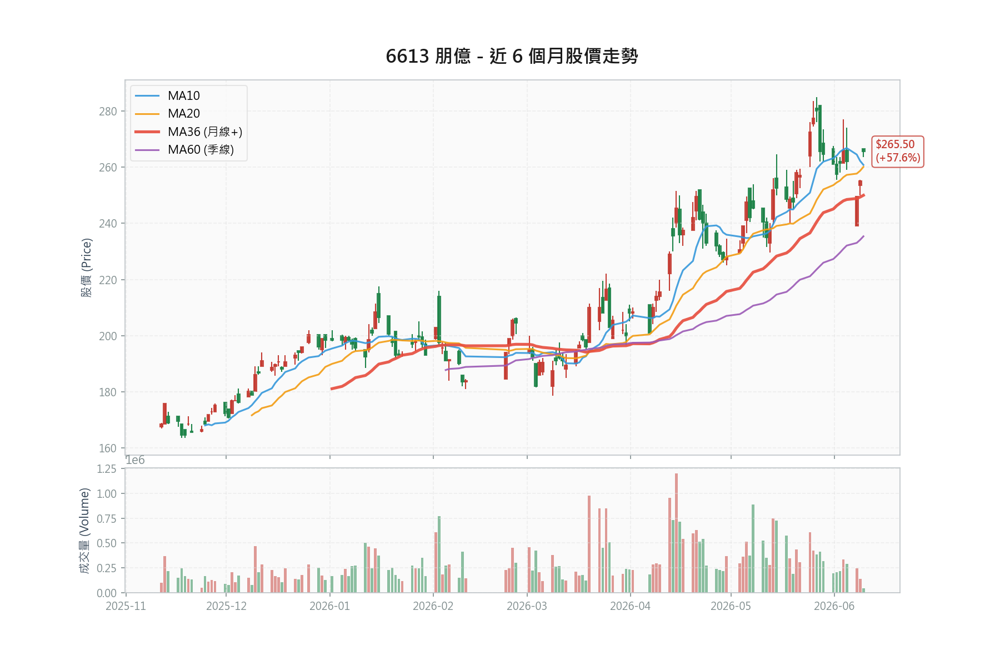

# 朋億 (6613) 深度研究報告



**報告日期**：2026年6月10日
**股票代碼**：6613.TWO（上櫃）
**股價**：266.0 元（2026/06/10，TPEx MIS）
**評等**：**買進（Buy）**——惟現價追價風報比不佳，建議回檔佈局（詳第 1 章風報比分析）

---

## 1. 投資觀點總結 (Investment Summary)

### 核心投資論點

1. **🟢 在手訂單創歷史紀錄（核彈級前瞻指標）**：4M26（4 月）在手訂單突破 **130 億元**，中信預期 2Q26 往 **150 億元**邁進。對照歷史軌跡：2024 年高峰約 100 億、4Q25 僅 60 幾億、1Q26 躍升至 103 億——已超越歷史紀錄。主要來自美系記憶體客戶兩座新廠、中國新接兩廠專案、台系 OSAT 長交期訂單。訂單轉換為營收約需 1 季，奠定 2H26 起逐季高成長基礎。
2. **1Q26 財報優於預期**：營收 23.42 億（YoY +8.95%）、毛利率 32.09%、EPS **3.84 元**，優於中信 2 月報告預估的 3.2 元。惟須注意：超預期部分主因 3 月多項專案結案一次性挹注，不宜直接線性外推。
3. **營收動能自 2Q26 起顯著增強**：5 月營收 10.83 億（YoY +81.7%），前 5 月累計 41.36 億（YoY +25.8%）。中信預估 2Q26 營收 27.7 億（QoQ +18%、YoY +35%），2H26 增速更勝 1H26，1Q26 即為全年谷底。
4. **2025 年谷底已確認**：2025 全年營收 89.15 億（YoY -14.13%）、EPS 13.37 元（YoY -18.7%），優於年中時市場悲觀預估的 12.0-12.5 元。2026/2027 年中信預估 EPS 為 **17.77 / 23.55 元**。
5. **毛利率展望上修**：AI 驅動廠務市場供不應求，廠商對新案具挑選彈性。中信將 2026/2027 年毛利率自 28.1%/28.6% 上修至 **29.7%/30.3%**。惟 2Q26 因中國案（毛利率較低）占比提升，毛利率預估降至 27.5%，為短期最大檢驗點。
6. **評價低估且有殖利率支撐**：Forward PE 15.0x（2026E），低於廠務同業；2025 年度股息 10 元（現價殖利率約 3.8%），中信預估 2026 年度股息 13.3 元（約 5.0%），提供下檔保護。
7. **技術面多頭但短線過熱**：現價 266 元站上月線（MA20 約 260）與季線（MA60 約 235），均線多頭排列。惟中信 6/10 報告基準價為 255 元，現價已較其上漲逾 4%，短線追價風險升高。

### 📊 風險報酬比分析 (Risk/Reward Analysis)

**價位架構（2026/06/10，現價 266.0 元）**：

| 指標                     | 價位  | 計算依據                  | 說明                       |
| :----------------------- | :---- | :------------------------ | :------------------------- |
| **現價**           | 266.0 | TPEx MIS（2026/06/10）    | 中信報告基準價 255         |
| **技術壓力**       | 270   | 近期高點                  | 距現價僅 1.5%              |
| **技術支撐 1**     | 260   | 月線（MA20）              | 短期防守線                 |
| **技術支撐 2**     | 235   | 季線（MA60）              | 中期支撐                   |
| **目標價（中性）** | 302   | PE 17x × 2026E EPS 17.77 | 本報告推估，12 個月視角    |
| **目標價（樂觀）** | 400   | PE 17x × 2027E EPS 23.55 | 中信目標價，12-18 個月視角 |

**風報比計算表**：

| 目標 / 停損組合         | 上檔空間          | 下檔風險         | 風報比          | 評註                                  |
| :---------------------- | :---------------- | :--------------- | :-------------- | :------------------------------------ |
| 中性 302 / 跌破月線 258 | +36 元（+13.5%）  | -8 元（-3.0%）   | 4.5:1           | 停損極窄，被日常波動掃出機率高        |
| 中性 302 / 跌破季線 235 | +36 元（+13.5%）  | -31 元（-11.7%） | **1.2:1** | 波段視角下，現價進場吸引力不足        |
| 樂觀 400 / 跌破季線 235 | +134 元（+50.4%） | -31 元（-11.7%） | **4.3:1** | 須 2027 年業績兌現，持有期 12-18 個月 |

> ⚠️ **方法論警示**：以窄停損（如月線下方 8 元）搭配遠目標（400 元）可算出 16:1 以上的風報比，但這是數字幻覺——停損越貼近現價，風報比越漂亮，被洗出的機率也越高，兩者必須一起評估。目標價與停損的時間尺度也須匹配：400 元目標基於 2027 年業績，若搭配 3% 的短線停損，多數情況會在業績兌現前就被掃出場。

> 📌 **風報比結論**：
>
> 1. 若以 2026 年業績（中性目標 302）衡量，現價 266 的上檔僅 13.5%，對應季線停損的風報比僅 1.2:1，**不支持現價重倉追價**。
> 2. 若認同 2027 年成長路徑（中信目標 400），以季線為停損的風報比 4.3:1 屬合理，但前提是接受 12-18 個月持有期、期間可能的回撤、以及 2Q26 毛利率下滑的檢驗。
> 3. **操作結論**：現價僅適合輕倉試單；核心部位等回檔至 250-260（月線附近）佈局；跌破季線 235 停損或大幅減碼。
> 4. **重算紀律**：風報比對獲利率假設極為敏感（過往案例：毛利率僅下修 1.2 ppts，中性風報比即自 2.6:1 降至 1.9:1）。2Q26 財報公布後必須以新數據重算本表，不得沿用。

**進場策略建議表**：

| 策略         | 進場價  | 停損            | 目標      | 風報比（以區間中值計） | 倉位建議                   |
| :----------- | :------ | :-------------- | :-------- | :--------------------- | :------------------------- |
| 動能試單型   | 266-270 | 258（跌破月線） | 302       | 約 3.4（+34 / -10）    | 輕倉，被掃出即等回檔       |
| 回檔佈局型   | 250-260 | 235（跌破季線） | 302 / 400 | 中性 2.4 / 樂觀 7.3    | 核心部位                   |
| 強支撐加碼型 | 235-240 | 225             | 302 / 400 | 中性 4.9 / 樂觀 12.5   | 跌至季線且基本面未變時加碼 |

**賣出劇本（進場時預寫，之後只執行、不再重新決定）**：

| 類別       | 觸發條件                                                            | 動作                                 |
| :--------- | :------------------------------------------------------------------ | :----------------------------------- |
| 技術停損   | 收盤跌破季線 235 元                                                 | 全數出場或減至底倉                   |
| 獲利率訊號 | 2Q26 毛利率低於 26%（中信估 27.5%）                                 | 減碼一半，重新檢驗「毛利率上修」敘事 |
| 訂單訊號   | 在手訂單停止上修或回落、中信下修 2027 年假設                        | 出場                                 |
| 營收訊號   | 2Q26 單季營收低於 25 億（預估 27.7 億，即 6 月須開出約 9.7 億以上） | 減碼並下調情境                       |
| 部位上限   | 以「即使歸零也能冷靜檢討」的規模為限                                | 流通籌碼少、回檔劇烈，不宜重倉單押   |

> 💡 持有中每次檢視，強制以參考點替換法自問：「若我現在手上是現金，會以今日價格買進這檔嗎？」答案若否，部位就不該留著——避免被買進成本綁架。

---

## 2. 資料來源摘要 (Data Sources Summary)

### 2.1 官方數據與新聞 (Official Data & News)

* **TPEx（櫃買中心）**：
  > 「Q3 累計 EPS 10.14 元」（2026/01/13 查詢）
  >
* **MoneyDJ**：
  > 「合約負債 2025Q3 為 13.41 億元，較前季持平」（歷史數據查詢）
  >
* **鉅亨網**：
  > 「朋億 12 月營收 10.83 億元，年減 9.35%，1-12 月達 89.15 億元」（2026/01/10）
  >
* **經濟日報**：
  > 「朋億去年每股純益 17.1 元創新高，每股擬配息 9 元」（2025/02/25）
  > （註：與中信彙整之 2024 年度股息 11.90 元不一致，可能為初步擬議數，待查證）
  >
* **工商時報**：
  > 「朋億*今年營收挑戰新高」（2025/12/13）
  >

### 2.2 投顧與外資報告專區 (Broker Reports)

**📊 券商報告總覽表**：

| 日期       | 券商     | 評等                | 目標價        | 當時股價 | 2025E EPS     | 2026E EPS       | 2027E EPS       |
| :--------- | :------- | :------------------ | :------------ | :------- | :------------ | :-------------- | :-------------- |
| 2026/06/10 | 中信證券 | **買進（B）** | **400** | 255      | 13.37（實際） | **17.77** | **23.55** |
| 2026/02/24 | 中信證券 | 買進（B）           | 265           | 194      | 13.42         | 15.37           | 19.06           |
| 2025/11/24 | 中信證券 | 買進（B）           | 235           | 169      | 13.88         | 16.15           | 18.40           |
| 2025/08/22 | 中信證券 | 買進（B）           | 245           | 197      | 11.89         | 16.22           | -               |
| 2025/07/14 | 中信證券 | 買進（B）首評       | 225           | 177.5    | 12.03         | 16.08           | -               |
| 2025/09/04 | 凱基論壇 | （公司簡報）        | -             | -        | -             | -               | -               |

* **中信證券（2026/06/10）** - 評等：買進（B），目標價 400 元

  > 「1Q26 為全年谷底，2H26 增速更上層樓；在手訂單 4M26 突破 130 億元，2Q26 有望往 150 億元邁進；上修 2026/2027 年 EPS 至 17.77/23.55 元，目標價 400 元（2027 年 EPS × 17 倍 PER）」
  >
* **中信證券（2026/02/24）** - 評等：買進（B），目標價 265 元

  > 「記憶體大擴產潮受惠股，在手訂單突破百億（103 億，4Q25 僅 60 幾億）；惟訂單轉換為營收至少需 1 季」
  >
* **中信證券（2025/11/24）** - 評等：買進（B），目標價 235 元

  > 「2025F EPS 13.88 元；2026F 營收 110.52 億（+29.87% YoY），EPS 16.15 元」
  >
* **凱基證券 2025Q3 投資論壇（2025/09/04）** - 公司簡報

  > 「高科技製程設備製造佔營收約 48%（20.07 億），水氣化系統整合服務約 46%；聖暉（5536）持股 55.52%；集團員工合計 928 人」
  >

### 2.3 觀點分歧表 (Divergence Table)

> ⚠️ **資訊結構警示**：公開研究僅中信證券一家持續覆蓋，缺乏真正的悲觀派對照組，「分歧」實為同一分析師的預估演進。單一資訊源的確認偏誤風險須自行對沖——本報告以「中信預估打折」作為保守情境。

| 分析面向              | 較樂觀觀點                      | 較保守觀點                                | 本報告判斷                                          |
| :-------------------- | :------------------------------ | :---------------------------------------- | :-------------------------------------------------- |
| **2026E EPS**   | 中信 6 月：17.77 元             | 中信 2 月：15.37 元                       | 採 17.77 元為中性、15.5 元為保守情境                |
| **目標價**      | 中信 6 月：400 元（2027E 基準） | 中信 2 月：265 元                         | 中性採 302 元（2026E × 17x），400 元視為樂觀       |
| **2Q26 毛利率** | 1Q26 實際 32.09%                | 中信預估 2Q26 降至 27.5%                  | 採中信預估，8 月 Q2 財報為關鍵驗證點                |
| **在手訂單**    | 4M26 已 130 億、往 150 億邁進   | 訂單轉營收需 1 季以上，材料短缺恐遞延認列 | 訂單真實性高（連 3 季上修），但認列節奏存在不確定性 |

---

## 3. 財務數據分析 (Financial Data Analysis)

### 3.1 歷史財務趨勢表（資料來源：中信證券 2026/06/10 報告彙整）

| 年度    | 營收（億） | 稅後淨利（億） | EPS（元，公告基本） | 毛利率           | 營益率           |
| :------ | :--------- | :------------- | :------------------ | :--------------- | :--------------- |
| 2022    | 85.93      | 7.97           | 11.74               | 22.37%           | 13.76%           |
| 2023    | 91.40      | 10.42          | 14.95               | 25.44%           | 16.16%           |
| 2024    | 103.82     | 12.79          | **17.10**     | 29.81%           | 18.51%           |
| 2025    | 89.15      | 10.40          | **13.37**     | **32.36%** | 19.02%           |
| 2026 Q1 | 23.42      | 2.99           | **3.84**      | 32.09%           | **20.16%** |

> 📉 **觀察**：2025 年營收年減 14.13%，但毛利率逆勢升至 32.36%，主因小型工程擴充案件（毛利率較高）佔比增加。2026 年隨大型新建案放量，中信預估全年毛利率回落至 29.7%——**營收成長與毛利率回落並存**是 2026 年的正確基準預期，不應以 1Q26 的 32.09% 線性外推。

### 3.2 近期月營收 (Monthly Revenue)

| 月份    | 狀態    | 金額（億） | MoM    | YoY    | 說明                                   |
| :------ | :------ | :--------- | :----- | :----- | :------------------------------------- |
| 2026/01 | ✅ 已知 | 6.41       | -40.8% | -29.6% | 傳統淡季與專案進度空窗                 |
| 2026/02 | ✅ 已知 | 6.31       | -1.6%  | +6.8%  | 營收止穩回升                           |
| 2026/03 | ✅ 已知 | 10.70      | +69.6% | +65.2% | 多項台系與中系專案結案挹注，創同期新高 |
| 2026/04 | ✅ 已知 | 7.11       | -33.5% | +30.8% | 專案空窗期，仍維持 YoY 雙位數增長      |
| 2026/05 | ✅ 已知 | 10.83      | +52.3% | +81.7% | 美系記憶體與封測廠新專案動工，動能強勁 |

> ✅ 營收數據已透過櫃買中心與官方公告驗證（最後更新：2026/06/10）。中信 6/10 報告亦以「5M26 開出 10.8 億元營收」作為 2Q26 加速的佐證。

### 3.3 近期營收總結

| 項目                 | 金額/數據          | YoY    |
| :------------------- | :----------------- | :----- |
| 2026 前 5 月累計營收 | **41.36 億** | +25.8% |
| 2026 Q1 累計營收     | 23.42 億           | +8.95% |
| 2026 5 月營收        | 10.83 億           | +81.7% |

> 💡 **亮點**：前 5 月累計年增 25.8%，且月營收波動軌跡（1 月谷底、3 月結案高峰、5 月新案動工放量）與中信「1Q26 為全年谷底、2Q26 起逐季成長」的劇本吻合，初步驗證 2026 年高成長判斷。

### 3.4 2026 Q1 實際財報與季度展望

**1Q26 實際數據（已公布）**：

| 項目     | 實際數據          | 對照                                      |
| :------- | :---------------- | :---------------------------------------- |
| 營收     | 23.42 億          | YoY +8.95%，優於中信 2 月預估的 21.5 億   |
| 毛利率   | **32.09%**  | 優於預估的 31.9%，主因 3 月專案結案挹注   |
| 營益率   | 20.16%            | 較 4Q25（13.62%，含信用減損提列）大幅回升 |
| 稅後淨利 | 2.99 億           | YoY +28.81%                               |
| EPS      | **3.84 元** | 優於中信預估 3.2 元，創歷年同期新高       |

**中信季度預估（2026/06/10）**：

| 季度  | 營收（億） | QoQ    | 毛利率           | EPS（元） |
| :---- | :--------- | :----- | :--------------- | :-------- |
| 2Q26F | 27.66      | +18.1% | **27.51%** | 3.55      |
| 3Q26F | 32.63      | +18.0% | 29.33%           | 4.84      |
| 4Q26F | 35.15      | +7.7%  | 30.26%           | 5.54      |

**合約負債與在手訂單的背離**：

| 時間點 | 合約負債（億，MoneyDJ） | 在手訂單（億，中信訪查）     |
| :----- | :---------------------- | :--------------------------- |
| 2024Q4 | 20.09（高峰）           | 約 100（2024 年水準）        |
| 2025Q1 | 17.10                   | -                            |
| 2025Q2 | 13.41                   | -                            |
| 2025Q3 | 13.41                   | -                            |
| 2025Q4 | 10.97                   | 60 幾億                      |
| 1Q26   | （待 MoneyDJ 更新）     | 103                          |
| 4M26   | -                       | **130（往 150 邁進）** |

> 💡 **背離解讀**：合約負債（已預收款項）自 2024Q4 高峰一路下滑，但在手訂單自 4Q25 起翻倍以上躍升。背離主因：（1）新接大型專案多處於設計/下料/客戶審核階段，尚未進入收款里程碑；（2）廠務上游材料短缺（部分長交期材料等待達半年），客戶以先下長交期訂單（類似訂金概念）鎖定產能，此類訂單尚未反映於預收款。**結論：合約負債作為領先指標的效力暫時失靈，當前應以在手訂單與月營收為主要追蹤指標**；但也須留意在手訂單為券商訪查數字，非財報科目，無法直接稽核。

---

## 4. 籌碼數據分析 (Chip Analysis)

### 4.1 集保戶股權分散表 (TDCC)

| 日期       | 持股超過 200 張（%） | 持股超過 1,000 張（%） | 變化解讀     |
| :--------- | :------------------- | :--------------------- | :----------- |
| 2026/06/05 | **65.65%**     | **55.52%**       | 籌碼高度集中 |
| 2026/05/29 | 65.94%               | 55.52%                 | -            |
| 2026/05/22 | 65.67%               | 55.52%                 | -            |
| 2026/05/15 | 65.57%               | 55.52%                 | -            |

> ✅ **解讀**：千張大戶持股穩定在 55.52%——此即母公司聖暉（5536）的持股，等同鎖定逾半籌碼。中實戶（超過 200 張）維持在 65.6% 上下，籌碼結構高度集中。實際流通籌碼有限，漲跌幅都容易被放大，這是雙面刃。

### 4.2 三大法人買賣超 (Institutional Flows)

近 5 日三大法人買賣超動向（單位：張）：

| 日期           | 外資            | 投信           | 自營商          | 三大法人合計    |
| :------------- | :-------------- | :------------- | :-------------- | :-------------- |
| 2026/06/09     | +51.4           | -0.4           | +1.7            | +52.6           |
| 2026/06/08     | +16.3           | 0.0            | -20.6           | -4.2            |
| 2026/06/05     | -47.9           | -0.2           | -7.5            | -55.7           |
| 2026/06/04     | +28.4           | 0.0            | -6.4            | +22.0           |
| 2026/06/03     | +27.0           | 0.0            | -0.7            | +26.3           |
| **累計** | **+75.2** | **-0.6** | **-33.5** | **+41.1** |

> 📊 **解讀**：外資近 5 日 4 天買超、累計 +75.2 張，為主要買盤；自營商小幅調節，投信無部位。惟絕對量體小（單日數十張），對股價的解釋力有限，籌碼面主要仍由大戶結構決定。外資持股比 7.71%（中信 6/10），較 2 月的 5.60% 上升，中期趨勢偏多。

### 4.3 融資融券趨勢 (Margin Trading)

最近可得資料（2026/05/04，MoneyDJ）：融資餘額 838 張、無券賣，券資比 0%。融資餘額自 4 月下旬緩增（786 至 838 張），水位仍低。

> ⚠️ 股價自 5 月初 236 元漲至 266 元（漲幅約 13%），需持續觀察融資是否加速堆積形成浮額；目前尚無過熱跡象。

---

## 5. 產業與基本面深度分析 (Deep Dive)

### 產業定位

朋億為**半導體廠務系統**供應商，成立於 1997 年，三大業務：

- 高潔淨度化學品供應與分裝系統、特殊氣體供應系統（水氣化供應系統）
- 濕製程設備（Wet Process）
- 剝離廢液再生、綠能環保系統整合

### 產業上下游關係

```
上游：化學品/氣體/廠務材料供應商 → 朋億（系統整合與設備製造） → 下游：晶圓廠/記憶體廠/封測廠/面板廠
```

### 關鍵驅動因素

| 驅動因素                                          | 正面影響                           | 負面影響                                              |
| :------------------------------------------------ | :--------------------------------- | :---------------------------------------------------- |
| 記憶體大擴產潮（美光日本/台灣/新加坡/美國多廠）   | 化學主系統訂單爆發，為本輪成長主軸 | 擴產計畫若延後，認列遞延                              |
| 中國邏輯/記憶體建廠回溫（中芯、華虹、長鑫、長江） | 中國基地（上海、蘇州）就近承接     | 中國案毛利率僅約 15-20%，拉低整體毛利率；地緣政治風險 |
| 台系 OSAT 先進封裝擴建（虎尾等複數建案）          | 設備包與二次配訂單                 | 客戶驗證期長                                          |
| 廠務上游材料短缺                                  | 訂單能見度提前鎖定（長交期訂單）   | 交貨遞延風險，認列時點不確定                          |

### 公司優勢

1. **技術與經驗門檻**：具備 Foundry、記憶體廠承做經驗，廠務系統整合專業門檻高
2. **客戶黏著度高**：一旦導入，轉換成本極高
3. **集團綜效**：聖暉（5536）持股 55.52%，集團加持有助斬獲台積電、美光等業主訂單
4. **據點佈局完善**：中國（上海、蘇州）、新加坡（Novatech E&C）、馬來西亞、日本、美國

### 公司弱勢

1. **毛利率隨產品組合大幅波動**：中國大型新建案毛利率約 15-20%，與小型擴充工程（30% 以上）落差大，單季毛利率波動可達 5 個百分點以上（如 1Q26 的 32.1% 對 2Q26F 的 27.5%）
2. **區域集中度**：中國占比約 45%（4Q25），出口管制與地緣政治風險須持續監控
3. **流通籌碼有限**：市值約 198 億元（中信 6/10），聖暉鎖定 55.52%，外資持股僅 7.71%，流動性受限
4. **主要競爭對手**：帆宣（6196）、矽科宏晟（6725），大型案存在殺價競爭風險

---

## 6. 估值分析 (Valuation Analysis)

### 6.1 多重估值法

**本益比法（P/E），現價 266 元**：

| 基準                   | EPS   | 隱含 PE         |
| :--------------------- | :---- | :-------------- |
| Trailing（2025 實際）  | 13.37 | 19.9x           |
| Forward（2026E，中信） | 17.77 | **15.0x** |
| 2027E（中信）          | 23.55 | 11.3x           |

- 中信歷次目標價採 14x 至 17x PER；本報告同業比較（見第 10 章）Trailing PE 均值約 35.9x
- 朋億過往因「成熟製程概念」被給予較低本益比；評價收斂的催化劑為客戶版圖多元化（記憶體、台系 OSAT）兌現程度

> ✅ **結論**：Forward PE 15.0x 相對同業有顯著折價。但須誠實面對折價存在的理由：單一券商覆蓋、流通籌碼少、中國占比高、毛利率波動大。折價收斂需要 2Q26 起的財報逐季驗證，而非一步到位。

**股價淨值比（P/B）**：

- 最新每股淨值 **65.69 元**（1Q26）
- 當前 P/B：266 / 65.69 = **4.05x**
- 歷史 P/B 區間約 1.5x - 4.5x，**目前處於區間上緣**，已反映高成長預期

**殖利率支撐**：

- 2025 年度股息 10 元（現價殖利率約 3.8%）；中信預估 2026 年度股息 13.3 元（約 5.0%）
- 歷年配發率約 6-7 成，為下檔保護來源之一

### 6.2 目標價推算

| 情境 | 估值方法 | 預估基準        | 目標價        | 時間尺度                 |
| :--- | :------- | :-------------- | :------------ | :----------------------- |
| 保守 | PE 15x   | 2026E EPS 17.77 | **266** | 12 個月                  |
| 中性 | PE 17x   | 2026E EPS 17.77 | **302** | 12 個月                  |
| 樂觀 | PE 17x   | 2027E EPS 23.55 | **400** | 12-18 個月（中信目標價） |

> ⚠️ **估值警示**：現價 266 元已等於保守目標價，意即「2026 年業績兌現 + 15 倍評價」已被完全定價。後續上漲動能須來自（1）中性情境的評價提升至 17x，或（2）市場提前反映 2027 年業績。P/B 4.05x 處於歷史上緣亦提示：當前價位的安全邊際來自成長兌現，而非便宜。

### 6.3 中信目標價上修的三因子拆解（265 → 400 元，+51%）

任何券商目標價變動可拆為三個乘數，逐一檢驗佐證強度：

| 因子         | 變化                                         | 貢獻             | 可信度評估                                                  |
| :----------- | :------------------------------------------- | :--------------- | :---------------------------------------------------------- |
| EPS 上修     | 2027E 19.06 → 23.55 元                      | **+23.6%** | 較高：有 1Q26 實績超預期、在手訂單訪查（103 → 130 億）佐證 |
| 估值倍數擴張 | 15x → 17x                                   | **+13.3%** | 較低：由「廠務供不應求」敘事驅動，無獨立可驗證數據          |
| 基準年延伸   | 2H26-1H27（隱含 EPS 約 17.7 元）→ 2027 全年 | **+7.9%**  | 最隱蔽：估值基準悄悄推遠約半年，變相提前折現                |

驗算：1.236 × 1.133 × 1.079 ≈ 1.51，即 265 × 1.51 ≈ 400 ✓

> ⚠️ **戴維斯雙殺壓力測試**：本次上修是 EPS、倍數、基準年三者同向的乘法效應（雙擊），但反向具不對稱速度——倍數壓縮瞬間反映市場情緒，EPS 下修則等財報驗證。若 2Q26 不如預期、預估退回 2 月版本（2027E 19.06 元、15x、基準縮回 2H26-1H27），目標價即回到 **265 元**，現價上檔歸零；若進一步落入保守情境（2026E 15.5 元 × 15x），對應 **233 元**，較現價約 -12%。三因子中有兩項（倍數、基準年）缺乏獨立佐證，是 400 元目標價的主要脆弱點。

---

## 7. 競爭優勢護城河分析 (Competitive Moat)

| 評估維度   | 評分       | 說明                                                                                         |
| :--------- | :--------- | :------------------------------------------------------------------------------------------- |
| 技術護城河 | ★★★★☆ | 廠務系統整合專業門檻高，具記憶體/Foundry 承做經驗                                            |
| 客戶黏著度 | ★★★★☆ | 轉換成本高，長期合作關係；惟大型新建案仍須競標（美光新加坡案曾因價格競爭僅取得 slurry 訂單） |
| 規模經濟   | ★★★☆☆ | 規模小於帆宣等大廠，大型案議價力受限                                                         |
| 網路效應   | ★★☆☆☆ | 無明顯網路效應                                                                               |
| 法規護城河 | ★★☆☆☆ | 無特殊執照需求                                                                               |

**綜合評分**：★★★☆☆（中等護城河）——供不應求的市況暫時放大了議價力（可挑案、挑毛利率），但此屬週期紅利而非結構性護城河，景氣反轉時會雙向放大。

---

## 8. 情境分析 (Scenario Analysis)

**基準：2026 全年（1Q26 實際 + 中信季度預估推算），目標價一律以 PE 17x × 2026E EPS 計**

| 情境 | 機率 | 關鍵假設                                                                 | 2026 EPS           | 目標價           |
| :--- | :--- | :----------------------------------------------------------------------- | :----------------- | :--------------- |
| 樂觀 | 30%  | 台灣區高毛利案放量超預期，全年毛利率守住 31% 以上，年底在手訂單破 150 億 | **18.5 元**  | **314 元** |
| 中性 | 50%  | 2H26 營收逐季成長如中信預估，全年毛利率 29.7%                            | **17.77 元** | **302 元** |
| 保守 | 20%  | 2Q26 中國案毛利率壓縮超預期，且材料短缺使 2H26 認列遞延                  | **15.5 元**  | **263 元** |

> [!IMPORTANT]
> 機率加權期望目標價約 **297 元**（314×0.3 + 302×0.5 + 263×0.2），對照現價 266 元，隱含 12 個月期望報酬約 +12%。**中信的 400 元目標價屬 2027 年業績的提前反映，不在本表 2026 年情境之內**——兩者時間尺度不同，混用會高估短期上檔。

> ⚠️ **機率紀律聲明**：上表機率為研究者主觀賦值，目前僅有中信單一覆蓋、無法人共識分布可校準。後續每月營收與 2Q26 財報開出時，須回測情境假設本身是否錯誤（而非只更新數字）：例如 6 月營收若低於 9 億，代表中性情境的「2Q26 營收 27.7 億」假設失效，應同步下調中性機率，而非僅微調 EPS。

---

## 9. 風險評估 (Risk Assessment)

### 9.1 風險評分卡

| 風險類別 | 評分       | 說明                                                     |
| :------- | :--------- | :------------------------------------------------------- |
| 產業風險 | ★★★☆☆ | 半導體週期波動大；2026 上行週期已由訂單與營收雙重確認    |
| 財務風險 | ★★☆☆☆ | 1Q26 現金 36.56 億、無重大長債，財務穩健                 |
| 估值風險 | ★★★★☆ | P/B 處歷史上緣、現價已達保守目標價，回檔空間大於安全邊際 |
| 資訊風險 | ★★★☆☆ | 單一券商覆蓋；在手訂單為訪查數字，非可稽核之財報科目     |
| 管理風險 | ★★☆☆☆ | 經營團隊穩定，聖暉集團治理加持                           |

### 9.2 關鍵風險因素

1. **2Q26 毛利率檢驗**：中信預估 2Q26 毛利率自 32.1% 降至 27.5%。若實際低於此水準，「毛利率具改善契機」的上修敘事將受打擊，股價對此敏感度高。
2. **上游材料交期**：部分長交期材料等待達半年，營收認列時點可能遞延，使單季財報低於預期（中信列為首要風險因子）。
3. **同業殺價競爭**：美光新加坡案的前例顯示，大型案競標中朋億可能因價格競爭縮減量體；帆宣、矽科宏晟均在爭奪同一波擴產需求。
4. **中國與地緣政治**：中國營收占比約 45%，出口管制升級或中國需求再度放緩均構成下行風險。
5. **估值與籌碼**：現價已反映保守情境，且 6/10 單日上漲逾 4%（中信上修目標價當日），追價者承擔短線利多出盡風險；流通籌碼少使回檔同樣猛烈。

---

## 10. 同業觀察與比較 (Peer Comparison)

| 公司           | 代號 | 股價            | 2025 EPS        | Trailing PE     | 動態觀察                                        | 趨勢    |
| :------------- | :--- | :-------------- | :-------------- | :-------------- | :---------------------------------------------- | :------ |
| **朋億** | 6613 | **266.0** | **13.37** | **19.9x** | 1Q26 EPS 3.84 元（YoY +28.8%），在手訂單 130 億 | ↑ 強勢 |
| 信紘科         | 6667 | 274.5           | 14.60           | 18.8x           | 營收動能穩定，半導體廠務拉貨強                  | → 平穩 |
| 聖暉           | 5536 | 1140.0          | 31.25           | 36.5x           | 母公司，持股朋億 55.52%                         | ↑ 回升 |
| 帆宣           | 6196 | 532.0           | 12.05           | 44.1x           | 廠務訂單能見度高，材料短缺待解                  | → 平穩 |
| 漢唐           | 2404 | 1185.0          | 26.80           | 44.2x           | 台積電擴產主力，評價享高溢價                    | ↑ 強勢 |

> 📝 **同業評價比較**：朋億 Trailing PE 19.9x 低於同業均值（約 35.9x），Forward PE 15.0x 折價更明顯。惟折價部分反映體質差異（流通籌碼、覆蓋度、中國占比），合理收斂目標宜對標體質最接近的信紘科（18.8x）而非漢唐/帆宣的 44x。
> （註：同業股價與 EPS 為 2026 年 6 月初彙整，未經即時逐筆驗證，引用前請確認。）

---

## 11. 管理層評估 (Management Assessment)

| 評估項目       | 評分       | 說明                                                                 |
| :------------- | :--------- | :------------------------------------------------------------------- |
| 過往承諾達成率 | ★★★★☆ | 中信評價「營收如預期開出且通常優於預期」；1Q26 實際即優於其預估      |
| 資本配置策略   | ★★★☆☆ | 歷年配發率約 6-7 成；2025 年度股息 10 元，中信預估 2026 年度 13.3 元 |
| 財報透明度     | ★★★☆☆ | 定期公告營收；法說頻率低（2025/09 凱基論壇為近期少數公開簡報）       |

---

## 12. 投資決策檢查清單 (Investment Checklist)

### 進場前檢查

- [X] 月營收持續成長？✅ 前 5 月累計 YoY +25.8%，5 月 YoY +81.7%
- [X] 在手訂單充足？✅ 4M26 達 130 億創歷史紀錄（惟為訪查數字，非財報科目）
- [X] 估值合理？⚠️ Forward PE 15.0x 相對同業折價，但現價已達保守目標價 266，P/B 處歷史上緣
- [X] 無重大利空？✅ 未見重大負面消息
- [X] 技術面站穩？✅ 多頭排列，惟距月線乖離有限、距 270 壓力僅 1.5%

### 持有中監控

- [X] 2025 年報符合預期？✅ EPS 13.37 元，優於市場悲觀預期
- [X] 1Q26 財報確認？✅ EPS 3.84 元，優於中信預估 3.2 元
- [ ] **2Q26 財報毛利率？⏳ 預計 2026/08 中旬公布，驗證 27.5% 預估，為當前最重要觀察點**
- [ ] 在手訂單是否如期往 150 億邁進？⏳ 追蹤中信後續更新與月營收轉換
- [X] 技術面穩健？✅ 站穩月線之上

---

## 13. 關鍵事件日曆 (Key Events Calendar)

| 日期                 | 事件                                                         | 重要性     |
| :------------------- | :----------------------------------------------------------- | :--------- |
| 每月 10 日前         | 月營收公告（驗證 2Q26 27.7 億預估，6 月需開出約 9.7 億以上） | ★★★★   |
| 2026/06（預估）      | 股東會                                                       | ★★★     |
| 2026/08 中旬（預估） | **2Q26 財報：毛利率 27.5% 預估之驗證點**               | ★★★★★ |
| 2026/Q3（預估）      | 除息（2025 年度股息 10 元）                                  | ★★★     |
| 2026/11 中旬（預估） | 3Q26 財報：台灣區放量與毛利率回升驗證                        | ★★★★★ |

---

## 14. 技術面深度分析 (Technical Analysis)

### 均線架構

- **現價 266.0 元 vs 月線 260 元**：✅ 站上（+2.3%）
- **現價 266.0 元 vs 季線 235.4 元**：✅ 站上（+13.0%）
- **均線排列**：多頭排列（短均在上、月線高於季線）

### 型態學分析

- **近期型態**：股價沿月線強勢創高，6/10 受中信上修目標價激勵跳漲（基準價 255 至現價 266）
- **關鍵支撐**：260（月線）、235（季線）
- **關鍵壓力**：270（近期高點，距現價僅 1.5%）

### 操作建議

與第 1 章進場策略表一致：

| 策略             | 進場點  | 停損 | 目標    |
| :--------------- | :------ | :--- | :------ |
| 動能試單（輕倉） | 266-270 | 258  | 302     |
| 回檔佈局（核心） | 250-260 | 235  | 302-400 |

> ⚠️ 季線乖離率 +13.0%，短線乖離偏大；歷史上此類乖離常以回測月線方式收斂，支持「回檔佈局優於追價」的結論。

---

## 15. 未來觀察重點 (Research Outlook)

1. **在手訂單**：2Q26 能否如中信預期往 150 億元邁進（同時認列 27 億後仍淨增）
2. **2Q26 毛利率**：27.5% 預估的驗證；低於 26% 即為警訊
3. **台灣區域放量**：3Q26 起高毛利台灣案認列進度，驅動毛利率回升至 29% 以上
4. **台系客戶機台驗證**：濕製程機台 demo 驗證原預期 2026 年中取得核可，進入封裝廠競標行列——追蹤是否如期
5. **材料短缺與交期**：長交期材料（等待達半年）對認列節奏的影響
6. **中國占比與毛利率結構**：區域組合變化對單季毛利率的擾動
7. **融資餘額**：自低水位（838 張）是否加速堆積

---

## 16. 建議提問範例 (Q&A Examples)

1. 在手訂單 130 億中，長交期訂單（訂金性質）占比多少？取消或遞延的違約條款如何設計？
2. 2Q26 中國案毛利率實際落點？中國大型案 15-20% 毛利率的報價環境是否改善？
3. 台系客戶濕製程機台驗證進度？是否如期於 2026 年中取得核可？
4. 材料短缺下，公司備料策略對營運資金與存貨跌價風險的影響？
5. 毛利率自 2024 年 29.8% 升至 2025 年 32.4%，再預估回落至 29.7%——產品組合各占多少貢獻？
6. 與帆宣、矽科宏晟在記憶體擴產案的競標勝率與定價策略差異？

---

## 17. 附錄：券商報告彙整 (Appendix: Broker Report Summary)

### 已分析報告清單

| 日期       | 券商/投顧 | 評等                | 目標價        | 當時股價 | 2026E EPS       | 2027E EPS       |
| :--------- | :-------- | :------------------ | :------------ | :------- | :-------------- | :-------------- |
| 2026/06/10 | 中信證券  | **買進（B）** | **400** | 255      | **17.77** | **23.55** |
| 2026/02/24 | 中信證券  | 買進（B）           | 265           | 194      | 15.37           | 19.06           |
| 2025/11/24 | 中信證券  | 買進（B）           | 235           | 169      | 16.15           | 18.40           |
| 2025/08/22 | 中信證券  | 買進（B）           | 245           | 197      | 16.22           | -               |
| 2025/07/14 | 中信證券  | 買進（B）首評       | 225           | 177.5    | 16.08           | -               |
| 2025/09/04 | 凱基論壇  | （公司簡報）        | -             | -        | -               | -               |

### 財測上修軌跡（中信證券）

| 報告日期   | 26E 營收（億） | 26E 毛利率 | 26E EPS         | 27E 營收（億） | 27E EPS         | 目標價 |
| :--------- | :------------- | :--------- | :-------------- | :------------- | :-------------- | :----- |
| 2026/06/10 | 118.9          | 29.7%      | **17.77** | 148.7          | **23.55** | 400    |
| 2026/02/24 | 112.0          | 28.1%      | 15.37           | 129.4          | 19.06           | 265    |
| 2025/11/24 | 110.5          | 29.2%      | 16.15           | 126.9          | 18.40           | 235    |
| 2025/08/22 | 114.8          | 28.1%      | 16.22           | -              | -               | 245    |
| 2025/07/14 | 114.2          | 29.0%      | 16.08           | -              | -               | 225    |

> 📝 半年內目標價自 235 元上修至 400 元（+70%），上修依據為在手訂單躍升與毛利率展望改善。**反面提醒**：上修軌跡陡峭本身即是風險——若任一驗證點（2Q26 毛利率、訂單轉換）失誤，下修的幅度與速度可能同樣劇烈。

### 在手訂單變化軌跡

| 時間點    | 在手訂單（億）               | 來源            |
| :-------- | :--------------------------- | :-------------- |
| 4M26      | **130（往 150 邁進）** | 中信 2026/06/10 |
| 1Q26      | 103                          | 中信 2026/02/24 |
| 4Q25      | 60 幾億                      | 中信 2026/02/24 |
| 2025 年中 | 70                           | 中信 2025/07/14 |
| 2024      | 約 100                       | 中信 2025/07/14 |

### 中信證券 2026/06/10 報告重點摘錄

| 指標             | 2024    | 2025    | 2026F            | 2027F            |
| :--------------- | :------ | :------ | :--------------- | :--------------- |
| 營收（億）       | 103.82  | 89.15   | **118.86** | **148.75** |
| 營收 YoY         | +13.59% | -14.13% | +33.32%          | +25.15%          |
| 毛利率           | 29.81%  | 32.36%  | 29.73%           | 30.32%           |
| 營益率           | 18.51%  | 19.02%  | 19.14%           | 20.62%           |
| 稅後淨利（億）   | 12.79   | 10.40   | 13.83            | 18.33            |
| 調整後 EPS（元） | 16.61   | 13.37   | **17.77**  | **23.55**  |
| ROE              | 28.73%  | 20.19%  | 25.10%           | 31.01%           |
| 股息（元）       | 11.90   | 10.00   | 13.30            | 17.70            |

> 📝 **中信分析師觀點（2026/06/10）**：
>
> - 1Q26 為全年谷底，2Q26 營收估 27.7 億（QoQ +18%），2H26 增速更勝 1H26
> - 毛利率：2Q26 受中國占比拉高降至 27.5%，3Q26 起隨台灣區放量逐季回升
> - 2027 年營收年增 25%，潛在建案包括新加坡成熟製程、美系記憶體新建案、台系記憶體、台系 OSAT 複數建案、日本美系記憶體專案
> - 目標價 400 元（2027 年 EPS × 17 倍 PER），風險因子：上游材料交貨困難、同業殺價競爭

### 凱基論壇公司簡報重點（2025/09/04）

**公司基本資料**：

- 董事長：梁進利 / 總經理：馬蔚
- 資本額：3.89 億元（77,801 千股）
- 員工人數：公司 145 人 / 集團合計 928 人
- 上櫃日期：民國 106 年 12 月 28 日

**集團架構（母公司：聖暉 5536 持股 55.52%）**：

- 寶韻科技（100%）
- 蘇州冠禮科技（86.59%）
- 銳澤實業 7703（41.46%）
- 理海技研（80%）
- 達德設計（53%）
- Novatech Engineering & Construction Pte. Ltd.（新加坡，100%）
- Rayzher Technology Malaysia Sdn. Bhd.（馬來西亞，100%）

**營收佔比（114 年 H1）**：

- 朋億母公司：38%
- Novatech E&C（新加坡）：28%
- 銳澤實業 7703：19%
- 冠禮控制科技（上海）：15%

**產品組成（114 年 H1）**：

- 高科技製程設備製造：約 48%（營收 20.07 億）
- 水氣化系統整合服務工程：約 46%
- 綠色永續整合等其他：6%

### 市場共識整理

* **看多理由**：

  * 在手訂單 130 億創歷史紀錄，且往 150 億邁進，能見度跨至 2027 年
  * 記憶體大擴產潮（美光多廠）、中國建廠回溫、台系 OSAT 擴建三引擎並進
  * 廠務市場供不應求，毛利率展望上修
  * 評價低於同業，且有殖利率下檔保護
* **風險提示**：

  * 上游材料交期長達半年，認列遞延風險
  * 2Q26 毛利率季減至 27.5%（中國案占比拉高）
  * 同業殺價競爭（帆宣、矽科宏晟）
  * 單一券商覆蓋，市場共識實為單一觀點
* **關鍵資訊**：

  * 2024 年 EPS 17.10 元為前波高峰，2025 年 13.37 元落底，2026E 17.77 元重回高峰之上
  * 中信半年內三度上修：目標價 235 → 265 → 400 元
  * 合約負債持續下滑但在手訂單翻倍，領先指標已從合約負債切換為在手訂單

---

## 結語

朋億（6613）為半導體廠務系統專業供應商。**4M26 在手訂單 130 億元創歷史紀錄**（2024 年高峰約 100 億），加上 1Q26 財報優於預期（EPS 3.84 元，YoY +28.8%），記憶體大擴產與先進封裝帶動的廠務建置潮已進入收割期。2Q26 毛利率將因中國案占比拉高而降溫（中信估 27.5%），但 3Q26 起台灣區高毛利案放量，營運可望逐季走高。

**投資建議**：維持**買進（Buy）**，但區分時間尺度與進場紀律：

- **12 個月中性目標 302 元**（PE 17x × 2026E EPS 17.77）；機率加權期望目標約 297 元
- **12-18 個月樂觀目標 400 元**（中信，PE 17x × 2027E EPS 23.55），須 2027 年業績逐步兌現
- 現價 266 元已達保守目標價、季線乖離 +13%，**追價的風報比僅 1.2:1（中性目標對季線停損），不支持現價重倉**；建議輕倉試單、主力部位等回檔至 250-260 元佈局，跌破季線 235 元停損
- 後續最關鍵驗證點：**2026/08 中旬 2Q26 財報的毛利率**與月營收對 27.7 億單季預估的兌現程度

---

*本報告僅供參考，不構成投資建議。*
*最後更新：2026-06-10（已納入中信 2026/06/10 報告、1Q26 財報、2026 年前 5 月營收；風報比與進出場架構全面重建）*
