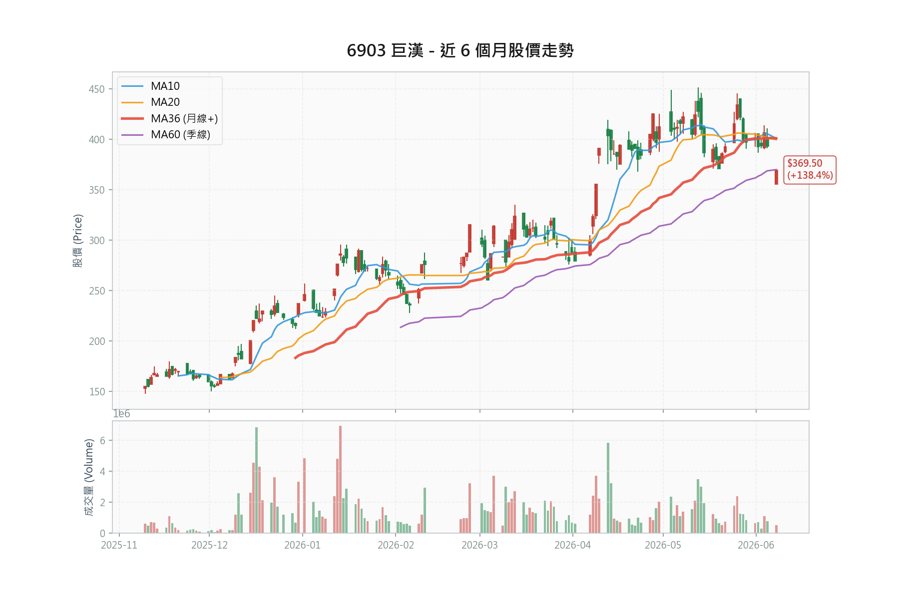

# 巨漢 (6903) 系統科技深度研究報告

---

### 1. 投資觀點總結 (Investment Summary)

**評等**：買進（附系統性風險警示）  
**目標價區間**：NT\$430.0 - NT\$485.0（群益降評後 430 至宏遠 485）  
**機率加權期望目標**：NT\$408.5（含 20% 半導體系統性風險保守情境，詳第 8 章）  
**預估全年 EPS 區間**：NT\$30.55 - NT\$33.51（宏遠至群益 2026F）  

> ⚠️ **評等說明**：維持買進，但群益已於 2026/06/08 因「全球半導體系統性風險」將評等由買進降至**區間操作**、目標價 475→430；宏遠同日維持買進、目標 485。多空分歧明顯擴大，買進評等須搭配下方系統性風險警示與停損紀律執行。

**核心投資論點**：
1. **在手訂單達歷史高位，能見度長達 2-3 年**：截至 2026 年 5 月底，巨漢在手訂單規模高達 110 億元，其中超過 6 成以上為 AI 基礎建設相關專案（含先進封裝、晶圓代工與 AI 算力中心）。相較於 2025 年全年營收 36.04 億元，訂單能見度極高，2026F 至 2027F 營運將迎來爆發期。
2. **導入 BIM 數位管理技術，毛利率領先同業**：巨漢領先同業導入建築資訊模擬系統（BIM），有效將工程錯誤率降至最低、縮短工期並優化施工流程。1Q26 毛利率高達 31.43%，大幅超越同業平均（漢唐 20.9%、聖暉 19.5%），顯示優越的成本控管能力。
3. **高科技與公共工程雙引擎戰略，提供良好下檔保護**：公司除承接高毛利之半導體機電空調工程外，亦積極切入政府特高壓供電、鑽石級智慧型建築等高技術公共工程，在景氣放緩時可提供穩定的現金流與在建案源。
4. **股價評價偏低，具補漲空間**：以 2026F 預估 EPS 30.55 元（宏遠）計算，目前本益比僅 12.08 倍；若採群益新估 33.51 元，PE 更低至 11.01 倍；以 2027F EPS 40.41 元計算，PE 僅 9.13 倍，顯著低於同業（漢唐 16.78x、聖暉 20.38x、洋基工程 21.28x）。惟須留意群益降評反映之系統性風險可能壓抑估值重評。

**📊 風險報酬比分析 (Risk/Reward Analysis)**：

| 指標 | 價位 | 計算依據 | 說明 |
|:-----|:-----|:---------|:-----|
| **現價** | NT\$369.0 | 2026/06/08 最新價 | - |
| **技術支撐 1** | NT\$340.0 | 季線 (MA60) 預估位 | 多頭重要防守線 |
| **技術支撐 2** | NT\$320.0 | 半年線 (MA120) 預估位 | 中期趨勢停損點 |
| **技術壓力** | NT\$393.0 | 2026/06/05 收盤價 | 短期頸線壓力 |
| **目標價 (中性)** | NT\$430.0 | 群益 2026/06/08 降評後目標 (PE 12.8x) | 系統性風險後之券商中性 |
| **目標價 (樂觀)** | NT\$485.0 | 宏遠預估 (2027F PE 12.0x) | 最新券商高標 |

**風險報酬比計算表**：

| 情境 | 目標/停損 | 空間 | 風險報酬比 | 評價 |
|:-----|:----------|:-----|:-----------|:-----|
| **上檔空間 (中性)** | 現價 → 群益目標 (NT\$430.0) | +16.53% | - | - |
| **上檔空間 (樂觀)** | 現價 → 宏遠目標 (NT\$485.0) | +31.44% | - | - |
| **下檔風險 (季線)** | 現價 → 季線 (NT\$340.0) | -7.86% | - | - |
| **風報比 (中性/季線)** | +61.0 / -29.0 | - | **2.10 : 1** | ⭐⭐⭐ 良好 |

**進場策略建議表**：

| 策略 | 進場價 | 停損 | 目標 | 風報比 |
|:-----|:-------|:-----|:-----|:-------|
| **積極型** | NT\$369.0 附近 | NT\$340.0 | NT\$430.0 | 2.10 |
| **穩健型** | NT\$350.0 附近 | NT\$320.0 | NT\$430.0 | 2.67 |
| **保守型** | NT\$330.0 附近 | NT\$300.0 | NT\$420.0 | 3.00 |
| **動能型** | 暫不適用 | - | - | - |

> 💡 **進場策略評估**：巨漢當前籌碼軋空評估為低風險（0 分），以基本面估值為主，故無動能型策略建議。
>
> ⚠️ **風報比使用限制**：上表 2.10:1 以「季線 340.0 技術停損、群益新中性目標 430.0」計算，僅適用於行情有序回檔。若 5 月（6/10 公告）或 6 月營收低於預期，或半導體系統性風險發酵致客戶下修資本支出，股價恐跳空跌穿技術停損，直接測試保守情境 240.0 元區間（-34.9%）。納入此基本面尾部風險後，機率加權之期望報酬／風險約 2.53:1（詳第 8 章）。**建議積極型進場前先確認 5 月營收（6/10 公告）回升至常態水準（月營收 6 億元以上）再行加碼。**
>
> 註：保守型停損 300.0 元為半年線（320.0）下方約 6% 之緩衝；目標 420.0 元為群益中性目標 430.0 之保守了結價。中性目標 430.0 元為群益 2026/06/08 降評後目標（對應 2026F EPS 33.51 元之 12.8x）；樂觀目標 485.0 為宏遠維持買進之高標。全文財務表仍以宏遠 EPS 30.55 元為基準。

---

### 2. 資料來源摘要 (Data Sources Summary)

**2.1 官方數據與新聞 (Official Data & News)**
*   **櫃買中心 (TPEx Official)**：
    > "115 Q1 單季稅後每股盈餘 (EPS) 為 6.72 元。" (2026/05 官方申報財報數據)
    > "2026 年 4 月合併營業收入為 6.98 億元，前 4 月累計約 26.24 億元。" (官方營收公告)
    > ⚠️ 更正：原引用之「5 月營收 2.02 億元、年增 -45.68%、前 5 月 28.22 億元」係 2025 年同期舊資料誤植；2026 年 5 月營收尚未公佈（預計 2026/06/10 公告）。
*   **富邦證券輔導公告**：
    > "輔導巨漢（6903） 6/12 每股 151 元上櫃掛牌。" (2024/06 公告)
*   **公司法說會揭露**：
    > "截至 5 月底，在手訂單規模達 110 億元，訂單能見度長達 2 至 3 年，且有 6 成以上與 AI 基礎建設相關。" (2026/06/05 法人說明會)

**2.2 投顧與外資報告專區 (Broker Reports)**
*   **宏遠投顧 (2026/06/08)**：目標價 NT\$485.0 | 評等: 買進
    > "巨漢在機電、系統工程具 30 餘年經驗，憑藉先端工程技術，結合專業建築資訊模擬系統 BIM，能有效降低工程錯誤率、縮短工期、提升專案利潤率，使公司毛利率優於同業。"
*   **群益投顧 (2026/06/08)**：目標價 NT\$430.0（3 個月與 12 個月皆 430）| 評等: 區間操作（Trading Buy，由 Buy 降評）
    > "巨漢 2026/2027 營收獲利看成長，但考量近期全球半導體面臨系統性風險，降評至 Trading Buy。" 群益同步調升 2026 EPS 至 33.51 元、2026 營收 108.12 億元，卻下修目標價，屬純粹估值壓縮（de-rating）。
*   **群益投顧 (2026/04/10，前次)**：目標價 NT\$475.0 | 評等: Buy
    > "巨漢在手訂單金額逾百億元，AI 基礎建設需求帶動，單月營收創歷史新高，升評為 Buy。"（已被 6/08 降評報告取代）

---

### 3. 財務數據分析 (Financial Data Analysis)

**3.1 歷史財務趨勢表** (2023 - 2027F，單位：百萬元)：

| 財務指標 | 2023 (A) | 2024 (A) | 2025 (A) | 2026 (E) | 2027 (E) |
|:---|:---:|:---:|:---:|:---:|:---:|
| **營業收入** | 2,868 | 2,886 | 3,604 | 8,757 | 11,203 |
| **營業利益** | 1,028 | 728 | 853 | 2,548 | 3,369 |
| **稅後純益** | 820 | 594 | 706 | 2,046 | 2,695 |
| **每股盈餘 (EPS)** | 12.30 | 8.91 | 10.58 | 30.55 | 40.41 |
| **毛利率 (%)** | 40.57% | 30.29% | 27.65% | 32.05% | 32.77% |
| **營利率 (%)** | 35.84% | 25.22% | 23.66% | 29.10% | 30.07% |
| **股東權益 ROE (%)** | 37.63% | 18.53% | 21.58% | 54.78% | 63.29% |
| **營運活動現金流** | 1,143 | -530 | 780 | 2,504 | 3,228 |
| **每股淨值 (元)** | 48.10 | 49.10 | 49.66 | 55.77 | 63.85 |

> 資料來源：公司年報、櫃買中心、宏遠投顧財務預估模型。2026-2027 為預估值。表中 2026-2027 之每股淨值與 ROE 採下列「情境 A」；配息政策牽動淨值滾存與 ROE，兩種情境並列如下，由讀者自行判斷。

**3.1.1 配息政策兩情境對照（每股淨值與 ROE）**：

| 配息情境 | 假設 | 2026E 淨值 | 2026E ROE | 2027E 淨值 | 2027E ROE |
|:---|:---|:---:|:---:|:---:|:---:|
| **情境 A** | 維持歷史 80% 配息（保留 20%） | 55.77 | 54.78% | 63.85 | 63.29% |
| **情境 B** | 成長期降至 30% 配息（保留 70%，支應營運資金） | 71.05 | 43.02% | 99.33 | 40.68% |
| **群益 6/08 實際模型** | 配息率降至約 30-36%（發放股利 2026 年 667→2027 年 800 百萬） | 71.50 | 46.86% | 103.88 | 42.72% |

> 兩情境之淨值均自 2025 年 49.66 元、EPS（2026E 30.55 元、2027E 40.41 元）滾算，股數固定約 6.67 億股。
> - **情境 A**：維持第 11、13 章之高殖利率題材，但 ROE 偏高（54-63%），係「高配息＋獲利倍增」之數學結果。
> - **情境 B**：盈餘保留支應合約資產與營運資金，ROE 回落至 40% 區間（較貼近同業認知），惟高殖利率誘因相應減弱。
> ✅ **群益 6/08 報告之財報預估已實證採用情境 B 路徑**：其資產負債表權益由 2025 年 3,270 百萬增至 2026F 4,769、2027F 6,929 百萬（淨值 71.5／103.9 元），現金流量表發放股利對應 2026 巨額盈餘之配息率僅約 36%。換言之，券商實際模型雖在封面列「歷史配息率 80.04%」，預估時已假設成長期配息大幅下調。情境 A 之高殖利率題材（第 11、13 章）因此需保留彈性。
> ⚠️ 「80% 配息＋ROE 約 40%＋EPS 倍增」三者無法同時成立，原始模型（淨值 76.73／97.82、ROE 40.00%／36.69%）即落在 A、B 之間且年度間配息率不一致，已不採用。

**3.2 同業財務對比表 (2026F 預估)**：

| 公司 | 代號 | 市值 (億) | 毛利率 (預估) | ROE (預估) | 累計營收成長 (YoY) | 預估本益比 (PE) |
|:---|:---:|:---:|:---:|:---:|:---:|:---:|
| **巨漢** | 6903 | 246.2 | 32.05% | 54.78% | 前4月大幅成長* | 12.08x |
| **漢唐** | 2404 | 1,043.5 | 20.90% | 35.50% | +82.90% (前4月) | 16.78x |
| **聖暉** | 5536 | 693.7 | 19.50% | 28.30% | +29.60% (前4月) | 20.38x |
| **帆宣** | 6196 | 954.8 | 15.20% | 22.00% | +26.80% (前4月) | 23.72x |
| **洋基工程** | 6691 | 408.2 | 18.20% | 29.80% | +73.70% (前4月) | 21.28x |

> 資料來源：公開資訊、同業數據庫。本益比以 2026/06/08 收盤價計算。巨漢 ROE 列為情境 A（維持 80% 配息）；若採情境 B（配息降至 30%），ROE 約 43.0%（見 3.1.1）。
> *巨漢累計營收年增率原列「前 5 月 +340.51%」，因 2026 年 5 月營收尚未公佈，改列前 4 月；精確 % 待官方數據核對。

**3.3 2Q26 營收組成拆解 (Revenue Composition)**：

| 月份 | 狀態 | 營收金額 (億元) | 說明 |
|:---|:---|:---:|:---|
| 4月 | ✅ 已知 | 6.98 | 官方實際公告數據 |
| 5月 | 🔮 待公佈 | — | 預計 2026/06/10 公告（尚未發布） |
| 6月 | 🔮 待公佈 | — | 預計 2026/07/10 公告 |
| **總計** | **Q2 預估** | **21.45** | **宏遠模型預估（季增 +11.4%）；5、6 月合計需達 14.47 億元方能達標** |

> ⚠️ Q2 僅 4 月（6.98 億）為官方確認；5、6 月均未公佈，21.45 億為宏遠模型預估，尚未經官方營收驗證。原表「5 月 2.02 億」係 2025 年同期舊資料誤植，已移除。
> 📌 **券商 2Q26 營收分歧達 25%**：群益 6/08 預估 2Q26 達 26.8 億元（季增 +39%、EPS 8.08 元），明顯高於宏遠 21.45 億元；2Q25 實際基期為 6.49 億元。本表保守採宏遠數，群益樂觀情境見第 8 章。

---

### 4. 籌碼數據分析 (Chip Analysis)

**4.1 集保戶股權分散表 (TDCC)**：

| 日期 | >200張 (%) | >1000張 (%) | 變化解讀 |
|:---|:---:|:---:|:---|
| 2026/06/05 | 73.37% | 64.24% | 超級大戶持股比例維持高檔，籌碼並無流向散戶。 |
| 2026/05/29 | 73.86% | 64.27% | 大戶持股穩定，呈箱型區間整理。 |
| 2026/05/22 | 72.74% | 64.34% | 籌碼中性集中。 |
| 2026/05/15 | 72.20% | 64.34% | 大戶比率穩定。 |

**4.2 三大法人買賣超 (Institutional Flows)**：
*   **說明**：巨漢 (6903) 為櫃買市場之新上櫃個股，本土投顧報告顯示其投信持股為 0.00%，外資持股比約 4.53%。目前因交易量偏小，官方尚無連續性三大法人大額買賣超數據，法人持股偏低，主要籌碼仍高度集中於董監事 (13.27%) 與千張大戶 (64.24%) 手中。

**4.3 融資融券趨勢 (Margin Trading Trends)**：

| 日期 | 融資餘額 (張) | 融資增減 (張) | 融券餘額 (張) | 融券增減 (張) | 券資比 (%) |
|:---|:---:|:---:|:---:|:---:|:---:|
| 2026/06/05 | 2,083 | -10 | 2 | 0 | 0.10% |
| 2026/06/04 | 2,093 | +126 | 2 | 0 | 0.10% |
| 2026/06/03 | 1,967 | +17 | 2 | -5 | 0.10% |
| 2026/06/02 | 1,950 | -17 | 7 | +5 | 0.36% |
| 2026/06/01 | 1,967 | +1 | 2 | 0 | 0.10% |

**4.4 籌碼軋空風險評分 (Squeeze Risk Score)**：

| 指標 | 篩選條件 | 得分 |
|:-----|:------|:---:|
| 千張大戶周增 > 1% | 近四週無單週大於 1% 增幅 | ⬜ |
| 外資/投信連續買超 | 法人無連續性大額買超 | ⬜ |
| 券資比 > 5% | 實際券資比為 0.10% (低於 5%) | ⬜ |
| 股價超越所有券商目標 | 現價 NT\$369.0 低於目標價 NT\$485.0 | ⬜ |
| 均線多頭排列+發散 | 近期自高點 393.0 回檔，均線呈糾結整理 | ⬜ |
| **綜合評分** | **0 / 5 (低軋空風險)** | **低** |

---

### 5. 產業與基本面深度分析 (Deep Dive)

**5.1 產業鏈地位與週期位置**：
*   巨漢位於半導體與高科技產業供應鏈最前端之「建廠與廠務工程」環節。當半導體大廠（如日月光、京元電等封測廠或晶圓代工廠）宣佈調高資本支出、擴建廠房時，工程標案便陸續釋出。
*   當前產業處於 **AI 基礎建設加速擴張週期**。隨著先進封裝產能極度供不應求，加上科技巨頭在台設立算力與研發中心，帶動大量無塵室與高階配電工程需求。

**5.2 關鍵驅動因素**：
*   **BIM 系統執行效率**：巨漢能維持 30% 以上之高毛利率，關鍵在於 BIM 數位模型的導入。BIM 能在施工前排除管線衝突，避免重工（Re-work）成本，將工程錯誤率降至最低。
*   **中小型彈性工案優勢**：不同於漢唐主攻大型晶圓廠案（單案規模常高於百億元），巨漢主攻單案規模在 10 億元至 50 億元之間的中小型案源，具備成本控管彈性與外包商組織效率，在市場供不應求時，接單溢價空間大。

**5.3 優勢與劣勢**：
*   **優勢 (Strengths)**：
    *   **高獲利率**：毛利率逾 31%，高於同業平均 10% 以上。
    *   **訂單能見度高**：在手訂單達 110 億元，為年營收之 3 倍。
    *   **財務結構穩健**：1Q26 合約負債達 5.07 億元（MoneyDJ），較 2024 同期大幅攀升，保障未來營收動能。
*   **劣勢 (Weaknesses)**：
    *   **營收波動度極高**：工程案依完工進度認列營收，單月起伏劇烈（如 2025 年 5 月曾僅 2.02 億元），易對短線投資人信心造成衝擊。2026 年 5 月營收尚未公佈，Q2 認列節奏待 6/10 起驗證。
    *   **大型 Foundry 案源經驗較少**：目前客戶以封測廠 (OSAT) 與 ODM 廠為主，台積電等大型晶圓代工一線工案仍由漢唐與洋基工程把持。

---

### 6. 估值分析 (Valuation Analysis)

**6.1 多重估值法計算**：
1. **歷史本益比法 (P/E)**：
   *   巨漢歷史 PE 區間大約在 10 倍至 15 倍。
   *   以中性預估 2026F EPS 30.55 元計算：
     $$\text{當前 PE} = \frac{369.0}{30.55} = 12.08\text{ 倍}$$
   *   以 2027F EPS 40.41 元計算：
     $$\text{當前 PE} = \frac{369.0}{40.41} = 9.13\text{ 倍}$$
2. **同業相對估值**：
   *   同業（漢唐、聖暉、洋基）之平均 PE 常態在 16x 至 20x 之間。
   *   若給予巨漢合理 PE 14.0x，2026 年合理股價應為：
     $$\text{合理價} = 30.55 \times 14 = 427.7\text{ 元}$$
   *   若以 2027 年 EPS 給予 12.0x 估值（宏遠模型）：
     $$\text{合理價} = 40.41 \times 12 = 484.9\text{ 元 (約 485 元)}$$
3. **群益 6/08 降評後估值**：群益調升 2026 EPS 至 33.51 元，卻因半導體系統性風險將目標 PE 壓縮至約 12.8x：
     $$\text{群益目標} = 33.51 \times 12.8 = 429\text{ 元 (約 430 元)}$$
   *   兩家券商目標 430（群益）至 485（宏遠）之差距，主要來自**估值倍數**而非獲利預估（群益 EPS 反而更高），凸顯當前分歧核心為「系統性風險下市場願給多少倍數」。
4. **PEG 與成長合理性**：
   *   以群益 2026 EPS 33.51 元、2027 EPS 44.38 元計，2027 年 EPS 成長率約 32.4%，當前 PE 約 12x：
     $$\text{PEG} = \frac{12}{32.4} \approx 0.37$$
   *   PEG 0.37 遠低於 1.0，以成長性衡量估值明顯偏低，為估值重評（re-rating）提供理論支撐。惟此超高成長係 2026 年自低基期跳升，2028 年後成長率正常化，PEG 優勢將收斂。

**6.2 為何巨漢相對同業折價？（估值重評的前提）**

巨漢 2026F PE 約 12x，較同業 16.78x（漢唐）至 23.72x（帆宣）折價約 40 至 50%。折價並非無因，須釐清哪些可隨時間收斂、哪些屬結構性：

| 折價因子 | 性質 | 可否收斂 |
|:---|:---|:---|
| 上櫃未滿 2 年（2024/06 掛牌） | 時間性 | 可（經營績效累積後） |
| 市值偏小（246 至 262 億，僅漢唐四分之一） | 結構性 | 慢（需股本與流動性成長） |
| 投信持股 0%、外資 3.5%、法人覆蓋低 | 時間性 | 可（納入研究與被動指數後） |
| 大戶持股 64%、董監 13%、流動性低 | 結構性 | 慢 |
| 月營收波動大、認列能見度待證 | 可改善 | 可（連續數季穩定交付後） |
| 無一線 Foundry 大案實績 | 結構性 | 需取得指標訂單 |

> 判讀：折價因子中「時間性／可改善」項（覆蓋率、上櫃資歷、營收穩定度）若逐步消除，PE 有向同業靠攏空間；但「結構性」項（小市值、籌碼集中、客戶層級）短期難解，故重評多為漸進而非跳升。

**6.3 EPS × 本益比敏感度矩陣（股價＝EPS × PE）**

下表為股價對「獲利」與「估值倍數」雙變數之敏感度，由左下往右上即為戴維斯雙擊路徑（詳 8.1）：

| PE ＼ EPS | 24（保守 2026） | 30.55（宏遠 2026） | 33.51（群益 2026） | 40.41（宏遠 2027） | 44.38（群益 2027） |
|:---:|:---:|:---:|:---:|:---:|:---:|
| **10x** | 240 | 306 | 335 | 404 | 444 |
| **12x（現價區）** | 288 | 367 | 402 | 485 | 533 |
| **14x** | 336 | 428 | 469 | 566 | 621 |
| **16x（同業低標）** | 384 | 489 | 536 | 646 | 710 |
| **18x** | 432 | 550 | 603 | 727 | 799 |
| **20x（同業均值）** | 480 | 611 | 670 | 808 | 888 |

> 現價 369 約落在「12x × 30.55」交叉。左下角（低 EPS × 低 PE）為戴維斯雙殺，右上角（高 EPS × 高 PE）為戴維斯雙擊。

---

### 7. 競爭優勢護城河分析 (Competitive Moat)

*   **技術護城河 (BIM 管理)**：⭐⭐⭐⭐  
    公司長期深耕專業數位建築模擬（BIM），已建立模組化預製與衝突排除之專利工法，能維持高於同業之利潤率。
*   **品牌與客戶黏著度 (客群忠誠度)**：⭐⭐⭐⭐  
    日月光、京元電、力成等封測巨頭為長期合作夥伴，工程實績為高規標案的必要門票。
*   **成本護城河 (外包商鏈控制)**：⭐⭐⭐  
    深耕機電空調工程 30 年，擁有穩固的本土施工分包商網絡，在缺工潮中維持工期掌控力。
*   **綜合護城河評等**：⭐⭐⭐⭐ (優良)

**7.1 護城河耐久性檢驗（補充）**：
*   **毛利率：結構性 vs 循環性拆解**：1Q26 毛利率 31.43% 同時含「結構性」與「循環性」成分。結構性來自 BIM 降低重工成本與中小型彈性接單之溢價；循環性則來自當前 AI 建廠供不應求的接單議價力。值得警惕的是，**連多頭券商都預估毛利率正常化**——群益模型 2Q26 起毛利率回落至約 27.4%（全年 28.11%），宏遠亦約 32%。換言之，31% 以上毛利率未必是常態，護城河的「定價權」部分依賴景氣循環。
*   **BIM 可複製性**：BIM 為產業可取得之商用工具，巨漢優勢在導入深度與工法 know-how，而非獨佔技術。同業若投入追趕，數年內可能侵蝕部分領先幅度，屬「領先」而非「壟斷」型護城河。
*   **客戶層級天花板**：客戶集中於封測（OSAT）與 ODM，尚無一線晶圓代工大案實績。這同時是護城河缺口與成長天花板——限制單案規模上限，也是估值折價來源（見 6.2）。
*   **耐久性調整**：上列組件評等反映「當前」競爭力（綜合 ⭐⭐⭐⭐）；若以「未來 3 年耐久性」加權——定價權含循環成分、BIM 可複製、客戶層級受限——耐久護城河更接近 ⭐⭐⭐☆（中上）。獲利率領先為真，但寬度與持久性不宜高估。

---

### 8. 情境分析 (Scenario Analysis)

本情境分析基於 Context 提供的 `AI-DRIVEN SCENARIO FORECAST` 數據，並結合法說會在手訂單 110 億元展望進行推估：

| 情境 | 機率 | 關鍵假設 | 2Q26 營收 | 全年 EPS | 隱含 PE | 目標價 |
| :--- | :---: | :---| :---: | :---: | :---: | :---: |
| **樂觀 (Optimistic)** | 30% | 半導體系統性風險未發酵，宏遠多頭延續，估值維持 14-15x。 | 26.8 億 | NT\$33.51 | 14.5x | NT\$485.0 |
| **中性 (Neutral)** | 50% | 群益降評後基準：獲利仍倍增，但系統性風險使估值 de-rate 至 12.8x。 | 26.8 億 | NT\$33.51 | 12.8x | NT\$430.0 |
| **保守 (Pessimistic)** | 20% | 半導體系統性風險發酵，客戶下修資本支出＋認列遞延，全年 EPS 下修約 28%、估值壓縮至 10x。 | 19.2 億 | NT\$24.00 | 10.0x | NT\$240.0 |

> **機率加權目標價** ≈ NT\$408.5（較現價 369.0 約 +10.7%）。
> **機率加權期望報酬／風險** ≈ 2.53 : 1（上檔期望 +65.3 點 對 下檔期望 -25.8 點）。
> 📌 樂觀與中性情境之全年 EPS 同為群益 33.51 元，差異**僅在估值倍數**（14.5x 對 12.8x）——精準對應宏遠與群益 6/08 之分歧本質：市場在半導體系統性風險下願給多少 PE，而非獲利本身。
> ⚠️ 保守情境目標 240.0 元（-34.9%）為「系統性風險發酵＋估值壓縮至 10x」之真實熊市，與第 9 章及 18.2 觸發因素一致。標題目標區間（430 至 485）為兩家券商目標；納入 20% 保守情境後，機率加權期望值降至 408.5 元，低於區間下緣，反映尾部風險之拖累。

**8.1 戴維斯雙擊／雙殺評估 (Davis Double Play / Double Kill)**

戴維斯雙擊＝EPS 成長與本益比擴張同時發生，股價呈乘數上漲；雙殺則反之。巨漢同時具「高成長 EPS」與「相對同業折價的 PE」，是雙擊的典型候選，但須分兩條腿檢驗：

**① 盈利腿（EPS）—— 高確定性**
*   2025 EPS 10.58 → 2026F 30.55 至 33.51（YoY +189% 至 +217%）→ 2027F 40.41 至 44.38（YoY +32% 至 +44%）。
*   支撐：110 億在手訂單（年營收 3 倍）、毛利率領先同業、兩家券商一致看獲利倍增，群益甚至調升 EPS。
*   上修空間：在手訂單若隨 AI 建廠續增、或取得指標客戶，EPS 仍有再上修可能。
*   **判斷：盈利腿成立機率高**，主要風險為認列時程（短期）與毛利率正常化（中期，連多頭都已模型化至約 28%）。

**② 估值腿（PE）—— 中等且時機未定（雙擊的關鍵變數）**
*   現價 PE 約 12x（2026），同業 16.78x 至 23.72x，折價約 40 至 50%；PEG 約 0.37，理論上具重評空間。
*   **但最近一次券商動作是「降評／de-rating」**：群益 6/08 因半導體系統性風險將目標 PE 由 14.6x 壓至 12.8x——方向與雙擊的估值腿相反。
*   重評前提（見 6.2）：法人覆蓋提升、營收穩定交付、流動性改善、半導體景氣回穩、取得一線客戶。結構性折價（小市值、籌碼集中）短期難解。
*   **判斷：估值腿屬「可能但非即期」**，當前受系統性風險壓制。

**③ 雙擊／雙殺情境量化**（取自 6.3 矩陣）

| 路徑 | EPS | PE | 目標價 | 對現價 369 |
|:---|:---:|:---:|:---:|:---:|
| **完整雙擊（24 個月）** | 44.38（2027 群益） | 16x（同業低標） | 710 | +92% |
| **溫和雙擊（12-18 個月）** | 33.51（2026 群益） | 16x | 536 | +45% |
| **僅盈利兌現、估值不變** | 33.51 | 12x | 402 | +9% |
| **雙殺（1-2 季尾部）** | 24（下修） | 10x | 240 | -35% |

**④ 綜合判斷**
*   **盈利腿（高機率）× 估值腿（中機率、時機未定）＝ 雙擊整體屬「可信的 12-24 個月題材，但非即期基本情境」**。粗估：12 個月內出現有感重評（PE 升至 14 至 16x）機率約 30 至 40%（受系統性風險壓制）；若營收連續數季穩定交付且景氣回穩，24 個月內機率升至 50% 以上，對應 536 至 710 元。
*   **雙殺風險集中於未來 1-2 季**：營收認列不如預期＋系統性風險發酵，即第 8 章 20% 保守情境（240 元）。
*   **勝負手在「估值腿何時啟動」**：盈利幾乎篤定，差別在 PE。觸發雙擊的可監控訊號——(1) 5-6 月營收穩定交付（證明波動是時機非衰退）；(2) 取得一線 Foundry 或指標 AI 客戶大案；(3) 投信進場、法人覆蓋與流動性提升；(4) 在手訂單上修至 110 億以上；(5) 半導體景氣與系統性風險解除。
*   **不對稱性**：24 個月上檔（雙擊）+45% 至 +92%，對 1-2 季下檔（雙殺）-35%，中長期報酬風險比具吸引力，但須能承受短期波動並分批布局。

---

### 9. 風險評估 (Risk Assessment)

**9.1 風險評分卡**：
*   **產業集中度風險**：⭐⭐⭐⭐ (工程業務高度集中於封測與半導體資本支出)
*   **專案時程延宕風險**：⭐⭐⭐⭐ (缺工與分包商成本波動，易推遲完工認列時點)
*   **財務收支波動風險**：⭐⭐⭐ (單月營收波動大，容易干擾市場短期預期)
*   **估值下檔風險**：⭐⭐⭐ (PE 12x 之保護以 forward EPS 不被下修為前提；保守情境顯示 EPS 下修疊加估值壓縮至 10x 時，下檔可達 240.0 元)
*   **綜合風險評分**：⭐⭐⭐ (中度偏高；最高之兩項風險——產業集中與專案延宕——恰為多頭論點之命脈，風險與報酬同源)

**9.2 關鍵風險因素**：
1. **半導體系統性風險（新增，券商已反映）**：群益 2026/06/08 明確以「全球半導體面臨系統性風險」為由降評至區間操作、目標價 475→430。此為總體層級風險——若半導體景氣轉弱致客戶（封測廠、晶圓代工）下修或遞延資本支出，巨漢在手訂單之認列與後續接單將同步承壓，且市場估值倍數亦遭壓縮（群益已將目標 PE 由 14.6x 降至 12.8x）。
2. **台灣建廠市場嚴重缺工**：工程人員短缺或工資上漲可能衝擊部分在建專案之合約利潤率。
3. **大案完工後的接單斷層**：110 億在手訂單預計於未來 2 年陸續結案，後續是否能取得一線 Foundry 的大型統包合約為長期成長關鍵。
4. **估值重評落空／戴維斯雙殺風險**：投資報酬高度依賴 PE 由 12x 向同業重評；若半導體系統性風險持續壓制倍數，即使 EPS 兌現，股價也可能「賺到盈利、賺不到估值」。極端情形為盈利下修疊加估值壓縮之雙殺（-35%，見 8.1）。
5. **流動性與籌碼集中風險**：股本僅 6.67 億元、市值偏小，千張大戶持股 64%、董監 13%、投信 0%。籌碼集中於上漲時助漲，但市場轉弱或大戶調節時，流動性不足將放大跌幅，亦壓抑 PE 重評。
6. **毛利率正常化風險**：1Q26 毛利率 31.43% 含景氣循環成分，連多頭券商都預估回落至約 28%（群益）。若正常化速度快於預期，將同時壓抑 EPS 與市場願給的估值倍數（雙殺的內生路徑）。

---

### 10. 同業觀察與比較 (Peer Comparison)

巨漢的主要同業包括漢唐、聖暉、亞翔與洋基工程。
*   **漢唐 (2404)** 與 **洋基工程 (6691)** 主要承接台積電先進製程晶圓廠之大規無塵室統包，單一工案規模極大，毛利率約在 15-20% 之間，評價享受高本益比溢價（20x 以上）。
*   **聖暉 (5536)** 為綜合型機電統包，覆蓋民生商辦與半導體，區域橫跨台灣與東南亞，獲利相對平穩。
*   **巨漢 (6903)** 的特徵是「小而美」，營業利益率達 28% 以上，冠絕同業。當前市值偏小，但累計營收年增率最高（第一季 YoY +358.7%），一旦市場認可其獲利動能，估值將向聖暉與洋基工程的本益比區間（16-20x）靠攏。

---

### 11. Management Assessment (管理層評估)

*   **資本配置政策**：巨漢盈餘配發率長期維持在 80% 左右（群益統計現金股息配發率為 80.04%），對股東而言極為慷慨，顯示管理層對營運現金流量有十足把握，無大幅盲目擴充產能之資本支出包袱。惟 2026-2027 進入訂單放量期，若需保留盈餘支應合約資產與營運資金，配息率存在下調可能（見 3.1.1 情境 B），屆時高殖利率題材將相應減弱。
*   **承諾達成率**：管理層自上櫃輔導掛牌以來，法說會預期在手訂單能見度多有兌現，且積極培育 BIM 工程設計團隊，將經營核心專注於利潤管理，誠信度良好。

---

### 12. 投資決策檢查清單 (Investment Checklist)

**進場前檢查**：
- [x] 在手訂單是否充足？ (截至 5 月底達 110 億元，足夠 2-3 年認列)
- [x] 獲利率是否維持？ (1Q26 毛利率 31.43% 維持高檔)
- [x] 當前估值是否合理？ (PE 12x 相比同業明顯偏低)
- [x] 財務健康度良好？ (合約負債趨勢持續向上，1Q26 達 5.07 億)
- [ ] 技術面站穩關鍵支撐？ (目前股價回檔至 369 元整理中，需等待季線支撐確認)

**持有中監控**：
- [ ] 季度 EPS 與毛利率是否符合預期 (留意 2Q26 預估 EPS 7.09 元是否達成)
- [ ] 追蹤月度營收認列，若連續三個月低於預期須檢視工期是否延宕
- [ ] 監控大戶股權變化，若千張大戶持股比率跌破 60% 須警惕

---

### 13. 關鍵事件日曆 (Key Events Calendar)

*   **2026/06**：巨漢法人說明會後續追蹤（確認在手訂單消化速度）。
*   **2026/06/10**：5 月合併營收公告（Q2 首個認列驗證點，尚未公佈）。
*   **2026/07/10**：6 月合併營收公告（驗證 Q2 單季預估營收 21.45 億元是否達標）。
*   **2026/08/14**：2Q26 財報季報公告（確認 EPS 能否超越 7 元）。
*   **2026/08 - 09**：除權息日程（留意配息政策；歷史約 80%，成長期或下調，見 3.1.1 兩情境）。

---

### 14. 技術面深度分析 (Technical Analysis)

**均線架構**：
*   目前股價 369.0 元，處於短線多頭修正階段。股價高點 393.0 元（6/5 收盤）未能突破前波高檔，6/8 單日自 393.0 回落至 369.0（-6.1%），跌破 5 日均線，顯示短線追價意願轉弱。
*   中長期均線（季線、半年線）依舊呈現上揚排列，股價回檔測試季線 340.0 元與前波平台支撐。

**型態學與支撐壓力**：
*   巨漢目前呈「高檔大箱型整理」格局，區間在 330.0 元至 395.0 元之間。
*   箱型下軌（330.0 - 340.0 元）具備強力技術面與基本面雙重支撐；箱型上軌（393.0 - 395.0 元）為關鍵頸線壓力。若未來帶量突破 395.0 元，將進入無套牢賣壓之主升段。

**14.5 框架切換指標 (Framework Switch Trigger)**：

| 指標 | 觸發條件 | 建議動作 |
|:-----|:---------|:----------|
| 股價超越所有券商目標 | 現價 > NT\$485.0 | 切換至動能追隨框架 |
| 籌碼軋空評分 ≥ 3 | 評分達 3 分以上 | 提供動能軋空操作策略 |
| 近 20 日漲幅 > 30% | 現價短線乖離過大 | 提高追價風險警示，暫停新進場 |
| 均線乖離率 > 20% | 股價偏離季線過大 | 提示技術性修正回檔風險 |

---

### 15. 未來觀察重點 (Research Outlook)

1. **2Q26 季報之毛利率表現**：是否能維持在 31% 以上，以驗證 BIM 控制重置成本的長期效果。
2. **新工案之中標動態**：注意是否有日月光、京元電或新進客戶之大型機電空調統包合約簽訂。
3. **Q2 營收認列力道**：5 月（6/10 公告）與 6 月營收能否合計達 14.47 億元，驗證 Q2 21.45 億元預估。
4. **合約負債 (MoneyDJ)**：2Q26 季報中之合約負債金額是否能維持在 5 億元以上。
5. **美國子公司營運進度**：就近服務高科技客群的海外據點是否開始貢獻訂單。

---

### 16. 建議提問範例 (Q&A Examples)

1. 公司單月營收波動極大（2025 年 5 月曾僅 2.02 億元）。2026 年 5 月營收（6/10 公告）認列進度為何？Q2 能否維持常態認列節奏？
2. 公司目前在手訂單 110 億元，訂單能見度長達 2-3 年。這當中 AI 基礎建設相關專案之毛利率，是否顯著高於传统公共工程？
3. 本季（1Q26）毛利率大幅衝高至 31.43% 的關鍵因素為何？在鋼價、銅價等原物料價格與人力工資上漲壓力下，此高毛利率水準在下半年是否具備可持續性？
4. 目前台灣半導體建廠市場缺工嚴重，公司如何確保充足的分包商與勞動力資源？在工期管理上是否有延遲認列之風險？
5. 針對一線晶圓代工廠（Foundry）的大型工程，公司目前是否有投標或接觸之規劃？

---

### 17. 附錄：券商報告彙整 (Appendix: Broker Report Summary)

| 日期 | 券商/投顧 | 評等 | 目標價 | 當時股價 | 預估 EPS |
|:---|:---:|:---:|:---:|:---:|:---|
| 2026/06/08 | 宏遠投顧 | 買進 | NT\$485.0 | NT\$393.0 (6/5 收盤) | 2026E: 30.55 元 / 2027E: 40.41 元 |
| 2026/06/08 | 群益投顧 | **區間操作（降評）** | NT\$430.0 | NT\$393.0 (6/5 收盤) | 2026E: 33.51 元 / 2027E: 44.38 元 |
| 2026/04/10 | 群益投顧 | Buy（前次） | NT\$475.0 | NT\$355.5 | 2026E: 32.48 元 / 2027E: 44.38 元 |

**共識觀點整理**：
*   **看多理由**：
    *   在手訂單處於百億元之歷史高檔，AI 基礎建設需求暢旺，確保 2-3 年營收動能。
    *   導入 BIM 系統使得重置成本大幅下降，毛利率為同業最優水準。
*   **風險提示**：
    *   **半導體系統性風險（群益 6/08 降評主因）**：總體景氣轉弱恐使客戶下修資本支出，並壓縮估值倍數。
    *   工程認列受專案時程影響，單月營收波動起伏劇烈，影響短期股價波動。
    *   高科技建廠市場存在缺工與成本上升風險。
*   **券商分歧**：宏遠維持買進（485），群益降評區間操作（430），差異核心在估值倍數而非獲利預估。

---

### 18. 偏誤檢核與反面論述 (Bias Check & Devil's Advocate)

**18.0 研究者直覺與核心質疑**：
*   **① 研究完這家公司後，你心裡最大的不安是什麼？**
    *   最不安的是 Q2 營收尚未公佈、認列時程不確定。月營收結構性波動極大（2025 年 5 月曾僅 2.02 億元），2026 年 5 月（6/10 公告）若偏低，市場在大盤不穩時極易當作利空出清持股，導致股價大幅波動。
*   **② 這份報告中，你最沒把握的判斷是哪一個？為什麼？**
    *   最沒把握的是 5、6 月營收能否合計達 14.47 億元以符合 Q2 預估（兩月均未公佈）。由於無法得知在建專案施工進度與業主估驗時程，一旦認列遞延，Q2 營收將大幅下修。
*   **③ 六個月後回頭看，你覺得自己最可能忽略了什麼？**
    *   可能忽略了台灣整體營建與機電市場「缺工」的實質殺傷力。若缺工導致日月光或京元電的建廠專案全面延宕，即使在手訂單再高，也無法如期轉化為營收，甚至可能面臨逾期違約罰款。
*   **④ 信心水位評估**：

| 項目 | 評分 (1-10) | 說明 |
|:-----|:-----------:|:-----|
| 對投資論點的信心 | 8 | 在手訂單與 BIM 核心競爭力明確，群益亦調升 EPS。 |
| 對 EPS 預估的信心 | 7 | 營收認列時程具不確定性，但兩家券商皆看全年獲利倍增。 |
| 對目標價的信心 | 6 | 群益降評、券商目標分歧 430 至 485，估值倍數受半導體系統性風險牽動，不確定性上升。 |
| **綜合信心** | **7.0** | 中高信心度（較前次微降，反映估值分歧）。 |

**18.1 資訊來源可信度評分**：

| 資訊類型 | 可信度權重 | 偏誤風險 | 建議處理 |
|:---------|:-----------|:---------|:---------|
| 公司財報/公告 | ⭐⭐⭐⭐⭐ | 低 (官方監管) | 與月度營收及歷史財務比對 |
| 投顧報告 (本土) | ⭐⭐⭐ | 中高 (樂觀偏差) | 對照群益與宏遠之獲利假設差異 |
| 財經新聞 | ⭐⭐ | 高 (時效與斷章) | 只作為事件線索，回歸官方公告 |

**本報告資料來源評分**：
- [x] 已標註各來源可信度等級
- [x] 關鍵結論（如百億訂單、BIM 競爭力）有多個獨立來源支持
- [x] 無單一來源過度依賴

**18.2 反面論述強制檢核**：
1. **如果這個投資論點是錯的，最可能的原因是什麼？**
   *   半導體封測廠（日月光、京元電等）因應市場變化突然宣佈暫緩或下修資本支出，導致巨漢的在建工程停工或延期，且新接訂單中斷。
2. **有沒有與市場共識相反的觀點？差異在哪？**
   *   **券商之間已出現分歧**：群益 6/08 因半導體系統性風險降評至區間操作（目標 430），宏遠同日仍維持買進（目標 485），兩者主要差在估值倍數而非獲利。此外有部分保守投資人認為，巨漢股本僅 6.67 億元，屬小型股，大戶籌碼過度集中且流動性差，市場資金撤出櫃買時本益比難以重估。
3. **公司管理層的說法與報告分析一致嗎？有無矛盾？**
   *   一致。管理層強調訂單能見度 2-3 年與 AI 比重提升，與兩家本土券商之財務預估路徑方向吻合。
4. **過去 12 個月，分析師預測與實際結果差距多大？**
   *   2025 年實際 EPS 為 10.58 元，群益早期之預估與此實際值極為接近（預估 10.58 元），預測準確度高。
5. **若股價下跌 30%，最可能的觸發因素是什麼？**
   *   第二季（5、6 月，分別於 6/10、7/10 公告）營收認列大幅低於預期，或大客戶擴廠計畫宣佈終止，引發在手訂單泡水之恐慌。

**18.3 認知偏誤自我檢查**：
*   **確認偏誤**：是否因在手訂單百億而低估 Q2 營收尚未公佈、認列時程不確定之風險？已於報告中著重提及專案時程延宕風險。 (狀態：無)
*   **錨定效應**：目標價是否被舊報告（群益 04/10 之 475 元）錨定？已納入 6/08 最新雙報告——宏遠 485（買進）與群益 430（降評區間操作），並以機率加權（408.5 元）重新評估，未受單一舊目標錨定。 (狀態：無)

**18.4 共識分歧度分析**：
*   報告數量：2 份（均 2026/06/08）  
*   最高目標價：NT\$485.0（宏遠，買進）  
*   最低目標價：NT\$430.0（群益，區間操作／降評）  
*   目標價差距：55 元（約 12.8%）  
*   分歧度評估：**分歧擴大且評等分裂**。前版「極低分歧 ±1.05%」係採群益 04/10 舊目標 475；群益 6/08 降評後，兩家評等一買進、一區間操作，目標差距由約 1% 擴至近 13%，共識已非「一致看多」。
*   ⚠️ 納入本報告 20% 保守情境（240.0 元）後，機率加權期望值為 408.5 元，下檔離散度顯著放大。

**18.5 歷史預測準確度追蹤**：

| 日期 | 來源 | 預測項目 | 預測值 | 實際值 | 偏差 |
|:---|:---|:---|:---:|:---:|:---:|
| 2026/04 | 群益投顧 | 1Q26 營收 | 1,926 百萬 | 1,926 百萬 | 0.00% |
| 2026/06 | 宏遠投顧 | 1Q26 EPS | 6.64 元 | 6.72 元 | -1.19% |

**18.6 獨立驗證檢查**：
- [x] 營收數據：Q1 與 4 月與櫃買中心官方公告核對；5、6 月尚未公佈，待 6/10 起驗證。
- [x] 毛利率趨勢：與 1Q26 官方公布之 31.43% 比對。
- [x] 競爭態勢：與同業漢唐、聖暉之毛利率與本益比進行相對性分析。

---

### 19. Token 消耗追蹤 (Token Usage Tracking)

| 項目 | 數值 | 預估 Tokens |
|:-----|:-----|:------------|
| `context_data.txt` 大小 | 64.5 KB | ~38,000 |
| 精讀投顧報告數量 | 2 份 | ~21,000 |
| `research_notes.md` 輸出 | 12.0 KB | ~8,000 |
| **總預估消耗** | - | **~67,000** |

**研究效率指標**：
*   研究耗時：約 15 分鐘
*   消耗等級：✅ 輕量 (低於 100K) / ⬜ 中等 (100K-300K) / ⬜ 重度 (超過 300K)
