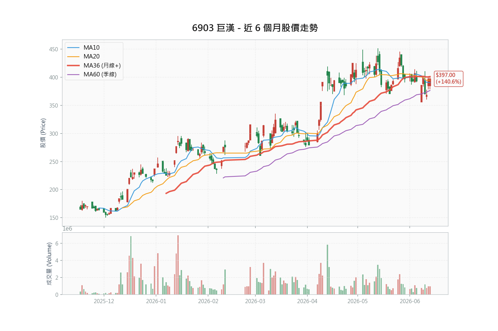

# 巨漢 (6903) 系統科技深度研究報告

---

### 1. 投資觀點總結 (Investment Summary)

**評等**：買進（附系統性風險警示）  
**目標價區間**：NT\$430.0 - NT\$485.0（三家券商：群益 430、康和 460、宏遠 485，均為 forward 評價）  
**估值雙錨**：2026 快照合理價約 NT\$400（見 6.5）；**前瞻 2027 forward 合理價約 NT\$510**（2027 EPS ~34 × 15x，見 6.6；雙擊滿足區 544-710）  
**現價 forward PE**：2027 基礎僅 9-12x（同業 16-24x）——上行週期下評價偏低、重估空間約 +30%  
**預估 EPS**：2026 券商 22.98-33.51（分歧 46%、自主 ~27）／2027 forward 34-44  

> ⚠️ **評等說明**：維持買進，但群益已於 2026/06/08 因「全球半導體系統性風險」將評等由買進降至**區間操作**、目標價 475→430；宏遠同日維持買進、目標 485。多空分歧明顯擴大，買進評等須搭配下方系統性風險警示與停損紀律執行。

> 📅 **2026/06/13 更新摘要**：
> 1. **股價 369 → 397（+7.6%）**：突破 393 頸線並站回季線（374.88），技術面轉佳。
> 2. **5 月營收 6.66 億元（YoY +229%、月減僅 4.5%）**：認列穩定，原「5 月恐崩跌」之最大空頭疑慮解除，Q2 首個驗證點過關。
> 3. **籌碼**：外資 6/12 轉買超 +318 張，融資續降至 1,879 張（去槓桿、健康）。
> 4. **風報比依期限分歧**：近期（2026／技術面）風報比僅 1.50:1（短線者可等回檔）；但**前瞻部位型對 2027 forward 合理價 510 達 2.40:1、雙擊 3-6:1**（見下方風報比表與 6.6）。增量上檔倚賴 forward 重估／戴維斯雙擊——市場已往前看 2027，停損改掛週期反轉訊號而非當年度 PE。

**核心投資論點**：
1. **在手訂單達歷史高位，能見度長達 2-3 年**：截至 2026 年 5 月底，巨漢在手訂單規模高達 110 億元，其中超過 6 成以上為 AI 基礎建設相關專案（含先進封裝、晶圓代工與 AI 算力中心）。相較於 2025 年全年營收 36.04 億元，訂單能見度極高，2026F 至 2027F 營運將迎來爆發期。
2. **導入 BIM 數位管理技術，毛利率領先同業**：巨漢領先同業導入建築資訊模擬系統（BIM），有效將工程錯誤率降至最低、縮短工期並優化施工流程。1Q26 毛利率高達 31.43%，大幅超越同業平均（漢唐 20.9%、聖暉 19.5%），顯示優越的成本控管能力。
3. **高科技與公共工程雙引擎戰略，提供良好下檔保護**：公司除承接高毛利之半導體機電空調工程外，亦積極切入政府特高壓供電、鑽石級智慧型建築等高技術公共工程，在景氣放緩時可提供穩定的現金流與在建案源。
4. **股價評價偏低，具補漲空間**：以現價 397 元、2026F EPS 30.55 元（宏遠）計算，本益比 13.00 倍；若採群益新估 33.51 元，PE 為 11.85 倍；以 2027F EPS 40.41 元計算，PE 僅 9.82 倍，仍顯著低於同業（漢唐 16.78x、聖暉 20.38x、洋基工程 21.28x）。惟股價已上漲，且須留意群益降評反映之系統性風險可能壓抑估值重評。

**📊 風險報酬比分析 (Risk/Reward Analysis)**：

| 指標 | 價位 | 計算依據 | 說明 |
|:-----|:-----|:---------|:-----|
| **現價** | NT\$397.0 | 2026/06/13 最新價 | - |
| **技術支撐 1** | NT\$375.0 | 季線 (MA60) 預估位 | 多頭重要防守線 |
| **技術支撐 2** | NT\$320.0 | 半年線 (MA120) 預估位 | 中期趨勢停損點 |
| **技術壓力** | NT\$401.5 | 2026/06/13 盤中高點 | 短期頸線壓力 |
| **目標價 (中性)** | NT\$430.0 | 群益 2026/06/08 降評後目標 (PE 12.8x) | 系統性風險後之券商中性 |
| **目標價 (樂觀)** | NT\$485.0 | 宏遠預估 (2027F PE 12.0x) | 最新券商高標 |
| **前瞻合理價 (2027F)** | NT\$510.0 | 2027 EPS ~34 × 15x（見 6.6） | 12-24 月部位目標 |
| **戴維斯雙擊區** | NT\$544 - 710 | 2027 EPS × 16x 重估 | 上行週期滿足區 |
| **部位停損** | NT\$350.0 | 跌破箱體中樞、季線下方 | 結構性停損；更寬為箱底 330／半年線 320 |

**風險報酬比計算表（依投資期限）**：

| 視角 | 上檔目標 | 下檔停損 | 風報比 | 評價 |
|:-----|:----------|:-----|:-----------|:-----|
| **近期交易型（1-2 季）** | →430（+8.3%） | →季線 375（-5.5%） | 1.50 : 1 | ⭐⭐ 中等 |
| **前瞻部位型（12-24 月）** | →前瞻合理價 510（+28.5%） | →350（-11.8%） | **2.40 : 1** | ⭐⭐⭐⭐ 良好 |
| **前瞻＋雙擊** | →544 至 710（+37% 至 +79%） | →350（-11.8%） | **3.1 至 6.7 : 1** | ⭐⭐⭐⭐⭐ 優異 |

> 關鍵：風報比高度取決於**投資期限**。近期追高（目標 430）僅 1.5:1，故短線者宜等回檔；但**以 2027 forward 合理價 510 為目標、箱底 350 為停損的部位型，風報比達 2.40:1，雙擊更達 3-6:1**——這才是上行週期 forward 多頭的入場依據。先前「風報比僅 1.5:1、宜等回檔」之結論，係誤用近期視角評斷一個 forward 部位，已修正。

**進場策略建議表**：

| 策略 | 進場價 | 停損 | 目標 | 風報比 |
|:-----|:-------|:-----|:-----|:-------|
| **積極型** | NT\$397.0 附近 | NT\$375.0 | NT\$430.0 | 1.50 |
| **穩健型** | NT\$375.0 附近 | NT\$350.0 | NT\$430.0 | 2.20 |
| **保守型** | NT\$330.0 附近 | NT\$300.0 | NT\$420.0 | 3.00 |
| **前瞻部位型** | NT\$397.0（回測 375 加碼） | NT\$350.0（週期停損） | NT\$510.0（雙擊 544-710） | 2.40（雙擊 3-6） |
| **動能型** | 暫不適用 | - | - | - |

> 💡 **進場策略評估**：巨漢當前籌碼軋空評估為低風險（0 分），以基本面估值為主，故無動能型策略建議。
>
> ⚠️ **風報比依期限而異**：近期交易型 1.50:1（季線 375 停損、群益中性目標 430）對短線追高偏緊；但前瞻部位型對 2027 forward 合理價 510、停損 350，風報比達 2.40:1（雙擊 3-6:1）。5 月營收已確認 6.66 億（月減 4.5%、認列穩定），下一驗證點為 6 月（7/10）。**短線者可等回測季線（375）；但 forward 部位者以現價建立、回測 375 加碼即可，不必等深度回檔——停損掛在週期反轉訊號（月營收連兩月走弱／客戶下修 capex／系統性風險發酵，見 6.6），而非當年度 PE。** 尾部風險仍為保守情境 240 元（見第 8 章）。
>
> 註：保守型停損 300.0 為半年線（320）下方緩衝、目標 420 為中性目標之保守了結價；前瞻部位型停損 350 為箱體中樞（跌破視為近期多頭失敗），更寬之結構停損為箱底 330／半年線 320。中性目標 430 為群益 2026/06/08 降評後目標（2026F EPS 33.51 之 12.8x）；前瞻合理價 510 見 6.6。全文財務表仍以宏遠 EPS 30.55 為基準。

---

### 2. 資料來源摘要 (Data Sources Summary)

**2.1 官方數據與新聞 (Official Data & News)**
*   **櫃買中心 (TPEx Official)**：
    > "115 Q1 單季稅後每股盈餘 (EPS) 為 6.72 元。" (2026/05 官方申報財報數據)
    > "2026 年 4 月合併營業收入為 6.98 億元，前 4 月累計約 26.24 億元。" (官方營收公告)
    > "2026 年 5 月合併營收為 6.66 億元，年增率 229.14%，月增率 -4.52%。前 5 月累計約 32.90 億元，年增 312.26%。" (官方營收公告)
*   **富邦證券輔導公告**：
    > "輔導巨漢（6903） 6/12 每股 151 元上櫃掛牌。" (2024/06 公告)
*   **公司法說會揭露**：
    > "截至 5 月底，在手訂單規模達 110 億元，訂單能見度長達 2 至 3 年，且有 6 成以上與 AI 基礎建設相關。" (2026/06/05 法人說明會)

**2.2 投顧與外資報告專區 (Broker Reports)**
*   **宏遠投顧 (2026/06/08)**：目標價 NT\$485.0 | 評等: 買進
    > "巨漢在機電、系統工程具 30 餘年經驗，憑藉先端工程技術，結合專業建築資訊模擬系統 BIM，能有效降低工程錯誤率、縮短工期、提升專案利潤率，使公司毛利率優於同業。"
*   **群益投顧 (2026/06/08)**：目標價 NT\$430.0（3 個月與 12 個月皆 430）| 評等: 區間操作（Trading Buy，由 Buy 降評）
    > "巨漢 2026/2027 營收獲利看成長，但考量近期全球半導體面臨系統性風險，降評至 Trading Buy。" 群益同步調升 2026 EPS 至 33.51 元、2026 營收 108.12 億元，卻下修目標價，屬純粹估值壓縮（de-rating）。
*   **康和投顧 (2026/06/09)**：目標價 NT\$460.0（潛在報酬 +19.3%）| 評等: 買進維持
    > "廠務工程榮景佳，訂單能見度長達兩年。" 康和為三家中**最保守之獲利預估**：2026 營收僅 72.97 億元（YoY +102.5%）、EPS 22.98 元，卻給予**同業等級 PE 20x**（參考漢唐、亞翔）推得 460。新增揭露：已接瑞儀（約 30 億）、CoPoS 先進封裝（約 10 億）等訂單，另有 2-3 個逾 10 億大案洽談中（最大潛在案達 60 億）；2026 團隊由 160 人擴編至 200 人。
*   **群益投顧 (2026/04/10，前次)**：目標價 NT\$475.0 | 評等: Buy
    > "巨漢在手訂單金額逾百億元，AI 基礎建設需求帶動，單月營收創歷史新高，升評為 Buy。"（已被 6/08 降評報告取代）

---

### 3. 財務數據分析 (Financial Data Analysis)

**3.1 歷史財務趨勢表** (2023 - 2027F，單位：百萬元)：

| 財務指標 | 2023 (A) | 2024 (A) | 2025 (A) | 2026 (E) | 2027 (E) |
|:---|:---:|:---:|:---:|:---:|:---:|
| **營業收入** | 2,868 | 2,886 | 3,604 | 8,757 | 11,203 |
| **營業利益** | 1,028 | 728 | 853 | 2,548 | 3,369 |
| **稅後純益** | 820 | 594 | 706 | 2,046 | 2,695 |
| **每股盈餘 (EPS)** | 12.30 | 8.91 | 10.58 | 30.55 | 40.41 |
| **毛利率 (%)** | 40.57% | 30.29% | 27.65% | 32.05% | 32.77% |
| **營利率 (%)** | 35.84% | 25.22% | 23.66% | 29.10% | 30.07% |
| **股東權益 ROE (%)** | 37.63% | 18.53% | 21.58% | 54.78% | 63.29% |
| **營運活動現金流** | 1,143 | -530 | 780 | 2,504 | 3,228 |
| **每股淨值 (元)** | 48.10 | 49.10 | 49.66 | 55.77 | 63.85 |

> 資料來源：公司年報、櫃買中心、宏遠投顧財務預估模型。2026-2027 為預估值。表中 2026-2027 之每股淨值與 ROE 採下列「情境 A」；配息政策牽動淨值滾存與 ROE，兩種情境並列如下，由讀者自行判斷。

**3.1.1 配息政策兩情境對照（每股淨值與 ROE）**：

| 配息情境 | 假設 | 2026E 淨值 | 2026E ROE | 2027E 淨值 | 2027E ROE |
|:---|:---|:---:|:---:|:---:|:---:|
| **情境 A** | 維持歷史 80% 配息（保留 20%） | 55.77 | 54.78% | 63.85 | 63.29% |
| **情境 B** | 成長期降至 30% 配息（保留 70%，支應營運資金） | 71.05 | 43.02% | 99.33 | 40.68% |
| **群益 6/08 實際模型** | 配息率降至約 30-36%（發放股利 2026 年 667→2027 年 800 百萬） | 71.50 | 46.86% | 103.88 | 42.72% |

> 兩情境之淨值均自 2025 年 49.66 元、EPS（2026E 30.55 元、2027E 40.41 元）滾算，股數固定約 6.67 億股。
> - **情境 A**：維持第 11、13 章之高殖利率題材，但 ROE 偏高（54-63%），係「高配息＋獲利倍增」之數學結果。
> - **情境 B**：盈餘保留支應合約資產與營運資金，ROE 回落至 40% 區間（較貼近同業認知），惟高殖利率誘因相應減弱。
> ✅ **群益 6/08 報告之財報預估已實證採用情境 B 路徑**：其資產負債表權益由 2025 年 3,270 百萬增至 2026F 4,769、2027F 6,929 百萬（淨值 71.5／103.9 元），現金流量表發放股利對應 2026 巨額盈餘之配息率僅約 36%。換言之，券商實際模型雖在封面列「歷史配息率 80.04%」，預估時已假設成長期配息大幅下調。情境 A 之高殖利率題材（第 11、13 章）因此需保留彈性。
> ⚠️ 「80% 配息＋ROE 約 40%＋EPS 倍增」三者無法同時成立，原始模型（淨值 76.73／97.82、ROE 40.00%／36.69%）即落在 A、B 之間且年度間配息率不一致，已不採用。

**3.2 同業財務對比表 (2026F 預估)**：

| 公司 | 代號 | 市值 (億) | 毛利率 (預估) | ROE (預估) | 累計營收成長 (YoY) | 預估本益比 (PE) |
|:---|:---:|:---:|:---:|:---:|:---:|:---:|
| **巨漢** | 6903 | 264.8 | 32.05% | 54.78% | +312.26% (前5月) | 13.00x |
| **漢唐** | 2404 | 1,043.5 | 20.90% | 35.50% | +82.90% (前4月) | 16.78x |
| **聖暉** | 5536 | 693.7 | 19.50% | 28.30% | +29.60% (前4月) | 20.38x |
| **帆宣** | 6196 | 954.8 | 15.20% | 22.00% | +26.80% (前4月) | 23.72x |
| **洋基工程** | 6691 | 408.2 | 18.20% | 29.80% | +73.70% (前4月) | 21.28x |

> 資料來源：公開資訊、同業數據庫。巨漢本益比 13.00x 以 2026/06/13 收盤價（397 元）÷ 宏遠 2026F EPS 30.55 元計算；ROE 列為情境 A（維持 80% 配息），若採情境 B（配息降至 30%），ROE 約 43.0%（見 3.1.1）。
> *巨漢累計營收成長 +312.26%（前 5 月）已採 2026 年 5 月官方營收（6.66 億）核算（前 4 月舊版 +340.51% 含誤植 5 月數據，已汰換）。

**3.3 2Q26 營收組成拆解 (Revenue Composition)**：

| 月份 | 狀態 | 營收金額 (億元) | 說明 |
|:---|:---|:---:|:---|
| 4月 | ✅ 已知 | 6.98 | 官方實際公告數據 |
| 5月 | ✅ 已知 | 6.66 | 官方實際公告數據 |
| 6月 | 🔮 待公佈 | — | 預計 2026/07/10 公告 |
| **總計** | **Q2 預估** | **21.45** | **宏遠模型預估（季增 +11.4%）；5、6 月合計需達 14.47 億元方能達標** |

> Q2 4、5 月已確認（合計 13.64 億）；6 月待公佈。若要達標宏遠 21.45 億，6 月需達 7.81 億（接近 4-5 月月均 6.82 億，可達性高）。
> 📌 **券商 2Q26 營收分歧達 25%**：群益 6/08 預估 2Q26 達 26.8 億元（季增 +39%、EPS 8.08 元），明顯高於宏遠 21.45 億元；2Q25 實際基期為 6.49 億元。群益達標需 6 月衝至 13.2 億（為 5 月近 2 倍，難度高），故 Q2 實績較可能落在宏遠而非群益。本表保守採宏遠數，群益樂觀情境見第 8 章。

---

### 4. 籌碼數據分析 (Chip Analysis)

**4.1 集保戶股權分散表 (TDCC)**：

| 日期 | >200張 (%) | >1000張 (%) | 變化解讀 |
|:---|:---:|:---:|:---|
| 2026/06/12 | 72.73% | 64.21% | 大戶比率微幅下降，籌碼呈現穩定。 |
| 2026/06/05 | 73.37% | 64.24% | 超級大戶持股比例維持高檔，籌碼並無流向散戶。 |
| 2026/05/29 | 73.86% | 64.27% | 大戶持股穩定，呈箱型區間整理。 |
| 2026/05/22 | 72.74% | 64.34% | 籌碼中性集中。 |
| 2026/05/15 | 72.20% | 64.34% | 大戶比率穩定。 |

**4.2 三大法人買賣超 (Institutional Flows)**：

| 日期 | 外資買賣超 (張) | 投信買賣超 (張) | 自營商買賣超 (張) | 法人合計 (張) |
|:---|:---:|:---:|:---:|:---:|
| 2026/06/12 | +318 | 0 | +35 | +353 |
| 2026/06/11 | -69 | 0 | -2 | -71 |
| 2026/06/10 | -145 | 0 | -9 | -154 |
| 2026/06/09 | +76 | 0 | +6 | +82 |
| 2026/06/08 | -97 | 0 | -11 | -108 |

*   **籌碼結構結論**：外資買賣互見（6/12 單日轉為買超），投信連日無進出，自營商僅有零星進出。整體法人參與度極低，籌碼高度集中於董監事 (13.27%) 與千張大戶 (64.21%) 手中。因交易量偏小且法人未連續買超，股價波動主要受主力大戶控盤影響。

**4.3 融資融券趨勢 (Margin Trading Trends)**：

| 日期 | 融資餘額 (張) | 融資增減 (張) | 融券餘額 (張) | 融券增減 (張) | 券資比 (%) |
|:---|:---:|:---:|:---:|:---:|:---:|
| 2026/06/12 | 1,879 | +49 | 0 | 0 | 0.00% |
| 2026/06/11 | 1,830 | -64 | 0 | 0 | 0.00% |
| 2026/06/10 | 1,894 | -125 | 0 | -2 | 0.00% |
| 2026/06/09 | 2,019 | -11 | 2 | +2 | 0.10% |
| 2026/06/08 | 2,030 | -53 | 0 | -2 | 0.00% |

**4.4 籌碼軋空風險評分 (Squeeze Risk Score)**：

| 指標 | 篩選條件 | 得分 |
|:-----|:------|:---:|
| 千張大戶周增 > 1% | 近四週無單週大於 1% 增幅 | ⬜ |
| 外資/投信連續買超 | 法人無連續性大額買超 | ⬜ |
| 券資比 > 5% | 實際券資比為 0.10% (低於 5%) | ⬜ |
| 股價超越所有券商目標 | 現價 NT\$397.0 低於目標價 NT\$485.0 | ⬜ |
| 均線多頭排列+發散 | 突破 393 頸線、站回季線，惟均線尚未多頭發散 | ⬜ |
| **綜合評分** | **0 / 5 (低軋空風險)** | **低** |

---

### 5. 產業與基本面深度分析 (Deep Dive)

**5.1 產業鏈地位與週期位置**：
*   巨漢位於半導體與高科技產業供應鏈最前端之「建廠與廠務工程」環節。當半導體大廠（如日月光、京元電等封測廠或晶圓代工廠）宣佈調高資本支出、擴建廠房時，工程標案便陸續釋出。
*   當前產業處於 **AI 基礎建設加速擴張週期**。隨著先進封裝產能極度供不應求，加上科技巨頭在台設立算力與研發中心，帶動大量無塵室與高階配電工程需求。

**5.2 關鍵驅動因素**：
*   **BIM 系統執行效率**：巨漢能維持 30% 以上之高毛利率，關鍵在於 BIM 數位模型的導入。BIM 能在施工前排除管線衝突，避免重工（Re-work）成本，將工程錯誤率降至最低。
*   **中小型彈性工案優勢**：不同於漢唐主攻大型晶圓廠案（單案規模常高於百億元），巨漢主攻單案規模在 10 億元至 50 億元之間的中小型案源，具備成本控管彈性與外包商組織效率，在市場供不應求時，接單溢價空間大。

**5.3 優勢與劣勢**：
*   **優勢 (Strengths)**：
    *   **高獲利率**：毛利率逾 31%，高於同業平均 10% 以上。
    *   **訂單能見度高**：在手訂單達 110 億元，為年營收之 3 倍；康和 6/09 揭露已接瑞儀（約 30 億）、CoPoS 先進封裝（約 10 億），興建中含日月光、旺矽湖口、緯創竹北，另有 2-3 個逾 10 億大案洽談中（最大潛在達 60 億），案源充沛。
    *   **財務結構穩健**：1Q26 合約負債達 5.07 億元（MoneyDJ），較 2024 同期大幅攀升，保障未來營收動能。
*   **劣勢 (Weaknesses)**：
    *   **營收波動度極高**：工程案依完工進度認列營收，單月起伏劇烈（如 2025 年 5 月曾僅 2.02 億元），易對短線投資人信心造成衝擊。惟 2026 年 5 月已認列 6.66 億元（月減僅 4.5%），認列趨穩，部分緩解此疑慮；6 月待驗證。
    *   **大型 Foundry 案源經驗較少**：目前客戶以封測廠 (OSAT) 與 ODM 廠為主，台積電等大型晶圓代工一線工案仍由漢唐與洋基工程把持。

---

### 6. 估值分析 (Valuation Analysis)

**6.1 多重估值法計算**：
1. **歷史本益比法 (P/E)**：
   *   巨漢歷史 PE 區間大約在 10 倍至 15 倍。
   *   以現價 397 元、2026F EPS 30.55 元計算：
     $$\text{當前 PE} = \frac{397.0}{30.55} = 13.00\text{ 倍}$$
   *   以 2027F EPS 40.41 元計算：
     $$\text{當前 PE} = \frac{397.0}{40.41} = 9.82\text{ 倍}$$
2. **同業相對估值**：
   *   同業（漢唐、聖暉、洋基）之平均 PE 常態在 16x 至 20x 之間。
   *   若給予巨漢合理 PE 14.0x，2026 年合理股價應為：
     $$\text{合理價} = 30.55 \times 14 = 427.7\text{ 元}$$
   *   若以 2027 年 EPS 給予 12.0x 估值（宏遠模型）：
     $$\text{合理價} = 40.41 \times 12 = 484.9\text{ 元 (約 485 元)}$$
3. **群益 6/08 降評後估值**：群益調升 2026 EPS 至 33.51 元，卻因半導體系統性風險將目標 PE 壓縮至約 12.8x：
     $$\text{群益目標} = 33.51 \times 12.8 = 429\text{ 元 (約 430 元)}$$
   *   兩家券商目標 430（群益）至 485（宏遠）之差距，主要來自**估值倍數**而非獲利預估（群益 EPS 反而更高），凸顯當前分歧核心為「系統性風險下市場願給多少倍數」。
4. **PEG 與成長合理性**：
   *   以群益 2026 EPS 33.51 元、2027 EPS 44.38 元計，2027 年 EPS 成長率約 32.4%，當前 PE 約 12x：
     $$\text{PEG} = \frac{12}{32.4} \approx 0.37$$
   *   PEG 0.37 遠低於 1.0，以成長性衡量估值明顯偏低，為估值重評（re-rating）提供理論支撐。惟此超高成長係 2026 年自低基期跳升，2028 年後成長率正常化，PEG 優勢將收斂。

**6.2 為何巨漢相對同業折價？（估值重評的前提）**

巨漢 2026F PE 約 12x，較同業 16.78x（漢唐）至 23.72x（帆宣）折價約 40 至 50%。折價並非無因，須釐清哪些可隨時間收斂、哪些屬結構性：

| 折價因子 | 性質 | 可否收斂 |
|:---|:---|:---|
| 上櫃未滿 2 年（2024/06 掛牌） | 時間性 | 可（經營績效累積後） |
| 市值偏小（246 至 262 億，僅漢唐四分之一） | 結構性 | 慢（需股本與流動性成長） |
| 投信持股 0%、外資 3.5%、法人覆蓋低 | 時間性 | 可（納入研究與被動指數後） |
| 大戶持股 64%、董監 13%、流動性低 | 結構性 | 慢 |
| 月營收波動大、認列能見度待證 | 可改善 | 可（連續數季穩定交付後） |
| 無一線 Foundry 大案實績 | 結構性 | 需取得指標訂單 |

> 判讀：折價因子中「時間性／可改善」項（覆蓋率、上櫃資歷、營收穩定度）若逐步消除，PE 有向同業靠攏空間；但「結構性」項（小市值、籌碼集中、客戶層級）短期難解，故重評多為漸進而非跳升。

**6.3 EPS × 本益比敏感度矩陣（股價＝EPS × PE）**

下表為股價對「獲利」與「估值倍數」雙變數之敏感度，由左下往右上即為戴維斯雙擊路徑（詳 8.1）：

| PE ＼ EPS | 24（保守 2026） | 30.55（宏遠 2026） | 33.51（群益 2026） | 40.41（宏遠 2027） | 44.38（群益 2027） |
|:---:|:---:|:---:|:---:|:---:|:---:|
| **10x** | 240 | 306 | 335 | 404 | 444 |
| **12x** | 288 | 367 | 402 | 485 | 533 |
| **13x（現價區）** | 312 | 397 | 436 | 525 | 577 |
| **16x（同業低標）** | 384 | 489 | 536 | 646 | 710 |
| **18x** | 432 | 550 | 603 | 727 | 799 |
| **20x（同業均值）** | 480 | 611 | 670 | 808 | 888 |

> 現價 397 約落在「13x × 30.55」交叉。左下角（低 EPS × 低 PE）為戴維斯雙殺，右上角（高 EPS × 高 PE）為戴維斯雙擊。

**6.4 獨立營收與 EPS 推估（自主模型，不依賴券商目標）**

券商 2026 EPS 預估從 22.98（康和）到 33.51（群益），分歧達 46%，不能直接當估值錨。以下用**已公佈的實際月營收 run-rate** 由下而上自建推估。

**已實現硬數據（2026 官方）**：Q1 19.26 ＋ 4 月 6.98 ＋ 5 月 6.66 ＝ **前 5 月 32.90 億元**（5 個月均 6.58 億／月）。

**三家券商全年預估，反推其隱含假設**：

| 券商 | 2026 營收 | 隱含 6-12 月月均 | 淨利率 | 2026 EPS |
|:---|:---:|:---:|:---:|:---:|
| 康和 | 72.97 億 | 5.72 億（較前 5 月**衰退**） | 21.0% | 22.98 |
| 宏遠 | 87.57 億 | 7.81 億（小幅加速） | 23.4% | 30.55 |
| 群益 | 108.12 億 | 10.75 億（近**倍增噴發**） | 20.7% | 33.51 |

> 拆穿假設：康和隱含 H2 月營收衰退，與「在手訂單創高、2H 完工高峰」矛盾，偏保守；群益隱含月營收近倍增至 10.75 億，需 4Q 大噴發，偏樂觀；宏遠的小幅加速最貼近現況。宏遠較高 EPS 部分來自其偏高之淨利率假設（23.4% vs 同業 21%）。

**自主推估（以實際 run-rate 為錨，淨利率取較保守的 21%）**：

| 自主情境 | H2 月營收假設 | 全年營收 | 推估 EPS |
|:---|:---:|:---:|:---:|
| 保守（持平） | ~6.6 億 | ~79 億 | ~25 |
| **中性（緩步加速）** | ~7.3 億 | ~84 億 | **~26.5** |
| 樂觀（完工噴發） | ~8.5 億 | ~92 億 | ~30 |

> **自主中性 EPS 約 26-27 元**，介於康和（23）與宏遠（30.55）之間，明顯低於市場頭部 EPS（30.55-33.51）。意涵：現價 397 對應之**真實 forward PE 約 15x**（而非以宏遠 EPS 計之 13x），相對同業 16.78-23.72x 之折價較表面說法收斂。

**可觀察的未來數據（驗證 EPS 落點）**：

| 月營收 run-rate | 隱含全年營收 | 隱含 EPS | 對應券商路徑 |
|:---|:---:|:---:|:---:|
| ~6 億／月（走弱） | ~76 億 | ~24 | 康和 |
| ~7 億／月（持平略升） | ~83 億 | ~26-27 | **自主中性** |
| ~8.5 億／月（加速） | ~92 億 | ~30 | 宏遠 |
| ~11 億／月（4Q 噴發） | ~106 億 | ~33 | 群益 |

> 最近檢核點：**6 月營收（7/10 公告）**。月營收站穩 7 億以上、且 Q3 升至 8 億以上，宏遠/群益高 EPS 才有據、估值重評才站得住；若回落至 6 億附近，EPS 落康和區間，現價已無折價。其他領先指標：合約負債（季報）、新接訂單公告（瑞儀 30 億已入、60 億潛在案是否落地）、AI 案佔比（牽動淨利率）、人力 160→200 進度（背包轉換能力）。

**6.5 自主合理價（vs 券商目標）**

*   自主中性 EPS 26.5 × 合理 PE 15x ＝ **約 398 元**。合理 PE 15x 之依據：折價同業 ~20x（反映小市值、流動性低、上櫃未滿 2 年、系統性風險），但溢價現價 13x（反映成長、毛利、ROE 領先）。
*   自主合理價區間：保守 25×14x ＝ 350；樂觀 30×16x ＝ 480；**中值約 398-405**。
*   ✅ **與券商機率加權 408.5 相互印證**：兩條獨立路徑——券商「高 EPS × 低倍數」與自主「中 EPS × 中倍數」——皆收斂於約 400-410，且貼近現價 397。
*   **結論（2026 年快照）**：就 2026 年獲利，股價已大致反映合理價值（約 400）。但此為靜態當年視角；市場在上行週期已往前看（見 6.6），就 2027 forward 現價僅 9-12x、明顯偏低，重估空間達 +30%。**故並非「沒有上檔」，而是「上檔來自 forward 重估與盈利兌現」**——回測季線（375）為加碼點，而非按兵不動的理由。

**6.6 前瞻估值：滾動至 2027 Forward（市場實際使用的尺）**

關鍵認知：現為 2026 年中，半導體與廠務類股正處資本支出上行週期，市場與三家券商目標皆已以 **2027 年 forward 獲利**評價，而非 2026。以 2026 EPS 為錨會系統性低估——因為市場的尺已往前滾。隨時序推進，估值錨將由 2026（約 400）滾向 2027 forward（約 510）。

**現價之 forward PE（市場真正在看的便宜度）**：

| 基礎 | 2027 EPS | 現價 397 之 forward PE |
|:---|:---:|:---:|
| 自主（保守） | ~34 | 11.7x |
| 宏遠 | 40.41 | 9.8x |
| 群益 | 44.38 | 8.95x |

> 對照同業 forward PE 16.78-23.72x，巨漢在 2027 基礎上僅 9-12x，折價達 40-55%——比 2026 基礎（13-15x）便宜得多。**這正是市場往前看時，評價重估的空間所在。**

**前瞻合理價矩陣（2027 EPS × 重估倍數）**：

| PE ＼ 2027 EPS | 34（自主保守） | 40.41（宏遠） | 44.38（群益） |
|:---:|:---:|:---:|:---:|
| **12x** | 408 | 485 | 533 |
| **14x** | 476 | 566 | 621 |
| **16x（同業低標）** | 544 | 646 | 710 |
| **18x** | 612 | 727 | 799 |
| **20x（同業均值）** | 680 | 808 | 888 |

> **前瞻基準（自主）**：2027 EPS 34 × 合理 15x ＝ **約 510 元（+28%）**；保守 14x ＝ 476；重估至同業低標 16x ＝ 544。券商目標 460-485 落在此區間下緣，多採 12-14x 之保守倍數，**仍有向同業靠攏的空間**。戴維斯雙擊（544 至 710）由此成為**上行週期的基本情境**，而非 24 個月尾部。

> ⚠️ 對稱風險（紀律所在）：forward 評價放大雙向。半導體資本支出週期若反轉，2027 EPS 預估將遭下修、估值同步壓縮（forward 雙殺），即第 8 章保守情境。故前瞻多頭之停損條件不在「等深度回檔」，而在「週期反轉訊號」——月營收連兩月走弱、客戶下修 capex、系統性風險發酵則退場；景氣與 capex 上行不破則續抱。

---

### 7. 競爭優勢護城河分析 (Competitive Moat)

*   **技術護城河 (BIM 管理)**：⭐⭐⭐⭐  
    公司長期深耕專業數位建築模擬（BIM），已建立模組化預製與衝突排除之專利工法，能維持高於同業之利潤率。
*   **品牌與客戶黏著度 (客群忠誠度)**：⭐⭐⭐⭐  
    日月光、京元電、力成等封測巨頭為長期合作夥伴，工程實績為高規標案的必要門票。
*   **成本護城河 (外包商鏈控制)**：⭐⭐⭐  
    深耕機電空調工程 30 年，擁有穩固的本土施工分包商網絡，在缺工潮中維持工期掌控力。
*   **綜合護城河評等**：⭐⭐⭐⭐ (優良)

**7.1 護城河耐久性檢驗（補充）**：
*   **毛利率：結構性 vs 循環性拆解**：1Q26 毛利率 31.43% 同時含「結構性」與「循環性」成分。結構性來自 BIM 降低重工成本與中小型彈性接單之溢價；循環性則來自當前 AI 建廠供不應求的接單議價力。值得警惕的是，**連多頭券商都預估毛利率正常化**——群益模型 2Q26 起毛利率回落至約 27.4%（全年 28.11%），宏遠亦約 32%。換言之，31% 以上毛利率未必是常態，護城河的「定價權」部分依賴景氣循環。
*   **BIM 可複製性**：BIM 為產業可取得之商用工具，巨漢優勢在導入深度與工法 know-how，而非獨佔技術。同業若投入追趕，數年內可能侵蝕部分領先幅度，屬「領先」而非「壟斷」型護城河。
*   **客戶層級天花板**：客戶集中於封測（OSAT）與 ODM，尚無一線晶圓代工大案實績。這同時是護城河缺口與成長天花板——限制單案規模上限，也是估值折價來源（見 6.2）。
*   **耐久性調整**：上列組件評等反映「當前」競爭力（綜合 ⭐⭐⭐⭐）；若以「未來 3 年耐久性」加權——定價權含循環成分、BIM 可複製、客戶層級受限——耐久護城河更接近 ⭐⭐⭐☆（中上）。獲利率領先為真，但寬度與持久性不宜高估。

---

### 8. 情境分析 (Scenario Analysis)

本情境分析基於 Context 提供的 `AI-DRIVEN SCENARIO FORECAST` 數據，並結合法說會在手訂單 110 億元展望進行推估：

| 情境 | 機率 | 關鍵假設 | 2Q26 營收 | 全年 EPS | 隱含 PE | 目標價 |
| :--- | :---: | :---| :---: | :---: | :---: | :---: |
| **樂觀 (Optimistic)** | 30% | 半導體系統性風險未發酵，宏遠多頭延續，估值維持 14-15x。 | 26.8 億 | NT\$33.51 | 14.5x | NT\$485.0 |
| **中性 (Neutral)** | 50% | 群益降評後基準：獲利仍倍增，但系統性風險使估值 de-rate 至 12.8x。 | 26.8 億 | NT\$33.51 | 12.8x | NT\$430.0 |
| **保守 (Pessimistic)** | 20% | 半導體系統性風險發酵，客戶下修資本支出＋認列遞延，全年 EPS 下修約 28%、估值壓縮至 10x。 | 19.2 億 | NT\$24.00 | 10.0x | NT\$240.0 |

> **機率加權目標價** ≈ NT\$408.5（較現價 397.0 約 +2.9%）。
> **機率加權期望報酬／風險** ≈ 1.37 : 1（上檔期望 +42.9 點 對 下檔期望 -31.4 點）。股價上漲後 RR 明顯壓縮，已追上機率加權合理值，增量上檔倚賴樂觀情境與中期估值重評。
> 📌 **EPS 假設的關鍵性（自主提醒）**：本表樂觀／中性 EPS 採群益 33.51（市場高端），故 430 對應 12.8x「看似便宜」。但若採自主 run-rate EPS 約 26.5（見 6.4），中性目標 430 ÷ 26.5 ＝ 16.2x，已達同業水準、重評空間有限。換言之，「PE 便宜」高度依賴樂觀 EPS；EPS 愈貼近現實（26-27），便宜程度愈收斂。此為本報告不全然採信券商目標、另立自主推估之關鍵理由。
> ⚠️ 保守情境目標 240.0 元（-39.5%，自現價 397）為「系統性風險發酵＋估值壓縮至 10x」之真實熊市（EPS 約 24，貼近康和 22.98），與第 9 章及 18.2 觸發因素一致。納入 20% 保守情境後，機率加權期望值 408.5 元，與 2026 快照合理價（約 400，見 6.5）相互印證。
> 🚀 **時間維度（重要）**：上表為近期（2026 基礎）視角，故加權僅 408.5；**12-24 個月之前瞻基準（2027 forward）見 6.6——合理價約 510、戴維斯雙擊 544 至 710，為上行週期之主軸**。兩者不矛盾，而是同一條成長曲線在不同時點的評價；市場往前看時，錨點由 408.5 向 510＋滾動。

**8.1 戴維斯雙擊／雙殺評估 (Davis Double Play / Double Kill)**

戴維斯雙擊＝EPS 成長與本益比擴張同時發生，股價呈乘數上漲；雙殺則反之。巨漢同時具「高成長 EPS」與「相對同業折價的 PE」，是雙擊的典型候選，但須分「盈利面」與「估值面」兩個面向檢驗：

**① 盈利面（EPS）—— 高確定性**
*   2025 EPS 10.58 → 2026F **券商區間 22.98（康和）至 33.51（群益），分歧達 46%**；自主 run-rate 推估約 26-27（見 6.4）→ 2027F 40.41 至 44.38。
*   支撐：110 億在手訂單（年營收 3 倍）、毛利率領先同業、三家券商一致看獲利倍增（年增逾倍），5 月營收 6.66 億穩定交付進一步驗證認列能見度。惟「賺多少」尚有大幅分歧——成長方向確定，幅度待 6 月起月營收驗證（見 6.4）。
*   上修空間：在手訂單若隨 AI 建廠續增、或取得指標客戶，EPS 仍有再上修可能。
*   **判斷：盈利面成立機率高**，主要風險為認列時程（短期）與毛利率正常化（中期，連多頭都已模型化至約 28%）。

**② 估值面（PE）—— 中等且時機未定（雙擊的關鍵變數）**
*   現價 PE 約 13x（2026 宏遠 EPS）／11.85x（群益 EPS），同業 16.78x 至 23.72x，折價約 30 至 45%；PEG 約 0.37，理論上仍具重評空間。
*   **但最近一次券商動作是「降評／de-rating」**：群益 6/08 因半導體系統性風險將目標 PE 由 14.6x 壓至 12.8x——方向與雙擊的估值面相反。
*   重評前提（見 6.2）：法人覆蓋提升、營收穩定交付、流動性改善、半導體景氣回穩、取得一線客戶。結構性折價（小市值、籌碼集中）短期難解。
*   **判斷：估值面屬「可能但非即期」**，當前受系統性風險壓制。

**③ 雙擊／雙殺情境量化**（取自 6.3 矩陣）

| 路徑 | EPS | PE | 目標價 | 對現價 397 |
|:---|:---:|:---:|:---:|:---:|
| **完整雙擊（24 個月）** | 44.38（2027 群益） | 16x（同業低標） | 710 | +78.8% |
| **溫和雙擊（12-18 個月）** | 33.51（2026 群益） | 16x | 536 | +35.0% |
| **僅盈利兌現、估值持平** | 33.51 | 12x | 402 | +1.3% |
| **雙殺（1-2 季尾部）** | 24（下修） | 10x | 240 | -39.5% |

**④ 綜合判斷**
*   **盈利面（高機率）× 估值面（上行週期下機率提升）＝ 在 forward 評價環境，雙擊接近基本情境而非尾部**。理由：市場往 2027 滾動時，「同一倍數套用更高 forward EPS」本身即推升股價（半機械式重估），只要 capex 週期不破，重估有其慣性。粗估：12 個月內 forward PE 升至 14 至 16x 機率約 45 至 55%（較前次上修，反映 forward 定價慣性與 5 月認列轉穩）；對應前瞻合理價 510 至 544，雙擊滿足區 646 至 710。
*   **雙殺風險集中於未來 1-2 季**：營收認列不如預期＋系統性風險發酵，即第 8 章 20% 保守情境（240 元）。
*   **勝負手在「估值面何時啟動」**：盈利幾乎篤定，差別在 PE。觸發雙擊的可監控訊號——(1) 5-6 月營收穩定交付（證明波動是時機非衰退）；(2) 取得一線 Foundry 或指標 AI 客戶大案；(3) 投信進場、法人覆蓋與流動性提升；(4) 在手訂單上修至 110 億以上；(5) 半導體景氣與系統性風險解除。
*   **不對稱性**：自現價 397，12-24 個月上檔（前瞻雙擊）+30% 至 +79%（510 至 710），對週期反轉下檔（雙殺）約 -40%；上行週期未破前，回測季線（375）為加碼點而非退場理由。**停損條件掛在「週期訊號轉弱」而非「2026 PE 偏貴」**——這是避免因當年度估值之謹慎而錯過 forward 重估的關鍵。

---

### 9. 風險評估 (Risk Assessment)

**9.1 風險評分卡**：
*   **產業集中度風險**：⭐⭐⭐⭐ (工程業務高度集中於封測與半導體資本支出)
*   **專案時程延宕風險**：⭐⭐⭐⭐ (缺工與分包商成本波動，易推遲完工認列時點)
*   **財務收支波動風險**：⭐⭐⭐ (單月營收波動大，容易干擾市場短期預期)
*   **估值下檔風險**：⭐⭐⭐ (現價 PE 13x，股價反彈後估值緩衝縮小；保護以 forward EPS 不被下修為前提，保守情境顯示 EPS 下修疊加估值壓縮至 10x 時，下檔可達 240.0 元)
*   **綜合風險評分**：⭐⭐⭐ (中度偏高；最高之兩項風險——產業集中與專案延宕——恰為多頭論點之命脈，風險與報酬同源)

**9.2 關鍵風險因素**：
1. **半導體系統性風險（新增，券商已反映）**：群益 2026/06/08 明確以「全球半導體面臨系統性風險」為由降評至區間操作、目標價 475→430。此為總體層級風險——若半導體景氣轉弱致客戶（封測廠、晶圓代工）下修或遞延資本支出，巨漢在手訂單之認列與後續接單將同步承壓，且市場估值倍數亦遭壓縮（群益已將目標 PE 由 14.6x 降至 12.8x）。
2. **台灣建廠市場嚴重缺工**：工程人員短缺或工資上漲可能衝擊部分在建專案之合約利潤率。
3. **大案完工後的接單斷層**：110 億在手訂單預計於未來 2 年陸續結案，後續是否能取得一線 Foundry 的大型統包合約為長期成長關鍵。
4. **估值重評落空／戴維斯雙殺風險**：投資報酬高度依賴 PE 由 13x 向同業重評；若半導體系統性風險持續壓制倍數，即使 EPS 兌現，股價也可能「賺到盈利、賺不到估值」。極端情形為盈利下修疊加估值壓縮之雙殺（-39.5%，見 8.1）。
5. **流動性與籌碼集中風險**：股本僅 6.67 億元、市值偏小，千張大戶持股 64%、董監 13%、投信 0%。籌碼集中於上漲時助漲，但市場轉弱或大戶調節時，流動性不足將放大跌幅，亦壓抑 PE 重評。
6. **毛利率正常化風險**：1Q26 毛利率 31.43% 含景氣循環成分，連多頭券商都預估回落至約 28%（群益）。若正常化速度快於預期，將同時壓抑 EPS 與市場願給的估值倍數（雙殺的內生路徑）。
7. **EPS 預估分歧／市場高估風險**：券商 2026 EPS 預估從 22.98（康和）到 33.51（群益），分歧達 46%。市場頭部 EPS（30.55-33.51）高於自主 run-rate 推估（約 26-27，見 6.4）；若實際 EPS 落康和區間，現價 397 之 forward PE 將達 15-17x，「相對同業便宜」之論述失效，估值下檔風險上升。此分歧須以 6 月起之月營收逐月驗證。

---

### 10. 同業觀察與比較 (Peer Comparison)

巨漢的主要同業包括漢唐、聖暉、亞翔與洋基工程。
*   **漢唐 (2404)** 與 **洋基工程 (6691)** 主要承接台積電先進製程晶圓廠之大規無塵室統包，單一工案規模極大，毛利率約在 15-20% 之間，評價享受高本益比溢價（20x 以上）。
*   **聖暉 (5536)** 為綜合型機電統包，覆蓋民生商辦與半導體，區域橫跨台灣與東南亞，獲利相對平穩。
*   **巨漢 (6903)** 的特徵是「小而美」，營業利益率達 28% 以上，冠絕同業。當前市值偏小，但累計營收年增率最高（第一季 YoY +358.7%），一旦市場認可其獲利動能，估值將向聖暉與洋基工程的本益比區間（16-20x）靠攏。

---

### 11. Management Assessment (管理層評估)

*   **資本配置政策**：巨漢盈餘配發率長期維持在 80% 左右（群益統計現金股息配發率為 80.04%），對股東而言極為慷慨，顯示管理層對營運現金流量有十足把握，無大幅盲目擴充產能之資本支出包袱。惟 2026-2027 進入訂單放量期，若需保留盈餘支應合約資產與營運資金，配息率存在下調可能（見 3.1.1 情境 B），屆時高殖利率題材將相應減弱。
*   **承諾達成率**：管理層自上櫃輔導掛牌以來，法說會預期在手訂單能見度多有兌現，且積極培育 BIM 工程設計團隊，將經營核心專注於利潤管理，誠信度良好。

---

### 12. 投資決策檢查清單 (Investment Checklist)

**進場前檢查**：
- [x] 在手訂單是否充足？ (截至 5 月底達 110 億元，足夠 2-3 年認列)
- [x] 獲利率是否維持？ (1Q26 毛利率 31.43% 維持高檔)
- [x] 當前估值是否合理？ (2026 PE 13x；2027 forward 僅 9-12x，較同業 16-24x 明顯偏低)
- [x] 財務健康度良好？ (合約負債趨勢持續向上，1Q26 達 5.07 億)
- [x] 技術面站穩關鍵支撐？ (股價回升至 397 元，站回季線 374.88、突破 393 頸線，技術轉佳；箱頂 395 主升段待帶量確認)

**持有中監控**：
- [ ] 季度 EPS 與毛利率是否符合預期 (留意 2Q26 預估 EPS 7.09 元是否達成)
- [ ] 追蹤月度營收認列，若連續三個月低於預期須檢視工期是否延宕
- [ ] 監控大戶股權變化，若千張大戶持股比率跌破 60% 須警惕

---

### 13. 關鍵事件日曆 (Key Events Calendar)

*   **2026/06**：巨漢法人說明會後續追蹤（確認在手訂單消化速度）。
*   **2026/06/10（已公佈）**：5 月合併營收 6.66 億元（YoY +229%、月減 4.5%，認列穩定，Q2 首個驗證點過關）。
*   **2026/07/10**：6 月合併營收公告（6 月需達 7.81 億方達宏遠 Q2 21.45 億；達 13.2 億方達群益 26.8 億）。
*   **2026/08/14**：2Q26 財報季報公告（確認 EPS 能否超越 7 元）。
*   **2026/08 - 09**：除權息日程（留意配息政策；歷史約 80%，成長期或下調，見 3.1.1 兩情境）。

---

### 14. 技術面深度分析 (Technical Analysis)

**均線架構**：
*   目前股價 397.0 元。日前股價自 369 元反彈，並突破月線與 393 元的短期頸線壓力，最高來到 401.5 元。目前各均線多空交戰，呈現盤整格局，但已成功站回季線 (MA60) 374.88 元之上。
*   中長期均線（季線、半年線）維持支撐，目前股價站上季線，技術面轉佳。

**型態學與支撐壓力**：
*   巨漢自箱型（330 至 395 元）下緣反彈，現價 397 元已觸及並小幅突破箱頂 393-395 頸線，處於箱型突破之臨界點。
*   箱型下軌（330 - 340 元）具備強力技術面與基本面雙重支撐；箱頂 393-395 頸線已遭測試，若能帶量站穩 395 之上，將確認進入無套牢賣壓之主升段；若量能不足而拉回，則季線（374.88）為支撐。

**14.5 框架切換指標 (Framework Switch Trigger)**：

| 指標 | 觸發條件 | 建議動作 |
|:-----|:---------|:----------|
| 股價超越前瞻合理價/券商高標 | 現價 > NT\$510（前瞻合理價）或 > 544（雙擊下緣） | 切換至動能追隨框架 |
| 籌碼軋空評分 ≥ 3 | 評分達 3 分以上 | 提供動能軋空操作策略 |
| 近 20 日漲幅 > 30% | 現價短線乖離過大 | 提高追價風險警示，暫停新進場 |
| 均線乖離率 > 20% | 股價偏離季線過大 | 提示技術性修正回檔風險 |

---

### 15. 未來觀察重點 (Research Outlook)

1. **2Q26 季報之毛利率表現**：是否能維持在 31% 以上，以驗證 BIM 控制重置成本的長期效果。
2. **新工案之中標動態**：注意是否有日月光、京元電或新進客戶之大型機電空調統包合約簽訂。
3. **Q2 營收認列力道**：5 月已確認 6.66 億元；6 月（7/10 公告）能否達 7.81 億元（達宏遠 21.45 億）或 13.2 億元（達群益 26.8 億）為下一驗證點。
4. **合約負債 (MoneyDJ)**：2Q26 季報中之合約負債金額是否能維持在 5 億元以上。
5. **美國子公司營運進度**：就近服務高科技客群的海外據點是否開始貢獻訂單。

---

### 16. 建議提問範例 (Q&A Examples)

1. 2026 年 5 月營收 6.66 億元（月減僅 4.5%、YoY +229%）顯示認列趨穩。此節奏能否延續至 6 月與下半年？全年營收之季度認列分布規劃為何？
2. 公司目前在手訂單 110 億元，訂單能見度長達 2-3 年。這當中 AI 基礎建設相關專案之毛利率，是否顯著高於传统公共工程？
3. 本季（1Q26）毛利率大幅衝高至 31.43% 的關鍵因素為何？在鋼價、銅價等原物料價格與人力工資上漲壓力下，此高毛利率水準在下半年是否具備可持續性？
4. 目前台灣半導體建廠市場缺工嚴重，公司如何確保充足的分包商與勞動力資源？在工期管理上是否有延遲認列之風險？
5. 針對一線晶圓代工廠（Foundry）的大型工程，公司目前是否有投標或接觸之規劃？

---

### 17. 附錄：券商報告彙整 (Appendix: Broker Report Summary)

| 日期 | 券商/投顧 | 評等 | 目標價 | 當時股價 | 預估 EPS |
|:---|:---:|:---:|:---:|:---:|:---|
| 2026/06/08 | 宏遠投顧 | 買進 | NT\$485.0 | NT\$393.0 (6/5 收盤) | 2026E: 30.55 元 / 2027E: 40.41 元 |
| 2026/06/09 | 康和投顧 | 買進 | NT\$460.0 | NT\$385.5 (6/9 收盤) | 2026E: 22.98 元（PE 20x）|
| 2026/06/08 | 群益投顧 | **區間操作（降評）** | NT\$430.0 | NT\$393.0 (6/5 收盤) | 2026E: 33.51 元 / 2027E: 44.38 元 |
| 2026/04/10 | 群益投顧 | Buy（前次） | NT\$475.0 | NT\$355.5 | 2026E: 32.48 元 / 2027E: 44.38 元 |

> 🔍 **目標價趨同、假設南轅北轍（重要）**：三家 6 月目標 430-485 看似接近，底層假設卻天差地遠——康和 EPS 最低（22.98）卻給最高倍數（20x）；群益 EPS 最高（33.51）卻給最低倍數（12.8x）；宏遠居中。**2026 EPS 預估區間 22.98 至 33.51，分歧達 46%**。所謂「券商共識」其實是相反假設的巧合交會，不宜直接當作估值錨——故本報告另立第 6.4、6.5 節之自主推估。

**共識觀點整理**：
*   **看多理由**：
    *   在手訂單處於百億元之歷史高檔，AI 基礎建設需求暢旺，確保 2-3 年營收動能。
    *   導入 BIM 系統使得重置成本大幅下降，毛利率為同業最優水準。
*   **風險提示**：
    *   **半導體系統性風險（群益 6/08 降評主因）**：總體景氣轉弱恐使客戶下修資本支出，並壓縮估值倍數。
    *   工程認列受專案時程影響，單月營收波動起伏劇烈，影響短期股價波動。
    *   高科技建廠市場存在缺工與成本上升風險。
*   **券商分歧**：宏遠維持買進（485），群益降評區間操作（430），差異核心在估值倍數而非獲利預估。

---

### 18. 偏誤檢核與反面論述 (Bias Check & Devil's Advocate)

**18.0 研究者直覺與核心質疑**：
*   **① 研究完這家公司後，你心裡最大的不安是什麼？**
    *   原先最大不安（5 月營收恐崩跌）已隨 6/10 公告解除——2026 年 5 月認列 6.66 億元（月減僅 4.5%、YoY +229%），證明認列穩定。當前最大不安轉為估值面：股價已自 369 反彈至 397，追上機率加權合理值 408.5（僅 +2.9%），近期風報比壓縮至約 1.5:1，而半導體系統性風險（群益降評主因）尚未解除。更深一層的不安是：券商高 EPS（30.55-33.51）未必兌現——自主 run-rate 推估僅 26-27（見 6.4），若屬實則現價已無折價、追高安全邊際薄。
*   **② 這份報告中，你最沒把握的判斷是哪一個？為什麼？**
    *   5 月已確認 6.66 億元，4-5 月合計 13.64 億元；最沒把握的是 6 月能否達 7.81 億元（符合宏遠 Q2 21.45 億）。群益 26.8 億則需 6 月衝至 13.2 億元（為 5 月近 2 倍），達標難度高，故 Q2 實績較可能落在宏遠而非群益預估。
*   **③ 六個月後回頭看，你覺得自己最可能忽略了什麼？**
    *   可能忽略了台灣整體營建與機電市場「缺工」的實質殺傷力。若缺工導致日月光或京元電的建廠專案全面延宕，即使在手訂單再高，也無法如期轉化為營收，甚至可能面臨逾期違約罰款。
*   **④ 信心水位評估**：

| 項目 | 評分 (1-10) | 說明 |
|:-----|:-----------:|:-----|
| 對投資論點的信心 | 8 | 在手訂單與 BIM 核心競爭力明確，群益亦調升 EPS。 |
| 對 EPS 預估的信心 | 8 | 5 月營收 6.66 億確認認列穩定，4-5 月合計 13.64 億，Q2 達標能見度提升。 |
| 對目標價的信心 | 6 | 群益降評、券商目標分歧 430 至 485；且股價已追上機率加權合理值，估值面安全邊際變薄。 |
| **綜合信心** | **7.3** | 中高信心度（EPS 端因 5 月認列穩定上修，估值端因股價追高持平）。 |

**18.1 資訊來源可信度評分**：

| 資訊類型 | 可信度權重 | 偏誤風險 | 建議處理 |
|:---------|:-----------|:---------|:---------|
| 公司財報/公告 | ⭐⭐⭐⭐⭐ | 低 (官方監管) | 與月度營收及歷史財務比對 |
| 投顧報告 (本土) | ⭐⭐⭐ | 中高 (樂觀偏差) | 對照群益與宏遠之獲利假設差異 |
| 財經新聞 | ⭐⭐ | 高 (時效與斷章) | 只作為事件線索，回歸官方公告 |

**本報告資料來源評分**：
- [x] 已標註各來源可信度等級
- [x] 關鍵結論（如百億訂單、BIM 競爭力）有多個獨立來源支持
- [x] 無單一來源過度依賴

**18.2 反面論述強制檢核**：
1. **如果這個投資論點是錯的，最可能的原因是什麼？**
   *   半導體封測廠（日月光、京元電等）因應市場變化突然宣佈暫緩或下修資本支出，導致巨漢的在建工程停工或延期，且新接訂單中斷。
2. **有沒有與市場共識相反的觀點？差異在哪？**
   *   **券商之間已出現分歧**：群益 6/08 因半導體系統性風險降評至區間操作（目標 430），宏遠同日仍維持買進（目標 485），兩者主要差在估值倍數而非獲利。此外有部分保守投資人認為，巨漢股本僅 6.67 億元，屬小型股，大戶籌碼過度集中且流動性差，市場資金撤出櫃買時本益比難以重估。
3. **公司管理層的說法與報告分析一致嗎？有無矛盾？**
   *   一致。管理層強調訂單能見度 2-3 年與 AI 比重提升，與兩家本土券商之財務預估路徑方向吻合。
4. **過去 12 個月，分析師預測與實際結果差距多大？**
   *   2025 年實際 EPS 為 10.58 元，群益早期之預估與此實際值極為接近（預估 10.58 元），預測準確度高。
5. **若股價下跌 30%，最可能的觸發因素是什麼？**
   *   第二季（5、6 月，分別於 6/10、7/10 公告）營收認列大幅低於預期，或大客戶擴廠計畫宣佈終止，引發在手訂單泡水之恐慌。

**18.3 認知偏誤自我檢查**：
*   **確認偏誤**：是否因 5 月營收 6.66 億亮眼而忽視「股價已追上合理值、半導體系統性風險未解」之估值面隱憂？已於更新摘要與 18.0① 明確提示風報比壓縮。 (狀態：無)
*   **錨定效應**：目標價是否被舊報告（群益 04/10 之 475 元）錨定？已納入 6/08 最新雙報告——宏遠 485（買進）與群益 430（降評區間操作），並以機率加權（408.5 元）重新評估，未受單一舊目標錨定。 (狀態：無)

**18.4 共識分歧度分析**：
*   報告數量：3 份（宏遠 6/08、群益 6/08、康和 6/09）  
*   目標價：485（宏遠）／460（康和）／430（群益），差距 55 元（約 12.8%）  
*   **2026 EPS 預估：30.55（宏遠）／22.98（康和）／33.51（群益），分歧達 46%**  
*   評等：買進／買進／區間操作（一家降評）  
*   分歧度評估：**目標價趨同，但底層假設嚴重分裂**。三家用「不同 EPS × 不同 PE」湊到相近目標——康和低 EPS 配 20x 高倍數、群益高 EPS 配 12.8x 低倍數。**這意味市場對「巨漢 2026 到底賺多少、該給幾倍」毫無共識**，目標價趨同純屬巧合，不可作為可靠估值錨。
*   ⚠️ 因此本報告以實際月營收 run-rate 自主推估（第 6.4、6.5 節），得合理價約 400 元，與券商機率加權 408.5 相互印證但路徑獨立。

**18.5 歷史預測準確度追蹤**：

| 日期 | 來源 | 預測項目 | 預測值 | 實際值 | 偏差 |
|:---|:---|:---|:---:|:---:|:---:|
| 2026/04 | 群益投顧 | 1Q26 營收 | 1,926 百萬 | 1,926 百萬 | 0.00% |
| 2026/06 | 宏遠投顧 | 1Q26 EPS | 6.64 元 | 6.72 元 | -1.19% |

**18.6 獨立驗證檢查**：
- [x] 營收數據：Q1、4 月、5 月（6.66 億）均與櫃買中心官方公告核對；6 月待 7/10 驗證。
- [x] 毛利率趨勢：與 1Q26 官方公布之 31.43% 比對。
- [x] 競爭態勢：與同業漢唐、聖暉之毛利率與本益比進行相對性分析。

---

### 19. Token 消耗追蹤 (Token Usage Tracking)

| 項目 | 數值 | 預估 Tokens |
|:-----|:-----|:------------|
| `context_data.txt` 大小 | 64.5 KB | ~38,000 |
| 精讀投顧報告數量 | 2 份 | ~21,000 |
| `research_notes.md` 輸出 | 12.0 KB | ~8,000 |
| **總預估消耗** | - | **~67,000** |

**研究效率指標**：
*   研究耗時：約 15 分鐘
*   消耗等級：✅ 輕量 (低於 100K) / ⬜ 中等 (100K-300K) / ⬜ 重度 (超過 300K)
